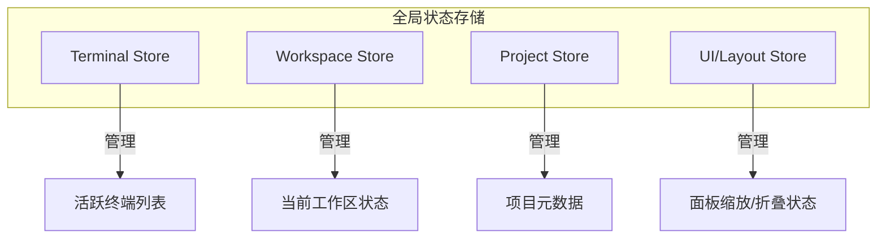
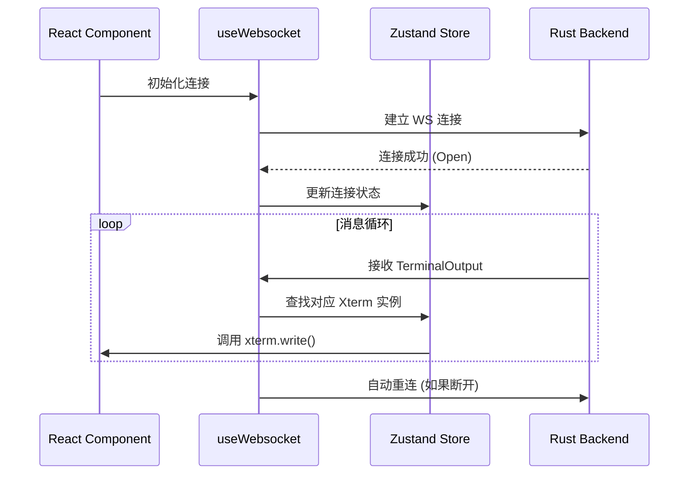
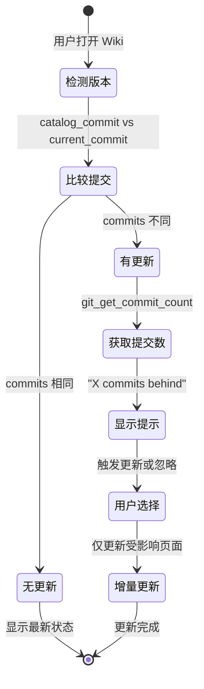
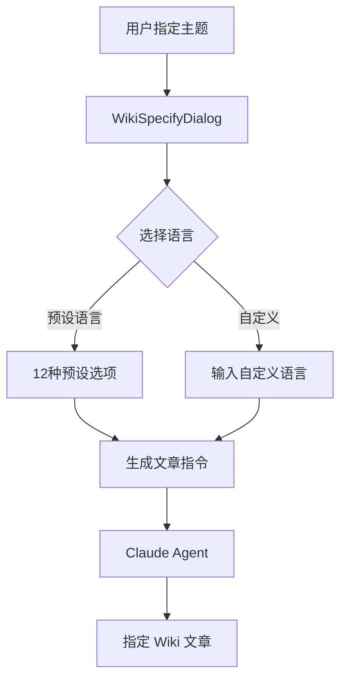

# Web 应用结构与状态管理

Atmos 的前端应用是一个复杂的 IDE 级 Web 平台，旨在浏览器中复现原生开发环境的流畅体验。基于 Next.js 14+、TypeScript 和 Zustand，我们构建了一套响应迅速、状态同步且高度模块化的架构。本章将深入探讨前端如何管理复杂的 UI 布局、高频的终端数据流以及全局业务状态。

## 架构哲学：组件化与状态驱动

Atmos 前端的核心设计思想是：**UI 是状态的函数，而状态是事件的累积。**

### 核心技术栈
- **Next.js (App Router)**: 提供路由、国际化 (i18n) 和服务器端渲染支持。
- **Zustand**: 负责所有非持久化的全局状态（终端实例、当前选中的工作区、UI 布局）。
- **Xterm.js**: 工业级终端渲染引擎，处理复杂的 ANSI 序列和 WebGL 加速。
- **Tailwind CSS**: 响应式、原子化的样式系统。

## 状态管理：Zustand 的深度应用

在 Atmos 这种实时性极强的应用中，状态管理的性能至关重要。我们选择了 Zustand，因为它轻量、无样板代码，且在处理高频更新时表现优异。

### 核心 Store 划分

#### Terminal Store 职责：
- 维护一个从 `terminal_id` 到 `Xterm.js` 实例的映射。
- 处理终端的创建、销毁和焦点切换。
- 缓存未激活终端的输出，确保切换回来时内容不丢失。

## 终端集成：高性能渲染

终端渲染是前端最耗资源的部分。Atmos 采取了多项优化措施：

### 1. 虚拟化与按需渲染
只有当前可见的终端面板才会挂载 `Xterm.js` 的 DOM 节点。隐藏的终端仅在内存中保留其缓冲区。

### 2. WebGL 加速
通过加载 `@xterm/addon-webgl`，我们将终端的渲染工作从 CPU 转移到 GPU，极大地提升了在大规模文本输出（如 `cat` 大文件）时的帧率。

### 3. 二进制流处理
WebSocket 接收到的数据直接以 `Uint8Array` 的形式喂给 `Xterm.js`，避免了昂贵的 Base64 解码或 UTF-8 字符串转换开销。

## 实时通信：WebSocket 客户端

前端通过一个高度封装的 `useWebsocket` Hook 与后端保持连接。

### 连接生命周期

## 布局系统：Panel Layout

为了实现类似 VS Code 的多面板布局，Atmos 开发了一套自定义的布局组件：
- **可调整大小**: 使用 `react-resizable-panels` 实现侧边栏和终端区域的动态缩放。
- **多标签页**: 在主编辑区或终端区支持多标签切换。
- **持久化**: 用户的布局偏好（如侧边栏宽度）会本地存储，下次打开时自动恢复。

## Wiki 系统功能

Atmos 的前端集成了强大的 Wiki 系统，支持增量更新、多语言生成和增强的导航体验。

### 1. Wiki 增量更新机制

Wiki 系统能够智能检测版本变化并仅更新受影响的页面，大幅提升更新效率。

**关键实现**:
- `use-wiki-store.ts` 维护 Wiki 更新状态，包括 `commitCount` 字段
- `gitApi.getCommitCount()` 调用后端获取提交数量
- `WikiSidebar` 显示刷新状态指示器（旋转动画、更新提示）

### 2. 多语言 Wiki 生成

Atmos 支持 12 种主要语言的 Wiki 文档生成，满足国际化团队需求。

**支持的语言**:
- 英语、中文、日语、韩语
- 西班牙语、法语、德语、葡萄牙语
- 俄语、阿拉伯语、印地语
- 自定义语言选项

### 3. 增强的 Markdown 渲染与导航

Wiki 的 Markdown 阅读体验经过多项增强：

#### Mermaid 图表模态框
- 点击 Mermaid 图表可在全屏模态框中查看
- 支持自定义缩放级别（0.5x - 3x）
- 拖拽平移功能，方便浏览大型图表
- 填充可用空间，充分利用屏幕

#### 自动头部导航
- 从 Markdown 内容中提取 H2/H3 标题
- 生成自动目录和锚点跳转
- 快速导航到文章任意章节

### 4. Wiki 目录结构

Wiki 系统支持三种文档类型：

| 类型 | 路径 | 用途 |
|-----|------|------|
| **入门指南** | `getting-started/` | 面向新用户的基础文档 |
| **深入探索** | `deep-dive/` | 面向贡献者的技术细节 |
| **指定 Wiki** | `specify-wiki/` | 用户按需生成的特定主题文章 |

## 关键源码分析

| 文件路径 | 核心职责 |
|:---|:---|
| `apps/web/src/hooks/use-terminal-store.ts` | 终端状态管理的"大脑"，处理所有终端逻辑。 |
| `apps/web/src/components/terminal/Terminal.tsx` | `Xterm.js` 的 React 封装组件，负责 DOM 挂载和插件初始化。 |
| `apps/web/src/api/ws-api.ts` | 封装底层的 WebSocket 消息发送与接收协议，包括 Git API。 |
| `apps/web/src/components/layout/PanelLayout.tsx` | 定义应用的主布局框架，管理侧边栏和主视图的比例。 |
| `apps/web/src/hooks/use-project-store.ts` | 管理项目列表的获取、创建和删除状态。 |
| `apps/web/src/hooks/use-wiki-store.ts` | Wiki 状态管理，包括目录加载、版本检测和更新触发。 |
| `apps/web/src/components/wiki/WikiSidebar.tsx` | Wiki 侧边栏，显示目录结构、更新状态和导航功能。 |
| `apps/web/src/components/wiki/WikiSpecifyDialog.tsx` | Wiki 文章生成对话框，支持主题输入、语言选择和 Agent 选择。 |
| `apps/web/src/components/markdown/MarkdownRenderer.tsx` | 增强的 Markdown 渲染器，支持代码高亮、Mermaid 图表和自动导航。 |

## 总结

Atmos 前端架构的设计核心在于“性能”与“同步”。通过 Zustand 的精细状态控制和 Xterm.js 的高性能渲染，我们成功地在 Web 平台上提供了一套不逊色于原生应用的开发体验。这套架构不仅支撑了当前的终端管理需求，也为未来集成代码编辑、图形化调试等功能打下了坚实的基础。

## 下一步建议

- **[WebSocket 系统设计](../../deep-dive/infra/websocket.md)**: 了解后端如何发送这些实时数据。
- **[终端服务实现](../../deep-dive/core-service/terminal.md)**: 探索业务层如何调度终端会话。
- **[架构概览](../../getting-started/architecture.md)**: 查看前端在整体系统中的位置。
- **[项目概览](../../getting-started/overview.md)**: 了解前端提供的完整功能。
