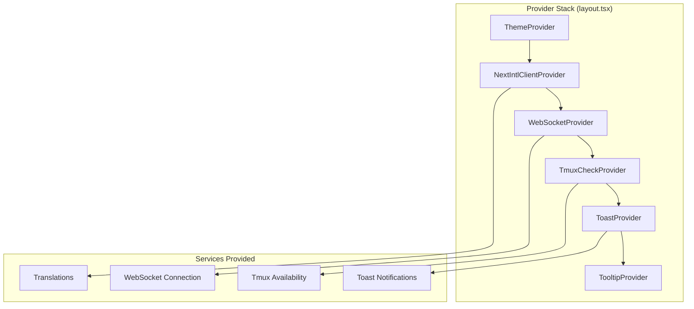
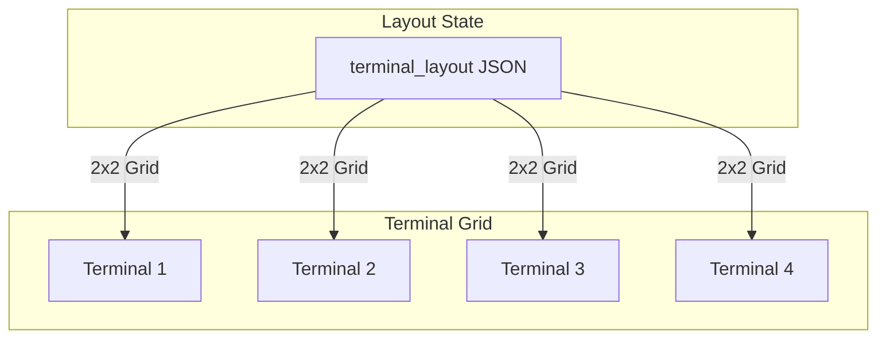

# Web Application Architecture

The ATMOS web application is a Next.js 16 application that serves as the primary user interface for the workspace ecosystem. It combines modern React patterns with real-time WebSocket communication to deliver a responsive, stateful experience for managing projects, workspaces, and terminal sessions. This article explores the frontend architecture, from the provider stack that enables global state management to the component patterns that make up the UI.

## Overview

The web application (`apps/web/`) is built with **Next.js 16** using the App Router pattern, **React 19**, **TypeScript 5**, and **Tailwind CSS v4**. It connects to the Rust backend via a persistent WebSocket connection that handles all real-time operations including terminal I/O, file system events, and git status updates.

Key architectural decisions include:
- **Zustand for state management** - Lightweight, TypeScript-first store pattern
- **WebSocket as primary transport** - All API calls go through WebSocket for type safety and request correlation
- **Provider stack pattern** - Nested context providers for global services
- **shadcn/ui components** - Headless Radix UI primitives with Tailwind styling
- **xterm.js for terminals** - Full terminal emulation with ANSI escape sequence support

The application consists of ~90 TypeScript/TSX files across 54 React components, organized by feature area rather than file type.

## Architecture

### Provider Stack

The root layout establishes a nested provider hierarchy that enables all global functionality throughout the application:



The provider stack in `apps/web/src/app/[locale]/layout.tsx:52-84` establishes these services in order:

1. **ThemeProvider** - Dark/light mode with system preference detection
2. **NextIntlClientProvider** - i18n message dictionary for all translations
3. **WebSocketProvider** - Global WebSocket connection with auto-reconnect
4. **TmuxCheckProvider** - Validates tmux availability on the backend
5. **ToastProvider** - Toast notification management via `@workspace/ui`
6. **TooltipProvider** - Radix UI tooltip context

### Component Organization

Components are organized by feature, with clear boundaries between layout, terminal, workspace, and utility concerns:

```mermaid
graph LR
    subgraph "Layout Components"
        L1[Header.tsx]
        L2[LeftSidebar.tsx]
        L3[CenterStage.tsx]
        L4[RightSidebar.tsx]
        L5[PanelLayout.tsx]
    end

    subgraph "Feature Components"
        F1[Terminal.tsx]
        F2[WorkspaceManager.tsx]
        F3[FileTree.tsx]
        F4[WikiContent.tsx]
    end

    subgraph "UI Library"
        U1[@workspace/ui<br/>shadcn components]
    end

    L5 --> L1 & L2 & L3 & L4
    L3 --> F1 & F2 & F3 & F4
    F1 & F2 & F3 & F4 --> U1
```

## WebSocket Integration

### Connection Management

The `useWebSocketStore` (Zustand store) manages the WebSocket lifecycle with automatic reconnection and request correlation:

```typescript
interface WebSocketStore {
  // State
  connectionState: ConnectionState;
  socket: WebSocket | null;
  pendingRequests: Map<string, PendingRequest>;
  eventListeners: Map<string, Set<(data: unknown) => void>>;

  // Configuration
  url: string;
  heartbeatInterval: number;  // 15 seconds
  reconnectInterval: number;   // 3 seconds
  requestTimeout: number;      // 30 seconds

  // Actions
  connect: () => void;
  disconnect: () => void;
  send: <T>(action: WsAction, data?: unknown) => Promise<T>;
  onEvent: (event: string, callback: (data: unknown) => void) => () => void;
}
```

> **Source**: [apps/web/src/hooks/use-websocket.ts](../../../../apps/web/src/hooks/use-websocket.ts#L111-L139)

The WebSocket URL is dynamically determined based on environment:
- **Production**: Uses `wss://` with current host
- **Development**: Uses `ws://localhost:8080/ws` or custom `NEXT_PUBLIC_WS_URL`
- **Tailscale/VPN**: Supports custom hostnames for remote development

### Request-Response Pattern

All API calls use a request-response correlation pattern with UUID-based request IDs:

```typescript
// Sending a request
const response = await send<ProjectListResponse>('project_list', {});

// Request payload
{
  type: 'request',
  payload: {
    request_id: '550e8400-e29b-41d4-a716-446655440000',
    action: 'project_list',
    data: {}
  }
}

// Response payload
{
  type: 'response',
  payload: {
    request_id: '550e8400-e29b-41d4-a716-446655440000',
    success: true,
    data: { projects: [...] }
  }
}
```

> **Source**: [apps/web/src/hooks/use-websocket.ts](../../../../apps/web/src/hooks/use-websocket.ts#L64-L97)

### Supported Actions

The `WsAction` type defines all 40+ available WebSocket actions:

```typescript
export type WsAction =
  // File system operations
  | 'fs_get_home_dir' | 'fs_list_dir' | 'fs_read_file' | 'fs_write_file'
  | 'fs_list_project_files' | 'fs_search_content'
  // Git operations
  | 'git_get_status' | 'git_changed_files' | 'git_file_diff'
  | 'git_commit' | 'git_push' | 'git_stage' | 'git_unstage'
  // Project operations
  | 'project_list' | 'project_create' | 'project_update' | 'project_delete'
  // Workspace operations
  | 'workspace_list' | 'workspace_create' | 'workspace_delete'
  | 'workspace_pin' | 'workspace_archive'
  // Skills operations
  | 'skills_list';
```

> **Source**: [apps/web/src/hooks/use-websocket.ts](../../../../apps/web/src/hooks/use-websocket.ts#L9-L62)

## State Management with Zustand

### Store Pattern

ATMOS uses Zustand for global state management, with separate stores for each domain:

| Store | Hook | Purpose |
|-------|------|---------|
| `WebSocketStore` | `useWebSocketStore` | Connection, pending requests, event listeners |
| `ProjectStore` | `useProjectStore` | Project list, current project |
| `WorkspaceStore` | `useWorkspaceStore` | Workspace list, current workspace |
| `GitStore` | `useGitStore` | Git status, changed files, diff content |
| `TerminalStore` | `useTerminalStore` | Terminal sessions, active terminal |
| `DialogStore` | `useDialogStore` | Modal dialog state |

### WebSocket Store Deep Dive

The WebSocket store implements a request correlation system that maps request IDs to promise resolvers:

```typescript
// Storing a pending request
const requestId = uuidv4();
const timeout = setTimeout(() => {
  const pending = pendingRequests.get(requestId);
  if (pending) {
    pendingRequests.delete(requestId);
    pending.reject(new Error(`Request timeout: ${action}`));
  }
}, requestTimeout);

pendingRequests.set(requestId, {
  resolve,
  reject,
  timeout
});

// Handling the response
if (message.type === 'response') {
  const { request_id, success, data } = message.payload;
  const pending = pendingRequests.get(request_id);

  if (pending) {
    clearTimeout(pending.timeout);
    pendingRequests.delete(request_id);

    if (success) {
      pending.resolve(data);
    } else {
      pending.reject(new Error(`Request failed: ${data}`));
    }
  }
}
```

> **Source**: [apps/web/src/hooks/use-websocket.ts](../../../../apps/web/src/hooks/use-websocket.ts#L257-L303)

## Terminal Integration

### xterm.js Terminal

The `Terminal` component wraps xterm.js to provide full terminal emulation:

```typescript
import { Terminal as XTerm } from 'xterm';

// Terminal initialization
const terminal = new XTerm({
  cursorBlink: true,
  fontSize: 14,
  fontFamily: 'Menlo, Monaco, "Courier New", monospace',
  theme: theme.background === 'dark' ? theme : undefined,
});

// Connecting to WebSocket
terminal.onData((data) => {
  websocketStore.send('terminal_input', {
    session_id: sessionId,
    data,
  });
});

// Receiving output
websocketStore.onEvent('terminal_output', (payload) => {
  const { data } = payload as TerminalOutputPayload;
  terminal.write(data);
});
```

> **Source**: [apps/web/src/components/terminal/Terminal.tsx](../../../../apps/web/src/components/terminal/Terminal.tsx)

Terminal I/O flows through a dedicated WebSocket endpoint (`/ws/terminal/:session_id`) that streams raw PTY output to the frontend for rendering in xterm.js.

### Terminal Grid Layout

The `TerminalManagerView` component implements a grid layout for multiple terminals with resizable panes:



## UI Component Library

### @workspace/ui

The `@workspace/ui` package provides 20+ shadcn/ui components with Tailwind styling:

| Component | Description | Radix Primitive |
|-----------|-------------|-----------------|
| `Button` | Clickable actions | - |
| `Dialog` | Modal overlays | Radix Dialog |
| `DropdownMenu` | Menu dropdowns | Radix Dropdown Menu |
| `Select` | Form selects | Radix Select |
| `Tabs` | Tab navigation | Radix Tabs |
| `Tooltip` | Hover tooltips | Radix Tooltip |
| `ScrollArea` | Custom scrollbars | Radix Scroll Area |
| `Toast` | Toast notifications | Sonner |

Components are copied into the project (not npm installed) to allow full customization while maintaining the shadcn/ui update pattern.

### Styling with Tailwind CSS v4

ATMOS uses Tailwind CSS v4 with pure CSS theme tokens in `apps/web/src/app/globals.css`:

```css
@theme {
  /* Light mode colors */
  --color-background: #ffffff;
  --color-foreground: #09090b;
  --color-primary: #18181b;
  --color-muted: #f4f4f5;

  /* Dark mode colors */
  @custom-media --dark (prefers-color-scheme: dark);
  @media (prefers-color-scheme: dark) {
    --color-background: #09090b;
    --color-foreground: #fafafa;
    --color-primary: #fafafa;
    --color-muted: #27272a;
  }
}
```

## Routing and Layout

### App Router Structure

Next.js 16 App Router with internationalization:

```
apps/web/src/app/
├── [locale]/           # Locale segment (en, zh)
│   ├── layout.tsx      # Root layout with providers
│   ├── page.tsx        # Home page
│   └── globals.css     # Global styles
├── favicon.ico
└── manifest.json
```

### Panel Layout

The `PanelLayout` component implements a resizable 3-panel layout using custom resize logic:

```typescript
interface PanelLayoutProps {
  left: React.ReactNode;
  center: React.ReactNode;
  right: React.ReactNode;
  leftWidth?: number;
  rightWidth?: number;
}
```

> **Source**: [apps/web/src/components/layout/PanelLayout.tsx](../../../../apps/web/src/components/layout/PanelLayout.tsx)

Each panel is independently resizable with visual feedback during drag operations.

## Key Source Files

| File | Purpose |
|------|---------|
| `apps/web/src/app/[locale]/layout.tsx` | Root layout with provider stack |
| `apps/web/src/hooks/use-websocket.ts` | WebSocket store with request correlation |
| `apps/web/src/api/ws-api.ts` | Type-safe WebSocket API wrappers |
| `apps/web/src/components/terminal/Terminal.tsx` | xterm.js terminal wrapper |
| `apps/web/src/components/layout/PanelLayout.tsx` | Resizable 3-panel layout |
| `packages/ui/src/components/ui/` | shadcn/ui component library |

## Next Steps

- **[API Routes & Handlers](../api/routes.md)** — See how the backend exposes HTTP and WebSocket endpoints
- **[WebSocket Service](../infra/websocket.md)** — Deep dive into the backend WebSocket infrastructure
- **[Build System & Tooling](../build-system/index.md)** — Learn how the frontend is built and deployed
- **[Terminal Service](../core-service/terminal.md)** — Understand how terminal sessions are managed on the backend
