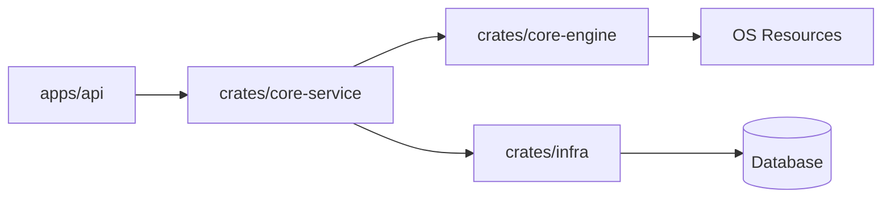

# 深入探索 (Deep Dive)

本章节为开发者和贡献者准备，深入探讨 Atmos 的内部实现细节、核心算法以及架构决策。

## 章节概览

如果你想了解 Atmos 是如何从底层构建起来的，或者打算为项目贡献代码，请阅读以下详细指南：

### 1. 核心引擎 (Core Engine)
探讨 Atmos 如何与底层操作系统交互。
- **[PTY, Git 与文件系统](./core-engine/fs-git.md)**: 深入了解伪终端管理、自动化 Git 操作和安全的文件系统访问实现。
- **[Tmux 会话管理](./core-engine/tmux.md)**: 了解我们如何利用 Tmux 实现终端会话的持久化。

### 2. 业务逻辑 (Core Service)
分析 Atmos 的核心业务建模。
- **[工作区生命周期](./core-service/workspace.md)**: 探索工作区从创建到归档的完整状态机实现。
- **[终端服务实现](./core-service/terminal.md)**: 了解终端会话的管理、流调度以及异常处理。

### 3. 基础设施 (Infrastructure)
底层支撑系统的设计。
- **[WebSocket 系统设计](./infra/websocket.md)**: 深入分析基于主题的消息路由、连接管理和性能优化。
- **[数据库设计与迁移](./infra/database.md)**: 了解数据模型设计、SeaORM 集成以及模式演进策略。

### 4. 前端架构 (Web App)
IDE 级前端应用的构建。
- **[Web 应用结构与状态管理](./frontend/web-app.md)**: 探索 Next.js 架构、Zustand 状态流以及 Xterm.js 的深度集成。

## 核心模块依赖图

## 研究建议

在深入代码之前，建议先阅读每个模块对应的 **Research Briefing**（位于 `.atmos/wiki/_briefings/`），这些简报记录了我们在开发过程中的核心关注点和研究问题。
