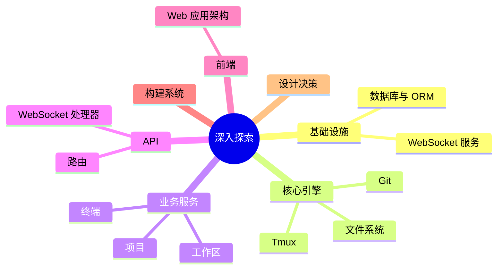

# 深入探索

本章节面向贡献者与维护者，深入介绍 ATMOS 各层的实现细节、数据流、API 设计与设计决策。阅读本章节前，建议先完成入门指南中的架构概览与核心概念。

## Overview

深入探索按层级组织：基础设施层（DB、WebSocket）、核心引擎层（Tmux、Git、FS）、业务服务层（Workspace、Terminal、Project）、API 层（HTTP、WebSocket 处理器）、前端架构，以及构建系统与设计决策。

## Architecture

## 文档导航

| 模块 | 文档 |
|------|------|
| 基础设施 | [数据库与 ORM](infra/database.md)、[WebSocket 服务](infra/websocket.md) |
| 核心引擎 | [Tmux 引擎](core-engine/tmux.md)、[Git 引擎](core-engine/git.md)、[文件系统引擎](core-engine/fs.md) |
| 业务服务 | [工作区服务](core-service/workspace.md)、[终端服务](core-service/terminal.md)、[项目服务](core-service/project.md) |
| API | [HTTP 路由](api/routes.md)、[WebSocket 处理器](api/websocket-handlers.md) |
| 前端 | [Web 应用架构](frontend/web-app.md) |
| 其他 | [构建系统](build-system/index.md)、[设计决策](design-decisions/index.md) |

## Key Source Files

| File | Purpose |
|------|---------|
| `crates/infra/AGENTS.md` | L1 工作模式 |
| `crates/core-engine/AGENTS.md` | L2 模块说明 |
| `crates/core-service/AGENTS.md` | L3 服务说明 |
| `apps/api/AGENTS.md` | API 入口规范 |

## Next Steps

- **[基础设施层](infra/index.md)** — 从 L1 开始深入
- **[业务服务层](core-service/index.md)** — 理解业务编排
