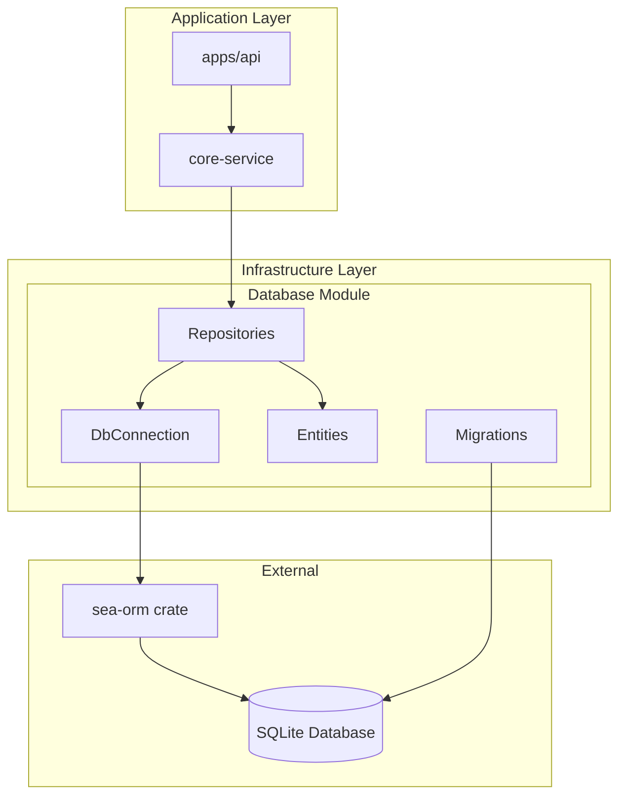
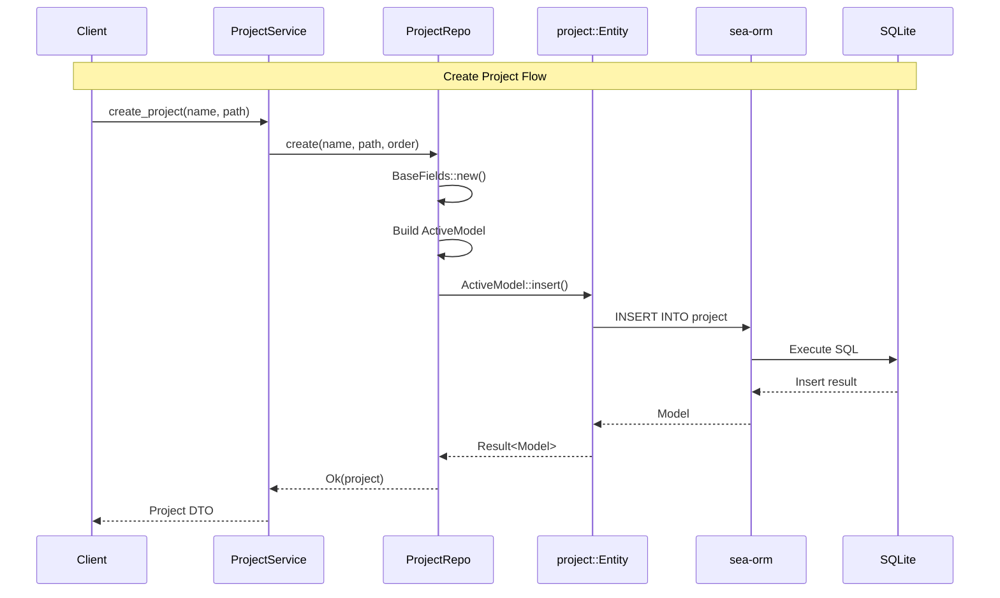

The Database module in ATMOS's Infrastructure Layer provides a complete ORM solution built on SeaORM with SQLite. It handles data persistence for projects, workspaces, and application state through a well-structured repository pattern, automatic migrations, and type-safe entity models.

## Overview

ATMOS uses SeaORM as its ORM framework with SQLite as the database backend. This combination provides an excellent balance of simplicity, reliability, and developer experience for a developer-focused application. The database module abstracts away raw SQL while maintaining performance through compile-time query validation and automatic type mapping.

### Architecture



### Database Location

The SQLite database is stored in the user's home directory:

```rust
fn get_db_path() -> Result<PathBuf> {
    let home = dirs::home_dir().ok_or(InfraError::HomeDirNotFound)?;
    Ok(home.join(".atmos").join("db").join("atmos.db"))
}
```

From [`crates/infra/src/db/connection.rs`](https://github.com/lurunrun/atmos/blob/main/crates/infra/src/db/connection.rs)

This provides:
- **User-scoped data**: Each user has their own database
- **No server required**: Zero-configuration setup
- **Easy backup**: Single file for all data

## Connection Management

### DbConnection

The `DbConnection` struct wraps SeaORM's `DatabaseConnection` and handles initialization:

```rust
pub struct DbConnection {
    pub conn: DatabaseConnection,
}

impl DbConnection {
    pub async fn new() -> Result<Self> {
        let db_path = Self::get_db_path()?;
        Self::connect(&db_path).await
    }

    pub async fn connect(db_path: &PathBuf) -> Result<Self> {
        if let Some(parent) = db_path.parent() {
            std::fs::create_dir_all(parent)?;
        }

        let db_url = format!("sqlite://{}?mode=rwc", db_path.display());
        info!("Connecting to database: {}", db_url);

        let conn = Database::connect(&db_url).await?;
        info!("Database connected successfully");

        Ok(Self { conn })
    }
}
```

From [`crates/infra/src/db/connection.rs`](https://github.com/lurunrun/atmos/blob/main/crates/infra/src/db/connection.rs)

The connection string uses `mode=rwc` which enables:
- **Read** operations
- **Write** operations
- **Create** database if it doesn't exist

### Usage in Application

The API server initializes the database during startup:

```rust
let db_connection = DbConnection::new().await?;
info!("Database connected");

Migrator::up(&db_connection.conn, None).await?;
info!("Database migrations completed");

let db = Arc::new(db_connection.conn.clone());

let project_service = Arc::new(ProjectService::new(Arc::clone(&db)));
let workspace_service = Arc::new(WorkspaceService::new(Arc::clone(&db)));
```

From [`apps/api/src/main.rs`](https://github.com/lurunrun/atmos/blob/main/apps/api/src/main.rs)

## Entity Design

### Base Entity Pattern

All entities share a common base pattern through the `BaseEntity` trait and `impl_base_entity!` macro:

```rust
pub trait BaseEntity {
    fn guid(&self) -> &str;
    fn created_at(&self) -> NaiveDateTime;
    fn updated_at(&self) -> NaiveDateTime;
    fn is_deleted(&self) -> bool;
}

#[macro_export]
macro_rules! impl_base_entity {
    ($model:ty) => {
        impl $crate::db::entities::base::BaseEntity for $model {
            fn guid(&self) -> &str {
                &self.guid
            }

            fn created_at(&self) -> chrono::NaiveDateTime {
                self.created_at
            }

            fn updated_at(&self) -> chrono::NaiveDateTime {
                self.updated_at
            }

            fn is_deleted(&self) -> bool {
                self.is_deleted
            }
        }
    };
}
```

From [`crates/infra/src/db/entities/base.rs`](https://github.com/lurunrun/atmos/blob/main/crates/infra/src/db/entities/base.rs)

This ensures consistent:
- **Primary Keys**: UUID-based `guid` instead of auto-increment
- **Audit Trail**: `created_at` and `updated_at` timestamps
- **Soft Deletes**: `is_deleted` flag for logical deletion

### Project Entity

The `project` entity represents a code repository or project:

```rust
#[derive(Clone, Debug, PartialEq, Eq, DeriveEntityModel, Serialize, Deserialize)]
#[sea_orm(table_name = "project")]
pub struct Model {
    #[sea_orm(primary_key, auto_increment = false)]
    pub guid: String,
    pub created_at: DateTime,
    pub updated_at: DateTime,
    pub is_deleted: bool,
    pub name: String,
    pub main_file_path: String,
    pub sidebar_order: i32,
    pub border_color: Option<String>,
    pub is_open: bool,
    /// Target branch for merge/PR/git diff operations
    /// If None, uses the repository's default branch
    pub target_branch: Option<String>,
}

impl_base_entity!(Model);

#[derive(Copy, Clone, Debug, EnumIter, DeriveRelation)]
pub enum Relation {
    #[sea_orm(has_many = "super::workspace::Entity")]
    Workspace,
}

impl Related<super::workspace::Entity> for Entity {
    fn to() -> RelationDef {
        Relation::Workspace.def()
    }
}
```

From [`crates/infra/src/db/entities/project.rs`](https://github.com/lurunrun/atmos/blob/main/crates/infra/src/db/entities/project.rs)

Key fields:
- **guid**: UUID primary key
- **main_file_path**: Path to the main file (e.g., README or main module)
- **sidebar_order**: UI ordering
- **border_color**: Visual identification
- **target_branch**: Git operations use this branch instead of default

### Workspace Entity

The `workspace` entity represents a branch-specific workspace within a project:

```rust
#[derive(Clone, Debug, PartialEq, Eq, DeriveEntityModel, Serialize, Deserialize)]
#[sea_orm(table_name = "workspace")]
pub struct Model {
    #[sea_orm(primary_key, auto_increment = false)]
    pub guid: String,
    pub project_guid: String,
    pub created_at: DateTime,
    pub updated_at: DateTime,
    pub is_deleted: bool,
    pub name: String,
    pub branch: String,
    pub sidebar_order: i32,
    pub is_pinned: bool,
    pub pinned_at: Option<DateTime>,
    pub is_archived: bool,
    pub archived_at: Option<DateTime>,
    /// JSON-encoded terminal layout configuration
    pub terminal_layout: Option<String>,
    /// The ID of the currently maximized terminal pane, if any
    pub maximized_terminal_id: Option<String>,
}

impl_base_entity!(Model);

#[derive(Copy, Clone, Debug, EnumIter, DeriveRelation)]
pub enum Relation {
    #[sea_orm(
        belongs_to = "super::project::Entity",
        from = "Column::ProjectGuid",
        to = "super::project::Column::Guid",
        on_update = "Cascade",
        on_delete = "Cascade"
    )]
    Project,
}

impl Related<super::project::Entity> for Entity {
    fn to() -> RelationDef {
        Relation::Project.def()
    }
}
```

From [`crates/infra/src/db/entities/workspace.rs`](https://github.com/lurunrun/atmos/blob/main/crates/infra/src/db/entities/workspace.rs)

Key features:
- **Foreign Key**: `project_guid` references project
- **Cascade Delete**: Deleting a project deletes all workspaces
- **State Management**: `is_pinned`, `is_archived` for UI organization
- **Terminal State**: Layout and maximization state persisted as JSON

## Repository Pattern

### Base Repository Trait

All repositories implement the `BaseRepo` trait for consistent database access:

```rust
#[async_trait]
pub trait BaseRepo<E, M, A>
where
    E: EntityTrait<Model = M>,
    M: ModelTrait<Entity = E> + IntoActiveModel<A> + Send + Sync,
    A: ActiveModelTrait<Entity = E> + ActiveModelBehavior + Send + Sync,
{
    /// Returns database connection reference
    fn db(&self) -> &DatabaseConnection;
}
```

From [`crates/infra/src/db/repo/base.rs`](https://github.com/lurunrun/atmos/blob/main/crates/infra/src/db/repo/base.rs)

This pattern provides:
- **Type Safety**: Generic constraints ensure compile-time correctness
- **Consistency**: All repositories have the same interface
- **Flexibility**: Each repo can add domain-specific methods

### Project Repository

`ProjectRepo` handles all project-related database operations:

```rust
pub struct ProjectRepo<'a> {
    db: &'a DatabaseConnection,
}

impl<'a> ProjectRepo<'a> {
    pub async fn list(&self) -> Result<Vec<project::Model>> {
        let projects = project::Entity::find()
            .filter(project::Column::IsDeleted.eq(false))
            .order_by_asc(project::Column::SidebarOrder)
            .all(self.db)
            .await?;
        Ok(projects)
    }

    pub async fn create(
        &self,
        name: String,
        main_file_path: String,
        sidebar_order: i32,
        border_color: Option<String>
    ) -> Result<project::Model> {
        let base = BaseFields::new();

        let model = project::ActiveModel {
            guid: Set(base.guid),
            created_at: Set(base.created_at),
            updated_at: Set(base.updated_at),
            is_deleted: Set(base.is_deleted),
            name: Set(name),
            main_file_path: Set(main_file_path),
            sidebar_order: Set(sidebar_order),
            border_color: Set(border_color),
            is_open: Set(true),
            target_branch: Set(None),
        };

        let result = model.insert(self.db).await?;
        Ok(result)
    }

    pub async fn soft_delete(&self, guid: String) -> Result<()> {
        project::Entity::update_many()
            .col_expr(project::Column::IsDeleted, Expr::value(true))
            .col_expr(
                project::Column::UpdatedAt,
                Expr::value(chrono::Utc::now().naive_utc()),
            )
            .filter(project::Column::Guid.eq(guid))
            .exec(self.db)
            .await?;
        Ok(())
    }

    pub async fn update_target_branch(
        &self,
        guid: String,
        target_branch: Option<String>
    ) -> Result<()> {
        project::Entity::update_many()
            .col_expr(project::Column::TargetBranch, Expr::value(target_branch))
            .filter(project::Column::Guid.eq(guid))
            .exec(self.db)
            .await?;
        Ok(())
    }
}
```

From [`crates/infra/src/db/repo/project_repo.rs`](https://github.com/lurunrun/atmos/blob/main/crates/infra/src/db/repo/project_repo.rs)

### Workspace Repository

`WorkspaceRepo` provides comprehensive workspace management:

```rust
pub struct WorkspaceRepo<'a> {
    db: &'a DatabaseConnection,
}

impl<'a> WorkspaceRepo<'a> {
    pub async fn list_by_project(&self, project_guid: String) -> Result<Vec<workspace::Model>> {
        let workspaces = workspace::Entity::find()
            .filter(workspace::Column::ProjectGuid.eq(project_guid))
            .filter(workspace::Column::IsDeleted.eq(false))
            .filter(workspace::Column::IsArchived.eq(false))
            .order_by_desc(workspace::Column::IsPinned)
            .order_by_desc(workspace::Column::PinnedAt)
            .order_by_desc(workspace::Column::CreatedAt)
            .all(self.db)
            .await?;
        Ok(workspaces)
    }

    pub async fn pin_workspace(&self, guid: String) -> Result<()> {
        let now = chrono::Utc::now().naive_utc();
        workspace::Entity::update_many()
            .col_expr(workspace::Column::IsPinned, Expr::value(true))
            .col_expr(workspace::Column::PinnedAt, Expr::value(Some(now)))
            .col_expr(workspace::Column::UpdatedAt, Expr::value(now))
            .filter(workspace::Column::Guid.eq(guid))
            .filter(workspace::Column::IsDeleted.eq(false))
            .exec(self.db)
            .await?;
        Ok(())
    }

    pub async fn archive_workspace(&self, guid: String) -> Result<()> {
        let now = chrono::Utc::now().naive_utc();
        workspace::Entity::update_many()
            .col_expr(workspace::Column::IsArchived, Expr::value(true))
            .col_expr(workspace::Column::ArchivedAt, Expr::value(Some(now)))
            .col_expr(workspace::Column::UpdatedAt, Expr::value(now))
            .filter(workspace::Column::Guid.eq(guid))
            .filter(workspace::Column::IsDeleted.eq(false))
            .exec(self.db)
            .await?;
        Ok(())
    }

    pub async fn update_terminal_layout(
        &self,
        guid: String,
        layout: Option<String>
    ) -> Result<()> {
        workspace::Entity::update_many()
            .col_expr(workspace::Column::TerminalLayout, Expr::value(layout))
            .col_expr(
                workspace::Column::UpdatedAt,
                Expr::value(chrono::Utc::now().naive_utc()),
            )
            .filter(workspace::Column::Guid.eq(guid))
            .filter(workspace::Column::IsDeleted.eq(false))
            .exec(self.db)
            .await?;
        Ok(())
    }
}
```

From [`crates/infra/src/db/repo/workspace_repo.rs`](https://github.com/lurunrun/atmos/blob/main/crates/infra/src/db/repo/workspace_repo.rs)

## Migrations

### Migration System

ATMOS uses SeaORM migrations for schema versioning:

```rust
pub struct Migrator;

#[async_trait::async_trait]
impl MigratorTrait for Migrator {
    fn migrations() -> Vec<Box<dyn MigrationTrait>> {
        vec![
            Box::new(m20260117_000001_create_test_message_table::Migration),
            Box::new(m20260118_000002_create_project_tables::Migration),
            Box::new(m20260120_000003_add_workspace_pin_archive::Migration),
            Box::new(m20260121_000004_add_project_target_branch::Migration),
            Box::new(m20260126_000005_add_workspace_terminal_layout::Migration),
            Box::new(m20260129_000006_add_maximized_terminal_id::Migration),
        ]
    }
}
```

From [`crates/infra/src/db/migration/mod.rs`](https://github.com/lurunrun/atmos/blob/main/crates/infra/src/db/migration/mod.rs)

### Migration Example

The project table creation migration:

```rust
#[derive(DeriveMigrationName)]
pub struct Migration;

#[async_trait::async_trait]
impl MigrationTrait for Migration {
    async fn up(&self, manager: &SchemaManager) -> Result<(), DbErr> {
        // Create Project Table
        manager
            .create_table(
                Table::create()
                    .table(Project::Table)
                    .if_not_exists()
                    .col(
                        ColumnDef::new(Project::Guid)
                            .string()
                            .not_null()
                            .primary_key(),
                    )
                    .col(ColumnDef::new(Project::CreatedAt).date_time().not_null())
                    .col(ColumnDef::new(Project::UpdatedAt).date_time().not_null())
                    .col(
                        ColumnDef::new(Project::IsDeleted)
                            .boolean()
                            .not_null()
                            .default(false),
                    )
                    .col(ColumnDef::new(Project::Name).string().not_null())
                    .col(ColumnDef::new(Project::MainFilePath).string().not_null())
                    .col(ColumnDef::new(Project::SidebarOrder).integer().not_null())
                    .col(ColumnDef::new(Project::BorderColor).string().null())
                    .col(
                        ColumnDef::new(Project::IsOpen)
                            .boolean()
                            .not_null()
                            .default(true),
                    )
                    .to_owned(),
            )
            .await?;

        // Create Workspace Table with foreign key
        manager
            .create_table(
                Table::create()
                    .table(Workspace::Table)
                    .if_not_exists()
                    .col(
                        ColumnDef::new(Workspace::Guid)
                            .string()
                            .not_null()
                            .primary_key(),
                    )
                    .col(
                        ColumnDef::new(Workspace::ProjectGuid)
                            .string()
                            .not_null(),
                    )
                    .col(ColumnDef::new(Workspace::CreatedAt).date_time().not_null())
                    .col(ColumnDef::new(Workspace::UpdatedAt).date_time().not_null())
                    .col(
                        ColumnDef::new(Workspace::IsDeleted)
                            .boolean()
                            .not_null()
                            .default(false),
                    )
                    .col(ColumnDef::new(Workspace::Name).string().not_null())
                    .col(ColumnDef::new(Workspace::Branch).string().not_null())
                    .col(ColumnDef::new(Workspace::SidebarOrder).integer().not_null())
                    .foreign_key(
                        ForeignKey::create()
                            .name("fk-workspace-project")
                            .from(Workspace::Table, Workspace::ProjectGuid)
                            .to(Project::Table, Project::Guid)
                            .on_delete(ForeignKeyAction::Cascade),
                    )
                    .to_owned(),
            )
            .await?;

        Ok(())
    }

    async fn down(&self, manager: &SchemaManager) -> Result<(), DbErr> {
        manager
            .drop_table(Table::drop().table(Workspace::Table).to_owned())
            .await?;
        manager
            .drop_table(Table::drop().table(Project::Table).to_owned())
            .await?;
        Ok(())
    }
}
```

From [`crates/infra/src/db/migration/m20260118_000002_create_project_tables.rs`](https://github.com/lurunrun/atmos/blob/main/crates/infra/src/db/migration/m20260118_000002_create_project_tables.rs)

### Migration History

| Migration | Date | Description |
|-----------|------|-------------|
| `m20260117_000001` | 2026-01-17 | Create test_message table |
| `m20260118_000002` | 2026-01-18 | Create project and workspace tables |
| `m20260120_000003` | 2026-01-20 | Add workspace pin and archive fields |
| `m20260121_000004` | 2026-01-21 | Add project target_branch field |
| `m20260126_000005` | 2026-01-26 | Add workspace terminal_layout field |
| `m20260129_000006` | 2026-01-29 | Add workspace maximized_terminal_id field |

## Data Flow



## Advanced Patterns

### Soft Deletes

ATMOS uses soft deletes for data retention:

```rust
pub async fn soft_delete(&self, guid: String) -> Result<()> {
    project::Entity::update_many()
        .col_expr(project::Column::IsDeleted, Expr::value(true))
        .col_expr(
            project::Column::UpdatedAt,
            Expr::value(chrono::Utc::now().naive_utc()),
        )
        .filter(project::Column::Guid.eq(guid))
        .exec(self.db)
        .await?;
    Ok(())
}
```

All queries filter deleted records:
```rust
.filter(project::Column::IsDeleted.eq(false))
```

### Cascade Operations

```rust
pub async fn soft_delete_by_project(&self, project_guid: String) -> Result<u64> {
    let result = workspace::Entity::update_many()
        .col_expr(workspace::Column::IsDeleted, Expr::value(true))
        .col_expr(
            workspace::Column::UpdatedAt,
            Expr::value(chrono::Utc::now().naive_utc()),
        )
        .filter(workspace::Column::ProjectGuid.eq(project_guid.clone()))
        .filter(workspace::Column::IsDeleted.eq(false))
        .exec(self.db)
        .await?;
    Ok(result.rows_affected)
}
```

### JSON Storage

Complex data is stored as JSON:

```rust
pub async fn update_terminal_layout(&self, guid: String, layout: Option<String>) -> Result<()> {
    workspace::Entity::update_many()
        .col_expr(workspace::Column::TerminalLayout, Expr::value(layout))
        .filter(workspace::Column::Guid.eq(guid))
        .exec(self.db)
        .await?;
    Ok(())
}
```

## Performance Optimizations

### Indexing

Foreign keys and frequently queried columns are automatically indexed by SQLite:
- Primary keys: `guid`
- Foreign keys: `project_guid`
- Filtered columns: `is_deleted`, `is_archived`, `is_pinned`

### Query Optimization

Use `find_by_id` for primary key lookups:
```rust
pub async fn find_by_guid(&self, guid: String) -> Result<Option<workspace::Model>> {
    let workspace = workspace::Entity::find_by_id(guid)
        .filter(workspace::Column::IsDeleted.eq(false))
        .one(self.db)
        .await?;
    Ok(workspace)
}
```

### Batch Operations

```rust
pub async fn update_order_batch(&self, updates: Vec<(String, i32)>) -> Result<()> {
    for (guid, order) in updates {
        self.update_order(guid, order).await?;
    }
    Ok(())
}
```

## Key Source Files

| File | Lines | Purpose |
|------|-------|---------|
| `crates/infra/src/db/mod.rs` | 13 | Public exports |
| `crates/infra/src/db/connection.rs` | 40 | DB connection management |
| `crates/infra/src/db/entities/base.rs` | 76 | Base entity trait and macros |
| `crates/infra/src/db/entities/project.rs` | 39 | Project entity definition |
| `crates/infra/src/db/entities/workspace.rs` | 49 | Workspace entity definition |
| `crates/infra/src/db/repo/base.rs` | 57 | Base repository trait |
| `crates/infra/src/db/repo/project_repo.rs` | 121 | Project repository |
| `crates/infra/src/db/repo/workspace_repo.rs` | 311 | Workspace repository |
| `crates/infra/src/db/migration/mod.rs` | 25 | Migrator entry point |
| `crates/infra/src/db/migration/m20260118_000002_create_project_tables.rs` | 122 | Project table migration |

## Next Steps

- **[WebSocket Service](./websocket.md)**: Real-time notifications for database changes
- **[Core Service Deep Dive](../core-service/)**: Business logic using repositories
- **[SeaORM Documentation](https://www.sea-ql.org/SeaORM/)**: Official SeaORM guide
- **[SQLite Documentation](https://www.sqlite.org/docs.html)**: SQLite reference
