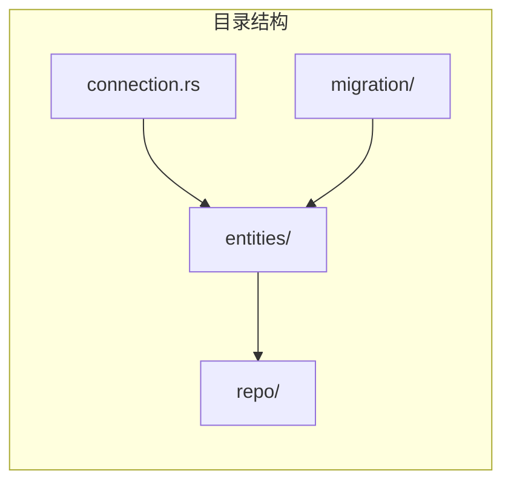
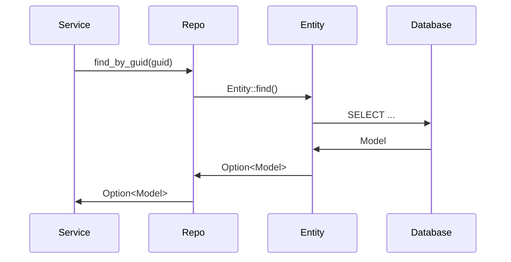

# 数据库与 ORM

本文深入介绍 ATMOS 的数据持久化架构，包括 SeaORM 的使用、实体设计、仓库模式以及迁移流程。理解本模块对于扩展新表或修改查询逻辑至关重要。

## Overview

L1 的 `db` 模块使用 SeaORM 进行数据库访问，支持 SQLite（默认）和 PostgreSQL。连接通过 `DbConnection` 建立，实体定义在 `entities/`，业务层通过 `repo/` 中的仓库类访问数据， migrations 管理表结构变更。

## Architecture

```mermaid
graph TB
    subgraph 业务层
        WorkspaceService[WorkspaceService]
        ProjectService[ProjectService]
    end

    subgraph Repo
        WorkspaceRepo[WorkspaceRepo]
        ProjectRepo[ProjectRepo]
    end

    subgraph 实体
        Workspace[workspace::Model]
        Project[project::Model]
    end

    subgraph DB
        DB[(SeaORM)]
    end

    WorkspaceService --> WorkspaceRepo
    ProjectService --> ProjectRepo
    WorkspaceRepo --> Workspace
    ProjectRepo --> Project
    Workspace --> DB
    Project --> DB
```





## 连接管理

`DbConnection` 在 `main.rs` 启动时创建，默认使用 `~/.atmos/db/atmos.db` 作为 SQLite 路径。连接串格式为 `sqlite://{path}?mode=rwc`，若父目录不存在会自动创建。连接以 `Arc<DatabaseConnection>` 形式注入到各服务中共享使用。

## 实体与基类

实体继承 `base.rs` 中定义的公共字段（如 `guid`、`created_at`、`updated_at`、`is_deleted`）。`impl_base_entity!` 宏为实体生成通用行为。当前核心实体包括 `project`、`workspace`、`test_message`。

## 仓库模式

仓库封装 SeaORM 的查询逻辑，对外提供 `find_by_guid`、`list_by_project` 等方法。业务服务只调用仓库 API，不直接使用 `Entity::find()`。这种设计便于单元测试（可 mock 仓库）和切换 ORM。

## 迁移

迁移文件位于 `db/migration/`，通过 `Migrator::up()` 在启动时自动执行。迁移顺序由文件名前缀（如 `m20260117_000001`）保证。

## Key Source Files

| File | Purpose |
|------|---------|
| `crates/infra/src/db/connection.rs` | 数据库连接与路径解析 |
| `crates/infra/src/db/entities/base.rs` | 公共实体字段与宏 |
| `crates/infra/src/db/repo/workspace_repo.rs` | Workspace 仓库实现 |
| `crates/infra/src/db/migration/mod.rs` | 迁移注册与执行 |

## Next Steps

- **[WebSocket 服务](websocket.md)** — 实时通信基础
- **[工作区服务](../core-service/workspace.md)** — Workspace 的业务逻辑与数据流
