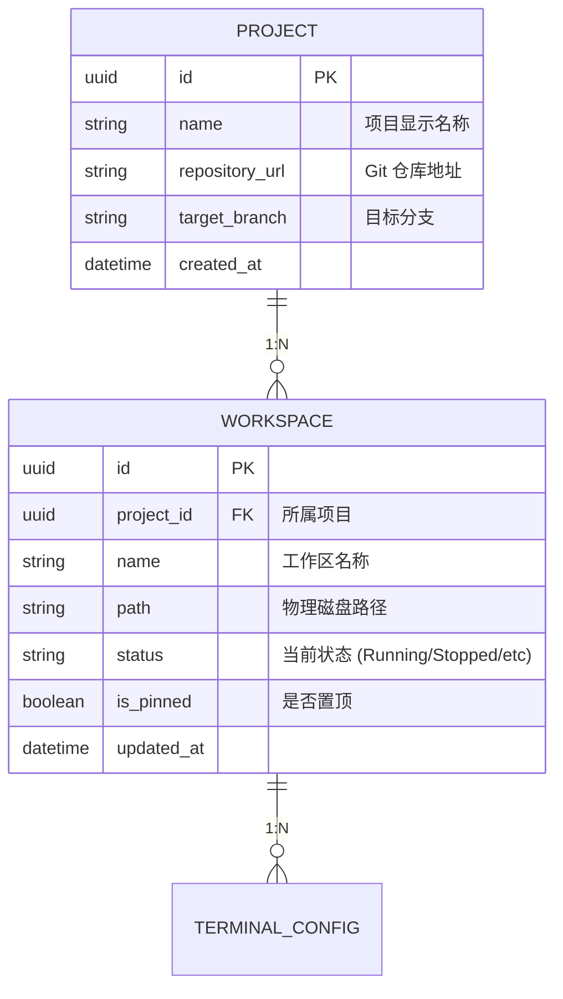

# 数据库设计与迁移

数据库模块是 Atmos 的“记忆”，负责持久化存储项目配置、工作区状态、用户偏好以及系统元数据。Atmos 采用了 Rust 生态中领先的异步 ORM 框架 **SeaORM**，构建了一套类型安全、易于扩展且支持多数据库后端的存储层。本章将深入解析 Atmos 的数据建模思路、迁移管理机制以及 Repository 模式的实践。

## 数据建模：实体与关系

Atmos 的核心业务逻辑围绕着“项目”与“工作区”展开。我们的数据库设计旨在反映这种层级关系，同时保持查询的高效性。

### 核心实体关系图 (ERD)



### 关键设计决策
1. **UUID 作为主键**: 确保了在分布式环境或未来可能的数据库迁移中，主键的全局唯一性。
2. **状态枚举存储**: 工作区状态以字符串形式存储，兼顾了可读性和未来的可扩展性。
3. **软归档机制**: 通过 `is_archived` 字段实现逻辑删除，确保用户数据在误操作后仍可恢复。

## 技术选型：SeaORM 的深度集成

SeaORM 为 Atmos 提供了以下核心能力：

- **异步优先**: 基于 `sqlx`，完美适配 Atmos 的异步架构，不会阻塞 Tokio 线程池。
- **类型安全**: 实体定义即 Schema，编译期即可发现 SQL 逻辑错误。
- **自动迁移**: 强大的迁移工具链，确保开发环境与生产环境的数据库模式始终同步。

### 数据库连接池管理
Atmos 在 `crates/infra/src/db/connection.rs` 中管理连接池。我们针对 SQLite 进行了特殊优化（如开启 WAL 模式），以提升并发读写性能。

## 迁移管理 (Migrations)

Atmos 的数据库模式演进是版本化的。所有的变更都记录在 `crates/infra/src/db/migration/` 中。

### 迁移执行流程
1. **启动检测**: 服务启动时，`MigrationExecutor` 会自动检查 `sea_ini_migration` 表。
2. **顺序执行**: 按照时间戳顺序执行尚未应用的迁移脚本。
3. **原子性**: 每个迁移都在事务中运行，确保模式变更要么全部成功，要么全部回滚。

## Repository 模式：解耦数据访问

为了防止业务逻辑（Core Service）直接依赖于具体的 ORM 代码，我们引入了 Repository 模式。

### 接口与实现分离
- **Trait 定义**: 在 `core-service` 或 `infra` 中定义数据访问接口（如 `WorkspaceRepo`）。
- **具体实现**: 在 `infra/src/db/repo/` 中使用 SeaORM 实现这些接口。

```rust
// 示例：Repository 接口
#[async_trait]
pub trait WorkspaceRepo: Send + Sync {
    async fn get_by_id(&self, id: Uuid) -> Result<Option<WorkspaceModel>, Error>;
    async fn list_by_project(&self, project_id: Uuid) -> Result<Vec<WorkspaceModel>, Error>;
}
```

## 关键源码分析

| 文件路径 | 核心职责 |
|:---|:---|
| `crates/infra/src/db/entities/` | 定义 SeaORM 实体类，对应数据库表结构。 |
| `crates/infra/src/db/migration/` | 存储所有数据库迁移脚本，定义模式演进历史。 |
| `crates/infra/src/db/repo/` | 实现具体的 Repository，封装 SeaORM 的查询逻辑。 |
| `crates/infra/src/db/connection.rs` | 负责数据库连接池的初始化与配置。 |
| `crates/infra/src/db/mod.rs` | 数据库模块的入口，提供初始化接口。 |

## 总结

Atmos 的数据库层设计不仅关注当前的存储需求，更前瞻性地考虑了系统的可扩展性和可维护性。通过 SeaORM 的强类型保障和 Repository 模式的解耦，我们构建了一个既稳固又灵活的数据基石，支撑起 Atmos 复杂的业务逻辑。

## 下一步建议

- **[工作区生命周期](../../deep-dive/core-service/workspace.md)**: 了解业务层如何通过数据库管理状态。
- **[WebSocket 系统设计](../websocket.md)**: 探索数据库变更如何触发实时推送。
- **[架构概览](../../getting-started/architecture.md)**: 查看基础设施层在整体系统中的位置。
- **[安装与配置](../../getting-started/installation.md)**: 了解如何配置数据库连接。
