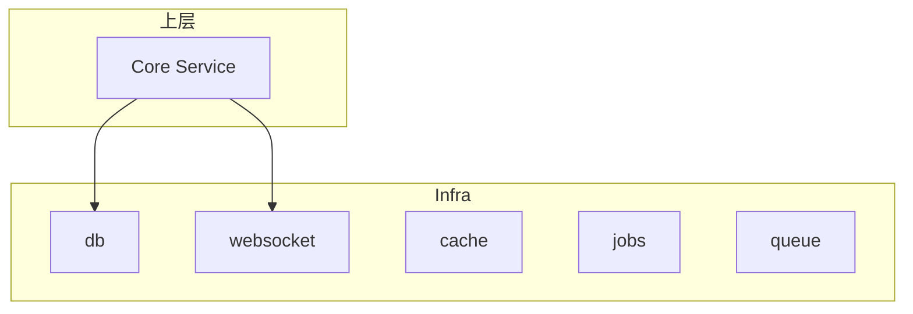
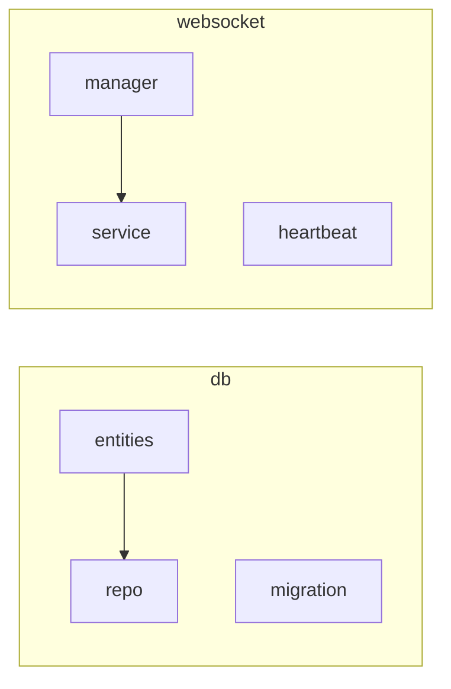

# 基础设施层

基础设施层（L1）是 ATMOS 的数据与通信基石，负责数据库访问、WebSocket 连接管理、缓存与队列预留。本文概述 L1 的职责、模块划分及与上层的协作方式。

## Overview

L1 对应 `crates/infra`，包含 `db`（SeaORM 实体与仓库）、`websocket`（连接管理、心跳、消息路由）、`cache`、`jobs`、`queue` 等模块。L3 通过 Repo 调用 DB，通过 `WsManager`/`WsService` 进行实时通信，不直接操作底层资源。

## Architecture

## 模块职责

| 模块 | 职责 |
|------|------|
| `db` | SeaORM 连接、实体、仓库、迁移 |
| `websocket` | WsManager 连接注册、消息投递、心跳检测 |
| `cache` | 预留缓存接口 |
| `jobs`/`queue` | 预留异步任务与队列 |

## Key Source Files

| File | Purpose |
|------|---------|
| `crates/infra/src/lib.rs` | 模块导出与公共 API |
| `crates/infra/src/db/mod.rs` | DB 子模块 |
| `crates/infra/src/websocket/mod.rs` | WebSocket 子模块 |

## Next Steps

- **[数据库与 ORM](database.md)** — SeaORM 与仓库模式
- **[WebSocket 服务](websocket.md)** — 连接管理与消息路由
