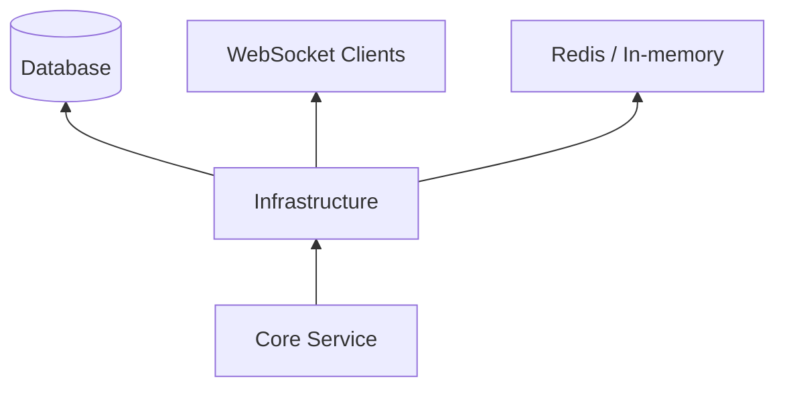

# 基础设施与 WebSocket

`infra` 层为整个 Atmos 项目提供底层的技术支撑，包括数据持久化、实时通信和异步任务调度。

## 模块目标

- **能力支撑**: 提供高性能的 WebSocket 管理和数据库访问能力。
- **技术屏蔽**: 隐藏底层库（如 SeaORM, Tungstenite）的复杂性，为上层提供简单的接口。
- **全局共享**: 维护全局单例资源（如数据库连接池、消息总线）。

## 核心组件

本章节将深入探讨以下基础设施实现：

- **[WebSocket 系统设计](./websocket.md)**: 深入分析基于主题的消息路由、连接管理和性能优化。
- **[数据库设计与迁移](./database.md)**: 了解数据模型设计、SeaORM 集成以及模式演进策略。

## 架构位置

## 关键特性

1. **异步数据库访问**: 基于 SeaORM 构建，支持复杂的查询和自动化的迁移管理。
2. **实时消息总线**: 内部消息分发机制，支持业务层轻松推送数据到前端。
3. **可扩展性**: 接口设计考虑了未来从 SQLite 迁移到 PostgreSQL 等更强大数据库的可能性。

## 下一步

- 深入分析实时通信：**[WebSocket 系统设计](./websocket.md)**。
- 了解数据存储方案：**[数据库设计与迁移](./database.md)**。
