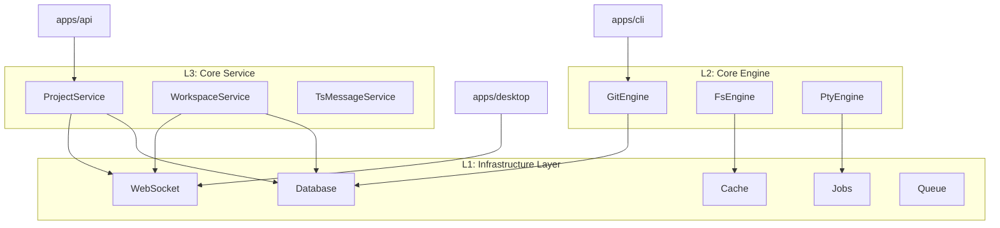
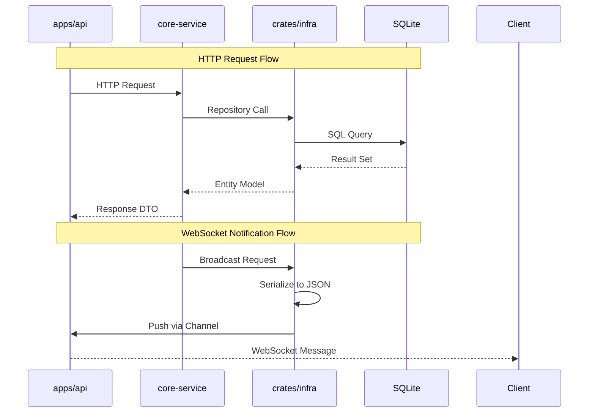

The Infrastructure Layer (L1) serves as the foundation for ATMOS's three-tier backend architecture. It provides the essential building blocks that the Core Engine (L2) and Core Service (L3) layers depend on, handling data persistence, real-time communication, and cross-cutting concerns like caching and job processing.

## Overview

The Infrastructure Layer is organized as a Rust crate (`crates/infra/`) that exposes foundational services through clean, well-defined interfaces. This layer focuses purely on technical capabilities without business logic, making it reusable across different applications (API, CLI, Desktop) and maintainable independently of higher-level concerns.

### Module Structure

The Infrastructure Layer consists of six main modules:

```rust
pub mod cache;      // Caching infrastructure (TODO)
pub mod db;         // Database & ORM with SeaORM
pub mod error;      // Unified error types
pub mod jobs;       // Background job processing (TODO)
pub mod queue;      // Message queue infrastructure (TODO)
pub mod websocket;  // Real-time WebSocket communication
```

From [`crates/infra/src/lib.rs`](https://github.com/lurunrun/atmos/blob/main/crates/infra/src/lib.rs)

### Current Implementation Status

| Module | Status | Description |
|--------|--------|-------------|
| **Database** | ✅ Complete | SeaORM with SQLite, migrations, repositories |
| **WebSocket** | ✅ Complete | Connection management, heartbeat, pub/sub |
| **Error Handling** | ✅ Complete | Unified `InfraError` and `Result` types |
| **Cache** | 🚧 Planned | Redis/local caching for performance |
| **Jobs** | 🚧 Planned | Background task processing |
| **Queue** | 🚧 Planned | Async message queue for task distribution |

## Architecture

### Three-Layer Backend Design

The Infrastructure Layer sits at the base of ATMOS's three-tier backend architecture:



### Data Flow Patterns

The Infrastructure Layer supports several key data flow patterns:



## Key Components

### Database Module (`db`)

The database module provides a complete ORM layer built on SeaORM with SQLite:

- **Connection Management**: `DbConnection` handles database initialization and connection pooling
- **Entity Definitions**: Auto-generated SeaORM models for `project`, `workspace`, and `test_message`
- **Repository Pattern**: Type-safe repositories with CRUD operations
- **Migrations**: Versioned schema migrations using `sea-orm-migration`

Example usage from [`apps/api/src/main.rs`](https://github.com/lurunrun/atmos/blob/main/apps/api/src/main.rs):

```rust
let db_connection = DbConnection::new().await?;
Migrator::up(&db_connection.conn, None).await?;
let db = Arc::new(db_connection.conn.clone());

let project_service = Arc::new(ProjectService::new(Arc::clone(&db)));
```

### WebSocket Module (`websocket`)

The WebSocket module provides real-time bidirectional communication:

- **Connection Management**: `WsManager` tracks active connections with metadata
- **Heartbeat Monitoring**: Automatic cleanup of stale connections
- **Message Types**: Strongly-typed request/response messages with serde
- **Handler Trait**: Dependency injection for business logic processing

The module uses a multi-actor architecture:

```rust
pub struct WsService {
    manager: Arc<WsManager>,
    message_handler: Option<Arc<dyn WsMessageHandler>>,
    config: WsServiceConfig,
}
```

From [`crates/infra/src/websocket/service.rs`](https://github.com/lurunrun/atmos/blob/main/crates/infra/src/websocket/service.rs)

### Error Handling

Unified error handling across all infrastructure components:

```rust
#[derive(Error, Debug)]
pub enum InfraError {
    #[error("Database error: {0}")]
    Database(#[from] sea_orm::DbErr),

    #[error("WebSocket error: {0}")]
    WebSocket(#[from] tokio_tungstenite::tungstenite::Error),

    #[error("Serialization error: {0}")]
    Serialization(#[from] serde_json::Error),

    #[error("Connection not found: {0}")]
    ConnectionNotFound(String),

    #[error("Home directory not found")]
    HomeDirNotFound,
}
```

From [`crates/infra/src/error.rs`](https://github.com/lurunrun/atmos/blob/main/crates/infra/src/error.rs)

### Planned Modules

#### Cache Module
The cache module (currently a placeholder) will provide:
- Redis integration for distributed caching
- In-memory LRU cache for local operations
- Cache invalidation strategies
- TTL-based expiration

#### Jobs Module
The jobs module (currently a placeholder) will handle:
- Background task scheduling
- Job queue management
- Retry logic and failure handling
- Job status tracking

#### Queue Module
The queue module (currently a placeholder) will implement:
- Async message passing
- Work queue distribution
- Priority queues
- Dead letter queues

## Integration with Upper Layers

### Service Layer Integration

The Infrastructure Layer is consumed by the Core Service layer through dependency injection:

```rust
impl AppState {
    pub fn new(
        project_service: Arc<ProjectService>,
        workspace_service: Arc<WorkspaceService>,
        ws_message_service: Arc<WsMessageService>,
        ws_service_config: WsServiceConfig,
    ) -> Self {
        let ws_service = WsService::with_config(ws_service_config)
            .with_message_handler(ws_message_service);

        Self { ws_service: Arc::new(ws_service), ... }
    }
}
```

From [`apps/api/src/app_state.rs`](https://github.com/lurunrun/atmos/blob/main/apps/api/src/app_state.rs)

### Engine Layer Integration

The Core Engine layer uses infrastructure services for persistence:

```rust
pub struct GitEngine {
    db: Arc<DatabaseConnection>,
}

impl GitEngine {
    pub async fn commit(&self, guid: String, message: String) -> Result<()> {
        // Use database to track commit operations
        WorkspaceRepo::new(&self.db).update_branch(guid, branch).await?;
    }
}
```

### Cross-Application Usage

The same infrastructure code powers multiple applications:

- **API Server**: Long-running service with WebSocket connections
- **CLI Tool**: Direct database access for local operations
- **Desktop App**: WebSocket client for real-time updates

## Design Principles

### Separation of Concerns

The Infrastructure Layer strictly separates:
- **Technical capabilities** (how to store data, send messages)
- **Business logic** (what data to store, when to send messages)

This allows the layer to be tested independently and reused across contexts.

### Dependency Inversion

The layer uses traits to invert dependencies:

```rust
pub trait WsMessageHandler: Send + Sync {
    async fn on_connect(&self, conn_id: &str);
    async fn on_disconnect(&self, conn_id: &str);
    async fn handle_message(&self, conn_id: &str, text: &str) -> Option<String>;
}
```

From [`crates/infra/src/websocket/handler.rs`](https://github.com/lurunrun/atmos/blob/main/crates/infra/src/websocket/handler.rs)

This allows business logic to be injected from higher layers.

### Error Propagation

All errors are converted to `InfraError` and propagated using the `Result<T>` type:

```rust
pub type Result<T> = std::result::Result<T, InfraError>;
```

This provides consistent error handling across the codebase.

## Testing Strategy

The Infrastructure Layer supports comprehensive testing:

```rust
#[cfg(test)]
mod tests {
    use super::*;

    #[tokio::test]
    async fn test_ws_connection_lifecycle() {
        let manager = WsManager::new();
        let (tx, _rx) = mpsc::channel(32);

        let id = manager.register_connection(ClientType::Web, tx).await;
        assert!(manager.has_connection(&id).await);

        manager.unregister_connection(&id).await;
        assert!(!manager.has_connection(&id).await);
    }
}
```

## Performance Considerations

### Database Performance

- **Connection Pooling**: SeaORM automatically manages connection pools
- **Indexing**: Foreign keys and frequently queried columns are indexed
- **Query Optimization**: Use of `find_by_id` for primary key lookups

### WebSocket Performance

- **Channel Capacity**: 32-message buffer per connection
- **Broadcast Optimization**: Single JSON serialization for all recipients
- **Lazy Cleanup**: Expired connections removed during next operation

### Memory Management

- **Arc Usage**: Shared ownership avoids excessive cloning
- **RwLock**: Read-write locks allow concurrent reads
- **Async/Await**: Non-blocking I/O throughout

## Key Source Files

| File | Purpose | Key Types |
|------|---------|-----------|
| `crates/infra/src/lib.rs` | Public exports | Module re-exports |
| `crates/infra/src/db/mod.rs` | Database module | `DbConnection`, `Migrator` |
| `crates/infra/src/db/connection.rs` | DB connection | `DbConnection` |
| `crates/infra/src/db/entities/` | SeaORM models | `project::Model`, `workspace::Model` |
| `crates/infra/src/db/repo/` | Repositories | `ProjectRepo`, `WorkspaceRepo` |
| `crates/infra/src/websocket/mod.rs` | WebSocket module | `WsService`, `WsManager` |
| `crates/infra/src/websocket/manager.rs` | Connection manager | `WsManager` |
| `crates/infra/src/websocket/connection.rs` | Connection type | `WsConnection`, `ClientType` |
| `crates/infra/src/websocket/service.rs` | WebSocket service | `WsService` |
| `crates/infra/src/websocket/heartbeat.rs` | Heartbeat monitor | `HeartbeatMonitor` |
| `crates/infra/src/error.rs` | Error types | `InfraError`, `Result` |
| `crates/infra/src/cache/mod.rs` | Cache (TODO) | Planned |
| `crates/infra/src/jobs/mod.rs` | Jobs (TODO) | Planned |
| `crates/infra/src/queue/mod.rs` | Queue (TODO) | Planned |

## Next Steps

- **[Database & ORM](./database.md)**: Deep dive into SeaORM setup, entity design, and repository patterns
- **[WebSocket Service](./websocket.md)**: Explore real-time communication architecture and message handling
- **[Core Engine Deep Dive](../core-engine/)**: How Git, Filesystem, and PTY engines use infrastructure
- **[Core Service Deep Dive](../core-service/)**: Business logic layer built on infrastructure
