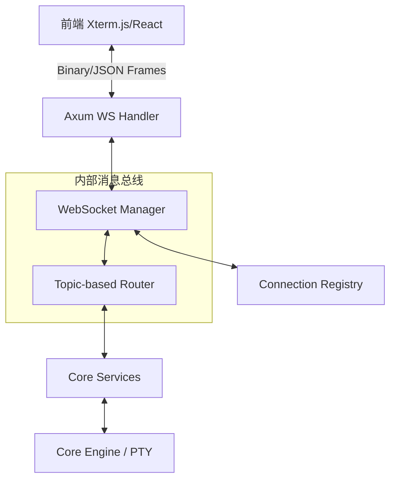
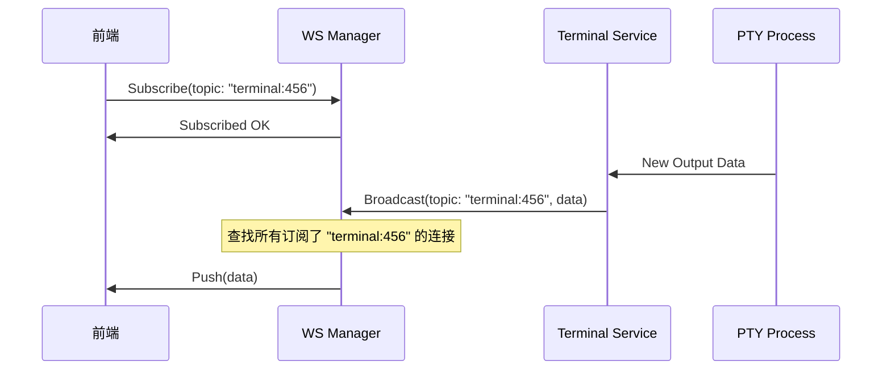

# WebSocket 系统设计

WebSocket 系统是 Atmos 的神经系统，负责在分布式组件（前端、API、业务服务、底层引擎）之间传递实时信息。由于 Atmos 本质上是一个交互式平台，WebSocket 的性能和可靠性直接决定了用户感知的延迟和系统的稳定性。

## 架构设计：解耦与路由

Atmos 的 WebSocket 架构设计遵循“发布-订阅”模式，将连接管理与业务逻辑完全解耦。

### 核心组件交互图



### 组件职责详解：
- **Axum WS Handler**: 负责处理 HTTP 升级协议、握手认证以及原始字节流的读写。
- **WebSocket Manager**: 全局单例，维护所有活跃连接的生命周期。它不关心消息内容，只负责分发。
- **Connection Registry**: 存储每个连接的元数据，例如：用户 ID、当前打开的工作区 ID、已订阅的主题列表。
- **Topic Router**: 实现基于主题的消息过滤。只有订阅了特定主题（如 `terminal:123`）的连接才会收到相关的推送。

## 消息协议：高效与灵活

Atmos 使用一套混合协议来平衡灵活性和性能：

### 1. 控制消息 (JSON)
用于建立连接、订阅主题、报告错误等元操作。
```json
{
  "type": "Subscribe",
  "topic": "workspace:789",
  "request_id": "abc-123"
}
```

### 2. 数据消息 (Binary/Base64)
用于高频的终端 I/O。为了减少序列化开销，终端输出通常被封装在轻量级的二进制帧或经过优化的 JSON 负载中。

## 性能优化策略

为了支撑 IDE 级的实时体验，Atmos 在 WebSocket 层实施了多项优化：

### 1. 消息合并 (Batching)
PTY 输出往往是细碎的字符。`WebSocketManager` 会在毫秒级的时间窗口内合并输出片段，减少发送到前端的帧数量，显著降低 CPU 占用。

### 2. 异步背压控制 (Backpressure)
当某个连接的发送缓冲区堆积过多时（例如用户执行了 `cat large_file.txt`），系统会暂时停止从对应的 PTY 读取数据，防止内存溢出。

### 3. 连接池与心跳检测
- **心跳机制**: 每 30 秒发送一次 Ping 帧，确保 NAT 映射不失效，并及时清理僵尸连接。
- **快速重连**: 前端保存订阅状态，在网络抖动恢复后，自动发送恢复订阅的请求，实现无感重连。

## 订阅机制深度解析

Atmos 的订阅机制允许前端精确控制接收的数据量：



## 关键源码分析

| 文件路径 | 核心职责 |
|:---|:---|
| `crates/infra/src/websocket/manager.rs` | 实现 `WebSocketManager`，负责连接注册与消息路由 |
| `crates/infra/src/websocket/handler.rs` | 处理 Axum 的 WebSocket 升级逻辑与流转换 |
| `crates/infra/src/websocket/message.rs` | 定义全系统的 WebSocket 消息协议与序列化逻辑 |
| `crates/infra/src/websocket/connection.rs` | 封装单个 WebSocket 连接的状态与发送队列 |

## 总结

Atmos 的 WebSocket 系统通过精妙的解耦设计和极致的性能优化，为复杂的实时交互提供了坚实的基础。它不仅支撑了终端的流畅输入输出，还为整个系统的状态同步提供了可靠的通道。

## 下一步建议

- **[终端服务实现](../../deep-dive/core-service/terminal.md)**: 了解业务层如何调用此系统传输终端数据。
- **[Web 应用结构与状态管理](../../deep-dive/frontend/web-app.md)**: 探索前端如何处理接收到的 WebSocket 消息。
- **[架构概览](../../getting-started/architecture.md)**: 查看 WebSocket 在整体架构中的位置。
- **[PTY, Git 与文件系统](../../deep-dive/core-engine/fs-git.md)**: 了解数据源头的产生过程。
