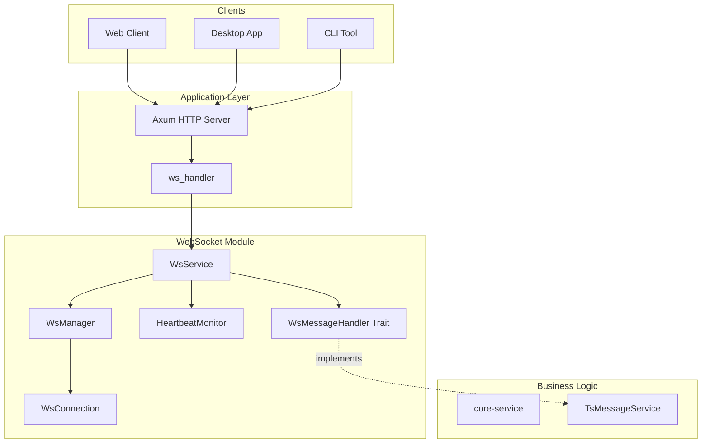
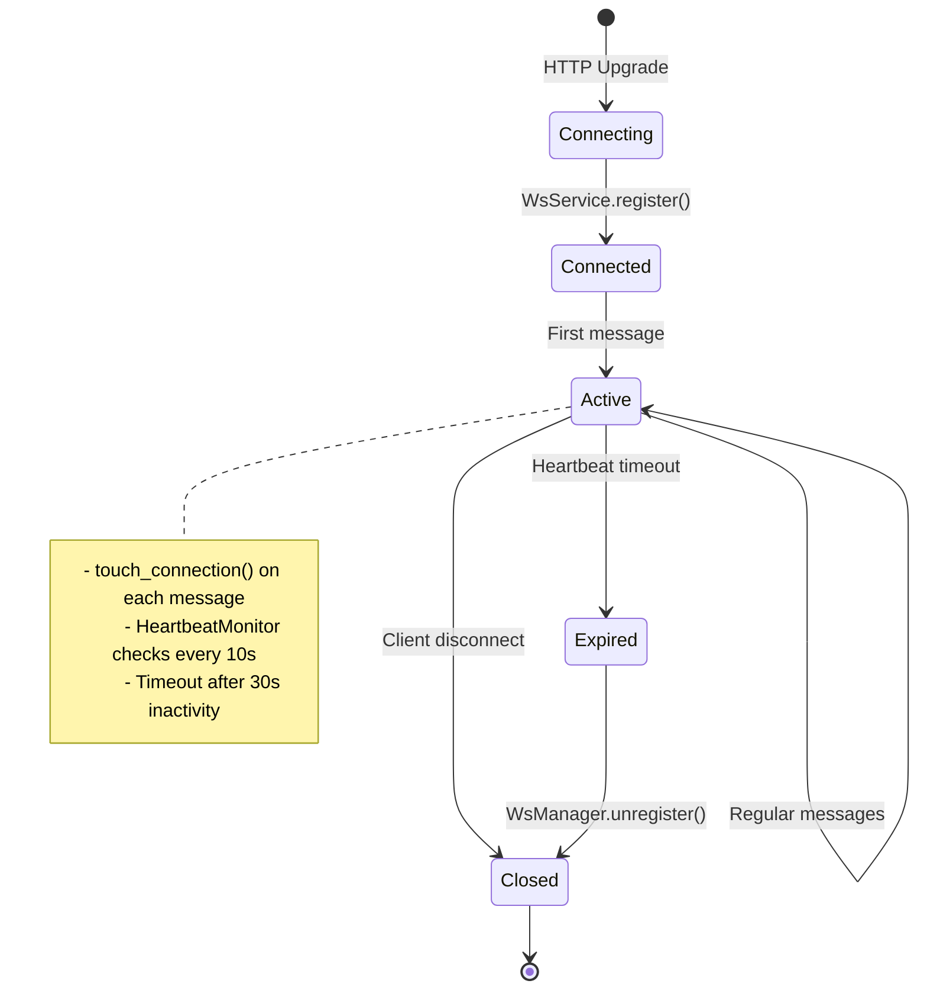
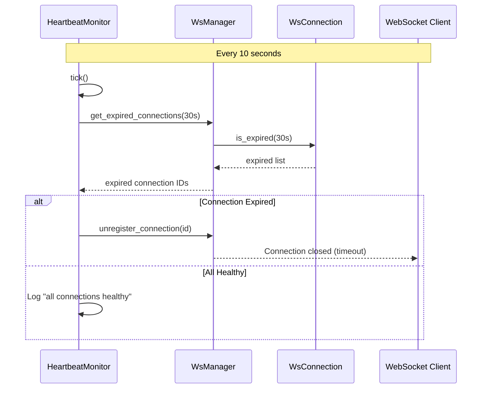
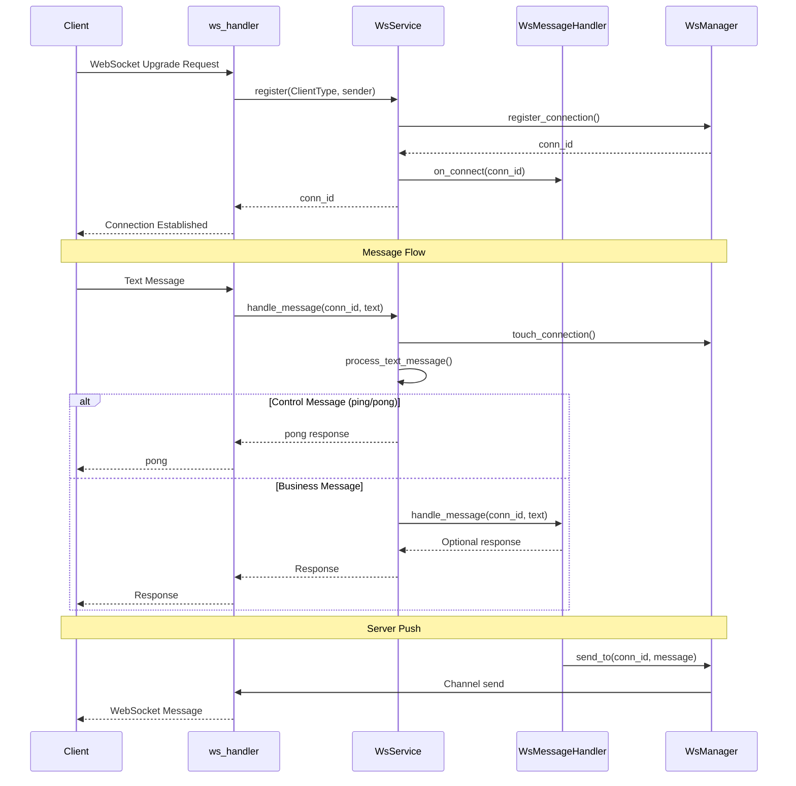

The WebSocket Service in ATMOS's Infrastructure Layer provides a robust real-time communication system built on Tokio and Axum. It handles connection lifecycle management, automatic heartbeat monitoring, and message routing through a clean dependency injection pattern that separates infrastructure concerns from business logic.

## Overview

The WebSocket module implements a production-ready real-time communication layer supporting multiple client types (Web, Desktop, CLI, Mobile) with automatic connection cleanup, typed message protocols, and flexible handler injection. It serves as the foundation for features like live terminal output, git operation progress, and collaborative state synchronization.

### Architecture



### Module Organization

```rust
pub mod connection;   // WsConnection, ClientType
pub mod error;        // WsError, WsResult
pub mod handler;      // WsMessageHandler trait
pub mod heartbeat;    // HeartbeatMonitor
pub mod manager;      // WsManager
pub mod message;      // WsMessage, request/response types
pub mod service;      // WsService
pub mod subscription; // TODO: Topic-based pub/sub
```

From [`crates/infra/src/websocket/mod.rs`](https://github.com/lurunrun/atmos/blob/main/crates/infra/src/websocket/mod.rs)

## Connection Management

### WsConnection

Each WebSocket connection is represented by a `WsConnection`:

```rust
#[derive(Debug, Clone, Copy, PartialEq, Eq)]
pub enum ClientType {
    Web,
    Desktop,
    Cli,
    Mobile,
    Unknown,
}

pub struct WsConnection {
    pub id: String,
    pub client_type: ClientType,
    sender: mpsc::Sender<String>,
    metadata: HashMap<String, String>,
    last_active: Instant,
}

impl WsConnection {
    pub fn new(client_type: ClientType, sender: mpsc::Sender<String>) -> Self {
        Self {
            id: generate_conn_id(client_type),
            client_type,
            sender,
            metadata: HashMap::new(),
            last_active: Instant::now(),
        }
    }

    pub fn touch(&mut self) {
        self.last_active = Instant::now();
    }

    pub fn is_expired(&self, timeout_secs: u64) -> bool {
        self.last_active.elapsed().as_secs() > timeout_secs
    }

    pub async fn send(&self, message: String) -> WsResult<()> {
        self.sender
            .send(message)
            .await
            .map_err(|_| WsError::ChannelClosed)
    }
}
```

From [`crates/infra/src/websocket/connection.rs`](https://github.com/lurunrun/atmos/blob/main/crates/infra/src/websocket/connection.rs)

Key features:
- **Unique IDs**: Generated as `{client_type}-{uuid}`
- **Activity Tracking**: `last_active` timestamp for heartbeat monitoring
- **Metadata**: Optional key-value storage for connection context
- **Type Safety**: Strongly-typed `ClientType` enum

### WsManager

The `WsManager` maintains the registry of active connections:

```rust
pub struct WsManager {
    connections: Arc<RwLock<HashMap<String, WsConnection>>>,
}

impl WsManager {
    pub fn new() -> Self {
        Self {
            connections: Arc::new(RwLock::new(HashMap::new())),
        }
    }

    pub async fn register_connection(
        &self,
        client_type: ClientType,
        sender: mpsc::Sender<String>,
    ) -> String {
        let connection = WsConnection::new(client_type, sender);
        let id = connection.id.clone();
        let mut connections = self.connections.write().await;
        connections.insert(id.clone(), connection);
        info!("WebSocket connection registered: {}", id);
        debug!("Total connections: {}", connections.len());
        id
    }

    pub async fn unregister_connection(&self, id: &str) -> Option<mpsc::Sender<String>> {
        let mut connections = self.connections.write().await;
        let removed = connections.remove(id);
        if let Some(ref conn) = removed {
            info!("WebSocket connection unregistered: {}", id);
            debug!("Total connections: {}", connections.len());
            return Some(conn.sender().clone());
        }
        None
    }

    pub async fn send_to(&self, id: &str, message: &WsMessage) -> WsResult<()> {
        let json = message.to_json()?;
        let connections = self.connections.read().await;

        if let Some(connection) = connections.get(id) {
            connection.send(json).await?;
            debug!("Message sent to connection: {}", id);
            Ok(())
        } else {
            warn!("Connection not found: {}", id);
            Err(WsError::ConnectionNotFound(id.to_string()))
        }
    }

    pub async fn broadcast(&self, message: &WsMessage) -> WsResult<()> {
        let json = message.to_json()?;
        self.broadcast_raw(json).await
    }

    pub async fn broadcast_except(&self, exclude_id: &str, message: &WsMessage) -> WsResult<()> {
        let json = message.to_json()?;
        self.broadcast_except_raw(exclude_id, json).await
    }

    pub async fn touch_connection(&self, id: &str) {
        let mut connections = self.connections.write().await;
        if let Some(conn) = connections.get_mut(id) {
            conn.touch();
            debug!("Connection {} touched", id);
        }
    }

    pub async fn get_expired_connections(&self, timeout_secs: u64) -> Vec<String> {
        let connections = self.connections.read().await;
        connections
            .iter()
            .filter(|(_, conn)| conn.is_expired(timeout_secs))
            .map(|(id, _)| id.clone())
            .collect()
    }
}
```

From [`crates/infra/src/websocket/manager.rs`](https://github.com/lurunrun/atmos/blob/main/crates/infra/src/websocket/manager.rs)

### Connection Lifecycle



## Heartbeat Monitoring

### HeartbeatMonitor

Automatic connection health monitoring:

```rust
pub const DEFAULT_CHECK_INTERVAL_SECS: u64 = 10;
pub const DEFAULT_TIMEOUT_SECS: u64 = 30;

pub struct HeartbeatMonitor {
    ws_manager: Arc<WsManager>,
    check_interval: Duration,
    timeout_secs: u64,
    shutdown_tx: broadcast::Sender<()>,
}

impl HeartbeatMonitor {
    pub fn new(ws_manager: Arc<WsManager>) -> Self {
        let (shutdown_tx, _) = broadcast::channel(1);
        Self {
            ws_manager,
            check_interval: Duration::from_secs(DEFAULT_CHECK_INTERVAL_SECS),
            timeout_secs: DEFAULT_TIMEOUT_SECS,
            shutdown_tx,
        }
    }

    pub fn start(self: Arc<Self>) -> tokio::task::JoinHandle<()> {
        let monitor = Arc::clone(&self);
        let mut shutdown_rx = self.shutdown_tx.subscribe();

        tokio::spawn(async move {
            info!(
                "Heartbeat monitor started (interval: {:?}, timeout: {}s)",
                monitor.check_interval, monitor.timeout_secs
            );

            let mut interval = tokio::time::interval(monitor.check_interval);

            loop {
                tokio::select! {
                    _ = interval.tick() => {
                        monitor.check_connections().await;
                    }
                    _ = shutdown_rx.recv() => {
                        info!("Heartbeat monitor shutting down");
                        break;
                    }
                }
            }
        })
    }

    async fn check_connections(&self) {
        let expired_ids = self
            .ws_manager
            .get_expired_connections(self.timeout_secs)
            .await;

        if expired_ids.is_empty() {
            debug!("Heartbeat check: all connections healthy");
            return;
        }

        for id in expired_ids {
            warn!(
                "Connection {} expired (no activity for {}s), closing",
                id, self.timeout_secs
            );
            self.ws_manager.unregister_connection(&id).await;
        }
    }
}
```

From [`crates/infra/src/websocket/heartbeat.rs`](https://github.com/lurunrun/atmos/blob/main/crates/infra/src/websocket/heartbeat.rs)

### Heartbeat Flow



## WsService

The `WsService` is the main entry point for WebSocket management:

```rust
#[derive(Clone)]
pub struct WsServiceConfig {
    pub heartbeat_interval_secs: u64,
    pub connection_timeout_secs: u64,
}

impl Default for WsServiceConfig {
    fn default() -> Self {
        Self {
            heartbeat_interval_secs: 10,
            connection_timeout_secs: 30,
        }
    }
}

pub struct WsService {
    manager: Arc<WsManager>,
    message_handler: Option<Arc<dyn WsMessageHandler>>,
    config: WsServiceConfig,
}

impl WsService {
    pub fn new() -> Self {
        Self {
            manager: Arc::new(WsManager::new()),
            message_handler: None,
            config: WsServiceConfig::default(),
        }
    }

    pub fn with_config(config: WsServiceConfig) -> Self {
        Self {
            manager: Arc::new(WsManager::new()),
            message_handler: None,
            config,
        }
    }

    /// Inject a message handler for business logic
    pub fn with_message_handler(mut self, handler: Arc<dyn WsMessageHandler>) -> Self {
        self.message_handler = Some(handler);
        self
    }

    pub fn manager(&self) -> Arc<WsManager> {
        Arc::clone(&self.manager)
    }

    pub fn start_heartbeat(self: &Arc<Self>) -> tokio::task::JoinHandle<()> {
        let service = Arc::clone(self);
        let interval = Duration::from_secs(service.config.heartbeat_interval_secs);
        let timeout = service.config.connection_timeout_secs;

        tokio::spawn(async move {
            info!(
                "Heartbeat monitor started (interval: {:?}, timeout: {}s)",
                interval, timeout
            );

            let mut tick = tokio::time::interval(interval);

            loop {
                tick.tick().await;
                let expired = service.manager.get_expired_connections(timeout).await;

                if expired.is_empty() {
                    debug!("Heartbeat check: all connections healthy");
                } else {
                    for id in expired {
                        warn!(
                            "Connection {} expired (no activity for {}s), closing",
                            id, timeout
                        );
                        service.manager.unregister_connection(&id).await;
                    }
                }
            }
        })
    }

    pub async fn register(&self, client_type: ClientType, sender: mpsc::Sender<String>) -> String {
        let conn_id = self.manager.register_connection(client_type, sender).await;

        if let Some(handler) = &self.message_handler {
            handler.on_connect(&conn_id).await;
        }

        conn_id
    }

    pub async fn unregister(&self, conn_id: &str) {
        if let Some(handler) = &self.message_handler {
            handler.on_disconnect(conn_id).await;
        }

        self.manager.unregister_connection(conn_id).await;
    }

    pub async fn handle_message(&self, conn_id: &str, text: &str) -> Option<String> {
        self.manager.touch_connection(conn_id).await;

        match process_text_message(text, conn_id) {
            HandleResult::Reply(response) => Some(response),
            HandleResult::Close => None,
            HandleResult::None => {
                if let Some(handler) = &self.message_handler {
                    handler.handle_message(conn_id, text).await
                } else {
                    warn!("No message handler configured, ignoring business message");
                    None
                }
            }
        }
    }

    pub async fn send_to(&self, conn_id: &str, message: &str) -> Result<(), String> {
        self.manager
            .send_raw(conn_id, message.to_string())
            .await
            .map_err(|e| e.to_string())
    }

    pub async fn broadcast(&self, message: &str) -> Result<(), String> {
        self.manager
            .broadcast_raw(message.to_string())
            .await
            .map_err(|e| e.to_string())
    }

    pub async fn broadcast_except(&self, exclude_id: &str, message: &str) -> Result<(), String> {
        self.manager
            .broadcast_except_raw(exclude_id, message.to_string())
            .await
            .map_err(|e| e.to_string())
    }
}
```

From [`crates/infra/src/websocket/service.rs`](https://github.com/lurunrun/atmos/blob/main/crates/infra/src/websocket/service.rs)

## Message Handler Pattern

### WsMessageHandler Trait

Business logic is injected through the `WsMessageHandler` trait:

```rust
#[async_trait]
pub trait WsMessageHandler: Send + Sync {
    async fn on_connect(&self, conn_id: &str);
    async fn on_disconnect(&self, conn_id: &str);
    async fn handle_message(&self, conn_id: &str, text: &str) -> Option<String>;
}
```

This dependency inversion pattern allows the infrastructure layer to remain independent of business logic.

### Implementation in Core Service

The `WsMessageService` in `core-service` implements this trait:

```rust
pub struct WsMessageService {
    project_service: Arc<ProjectService>,
    workspace_service: Arc<WorkspaceService>,
    ws_manager: Option<Arc<WsManager>>,
}

#[async_trait]
impl WsMessageHandler for WsMessageService {
    async fn on_connect(&self, conn_id: &str) {
        info!("[WsMessageService] Client connected: {}", conn_id);
    }

    async fn on_disconnect(&self, conn_id: &str) {
        info!("[WsMessageService] Client disconnected: {}", conn_id);
    }

    async fn handle_message(&self, conn_id: &str, text: &str) -> Option<String> {
        match parse_ws_action(text) {
            Ok(WsAction::ProjectCreate) => {
                let req: ProjectCreateRequest = serde_json::from_str(text).ok()?;
                self.handle_project_create(conn_id, req).await
            }
            Ok(WsAction::WorkspaceCreate) => {
                let req: WorkspaceCreateRequest = serde_json::from_str(text).ok()?;
                self.handle_workspace_create(conn_id, req).await
            }
            // ... more actions
            _ => None,
        }
    }
}
```

## Axum Integration

### HTTP Upgrade Handler

The API layer handles the WebSocket upgrade:

```rust
#[derive(Debug, Deserialize)]
pub struct WsQueryParams {
    #[serde(default = "default_client_type")]
    pub client_type: String,
}

pub async fn ws_handler(
    ws: WebSocketUpgrade,
    Query(params): Query<WsQueryParams>,
    State(state): State<AppState>,
) -> Response {
    let client_type = ClientType::from_str(&params.client_type);
    ws.on_upgrade(move |socket| handle_socket(socket, state, client_type))
}

async fn handle_socket(socket: WebSocket, state: AppState, client_type: ClientType) {
    let (mut sender, mut receiver) = socket.split();

    let (tx, mut rx) = mpsc::channel::<String>(32);

    let conn_id = state.ws_service.register(client_type, tx.clone()).await;
    tracing::info!("WebSocket connection established: {}", conn_id);

    // Task: Forward messages from channel to WebSocket
    let conn_id_send = conn_id.clone();
    let send_task = tokio::spawn(async move {
        while let Some(msg) = rx.recv().await {
            if sender.send(Message::Text(msg.into())).await.is_err() {
                tracing::warn!("Failed to send message to {}", conn_id_send);
                break;
            }
        }
    });

    // Main loop: Receive messages and delegate to WsService
    while let Some(result) = receiver.next().await {
        match result {
            Ok(msg) => {
                if !handle_incoming_message(msg, &tx, &state, &conn_id).await {
                    break;
                }
            }
            Err(e) => {
                tracing::error!("WebSocket error: {}", e);
                break;
            }
        }
    }

    push_task.abort();
    send_task.abort();
    state.ws_service.unregister(&conn_id).await;
    tracing::info!("WebSocket connection closed: {}", conn_id);
}
```

From [`apps/api/src/api/ws/handlers.rs`](https://github.com/lurunrun/atmos/blob/main/apps/api/src/api/ws/handlers.rs)

### Application State Setup

```rust
impl AppState {
    pub fn new(
        test_service: Arc<TestService>,
        project_service: Arc<ProjectService>,
        workspace_service: Arc<WorkspaceService>,
        ws_message_service: Arc<WsMessageService>,
        message_push_service: Arc<MessagePushService>,
        terminal_service: Arc<TerminalService>,
        ws_service_config: WsServiceConfig,
    ) -> Self {
        let ws_service =
            WsService::with_config(ws_service_config).with_message_handler(ws_message_service);

        Self {
            test_service,
            project_service,
            workspace_service,
            message_push_service,
            terminal_service,
            ws_service: Arc::new(ws_service),
        }
    }
}
```

From [`apps/api/src/app_state.rs`](https://github.com/lurunrun/atmos/blob/main/apps/api/src/app_state.rs)

### Main Server Initialization

```rust
let ws_config = WsServiceConfig {
    heartbeat_interval_secs: 10,
    connection_timeout_secs: 30,
};

let app_state = AppState::new(
    test_service,
    project_service,
    workspace_service,
    ws_message_service.clone(),
    message_push_service,
    terminal_service,
    ws_config,
);

ws_message_service.set_ws_manager(app_state.ws_service.manager()).map_err(|e| e.to_string())?;

let _heartbeat_task = app_state.ws_service.start_heartbeat();
info!("WebSocket service started with heartbeat (timeout: 30s)");
```

From [`apps/api/src/main.rs`](https://github.com/lurunrun/atmos/blob/main/apps/api/src/main.rs)

## Message Flow



## Error Handling

```rust
#[derive(Error, Debug)]
pub enum WsError {
    #[error("Connection not found: {0}")]
    ConnectionNotFound(String),

    #[error("Send failed: {0}")]
    SendFailed(String),

    #[error("Serialization error: {0}")]
    SerializationError(#[from] serde_json::Error),

    #[error("Channel closed")]
    ChannelClosed,
}

pub type WsResult<T> = std::result::Result<T, WsError>;
```

From [`crates/infra/src/websocket/error.rs`](https://github.com/lurunrun/atmos/blob/main/crates/infra/src/websocket/error.rs)

## Key Source Files

| File | Lines | Purpose |
|------|-------|---------|
| `crates/infra/src/websocket/mod.rs` | 40 | Public exports and module organization |
| `crates/infra/src/websocket/service.rs` | 203 | Main WsService implementation |
| `crates/infra/src/websocket/manager.rs` | 192 | Connection registry and management |
| `crates/infra/src/websocket/connection.rs` | 124 | Individual connection representation |
| `crates/infra/src/websocket/heartbeat.rs` | 110 | Automatic connection monitoring |
| `crates/infra/src/websocket/error.rs` | 19 | WebSocket-specific error types |
| `apps/api/src/api/ws/handlers.rs` | 133 | Axum HTTP upgrade handling |
| `apps/api/src/app_state.rs` | 41 | Service initialization with DI |
| `apps/api/src/main.rs` | 157 | Server bootstrap and heartbeat start |

## Performance Characteristics

- **Concurrent Connections**: `RwLock<HashMap>` allows concurrent reads
- **Message Throughput**: Channel capacity of 32 messages per connection
- **Memory Efficiency**: Single JSON serialization for broadcast
- **Graceful Degradation**: Failed connections auto-removed

## Next Steps

- **[Database & ORM](./database.md)**: Persistence for connection state
- **[Core Service Deep Dive](../core-service/)**: Business logic implementation
- **[Message Types Reference](../../reference/message-types.md)**: Complete message protocol
- **[WebSocket Protocol (RFC 6455)](https://datatracker.ietf.org/doc/html/rfc6455)**: WebSocket specification
