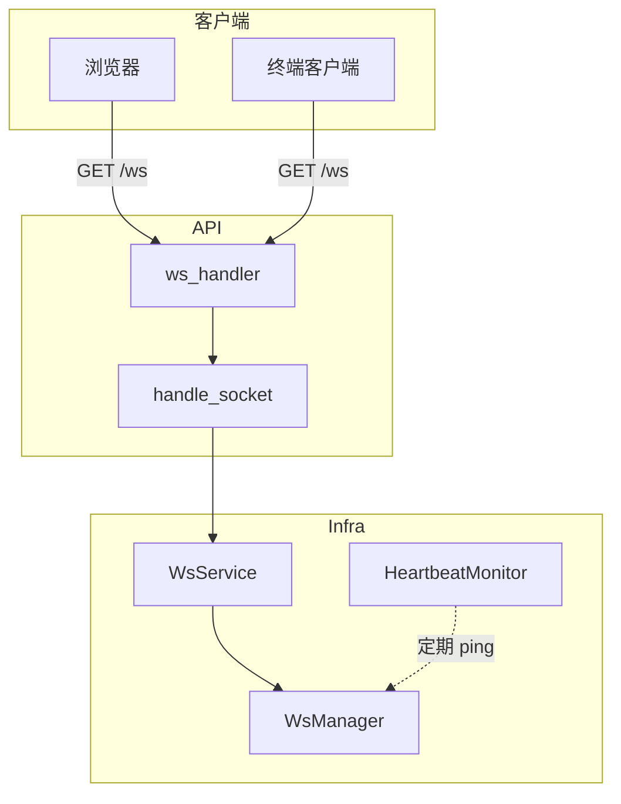
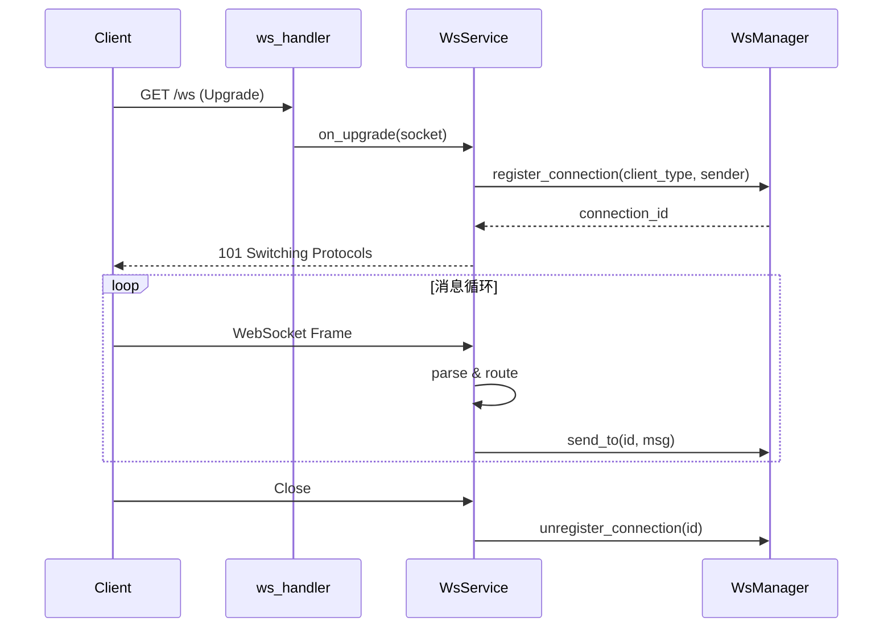
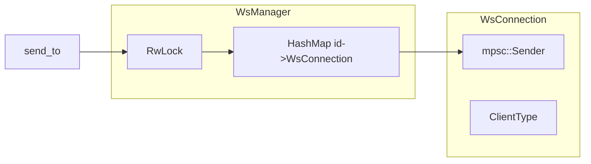

# WebSocket 服务

WebSocket 服务是 ATMOS 的实时通信 backbone，支撑终端输出、文件变更、消息推送等能力。本文介绍连接管理、心跳机制、消息路由以及与应用层的协作方式。

## Overview

WebSocket 基础设施分布在 `crates/infra/src/websocket/`，核心包括 `WsManager`（连接注册表）、`WsConnection`（单连接状态）、`WsService`（生命周期与心跳）、以及 `WsMessageHandler` trait（业务消息委托）。API 层负责 HTTP 升级与消息分发，业务逻辑由 `WsMessageService` 实现。

## Architecture

## 连接管理

`WsManager` 维护一个 `Arc<RwLock<HashMap<String, WsConnection>>>`，以 connection_id 为键。注册时创建 `WsConnection`，将 MPSC sender 存入；注销时从 map 移除并 drop sender，导致下游 forwarder 任务退出。读写锁保证：`send_to` 仅需读锁可并发，`register`/`unregister` 需写锁串行。

## 消息投递

`send_to(id, message)` 将 `WsMessage` 序列化为 JSON 后通过对应连接的 sender 发送。若连接不存在返回 `WsError::ConnectionNotFound`。支持 `broadcast` 向同类型所有连接广播。

## 心跳与超时

`WsService::start_heartbeat()` 启动后台任务，按 `heartbeat_interval_secs` 周期检查。超时未活动的连接通过 `get_expired_connections(timeout)` 获取并移除，防止僵尸连接占用资源。

## 业务消息委托

`WsMessageHandler` trait 定义 `handle_message`，由 `WsMessageService` 实现。`WsService` 收到非控制消息时调用 handler，业务逻辑与基础设施解耦。

## Key Source Files

| File | Purpose |
|------|---------|
| `crates/infra/src/websocket/manager.rs` | 连接注册、注销、send_to、broadcast |
| `crates/infra/src/websocket/connection.rs` | WsConnection 与 ClientType |
| `crates/infra/src/websocket/service.rs` | WsService、心跳、handler 注入 |
| `crates/infra/src/websocket/message.rs` | WsMessage、序列化 |
| `apps/api/src/api/ws/handlers.rs` | HTTP 升级与 socket 处理 |

## Next Steps

- **[WebSocket 处理器](../api/websocket-handlers.md)** — API 层的 WS 路由与终端桥接
- **[终端服务](../core-service/terminal.md)** — 终端如何通过 WebSocket 流式输出
