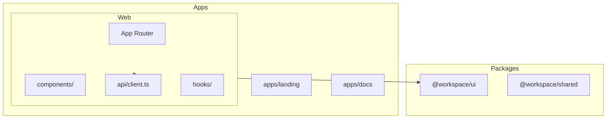

# 前端应用

## Overview

ATMOS 前端包括 `apps/web`（主 Web 工作空间）、`apps/landing`（营销页）、`apps/docs`（文档站）。通用 UI 组件来自 `@workspace/ui`（shadcn/ui）。API 交互通过 `src/api/client.ts` 和 `src/types/api.ts` 与后端 DTO 对齐。

## Architecture

## 约定

- **API 客户端**：所有网络请求使用 `src/api/client.ts`
- **类型**：`src/types/api.ts` 严格匹配 Rust DTO
- **组件**：业务组件在 `src/components/`，原子组件用 `@workspace/ui`
- **主题**：使用语义化变量（`bg-background`、`text-muted-foreground`）而非硬编码颜色

## 相关链接

- [Web 应用架构](web-app.md)
- [快速开始](../overview/quick-start.md)
- [API 入口](../api/index.md)
