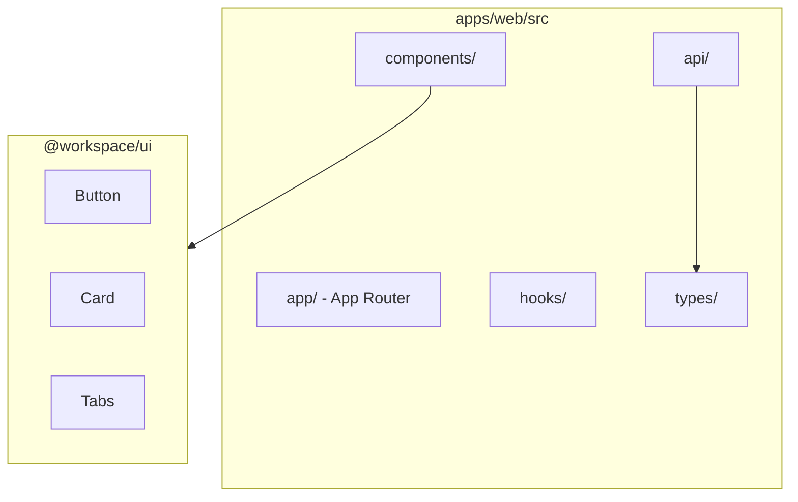

# Web 应用架构

## Overview

`apps/web` 是 ATMOS 的主 Web 工作空间应用，基于 Next.js 16 App Router。目录结构包括 `app/`（页面与布局）、`components/`（Web 专属组件）、`api/`（API 客户端）、`hooks/`（自定义 Hooks）、`types/`（TypeScript 定义）。

## Architecture



## 目录结构

```
apps/web/
├── src/
│   ├── app/                 # Next.js App Router
│   ├── components/         # Web 专属 UI
│   ├── api/                # API 客户端层
│   │   └── client.ts
│   ├── hooks/              # 自定义 Hooks
│   ├── types/              # TypeScript 定义
│   │   └── api.ts
│   └── lib/                # 工具
├── public/                 # 静态资源
└── package.json
```

> **Source**: [apps/web/AGENTS.md](../../../apps/web/AGENTS.md)

## 工作模式

1. **API 调用**：通过 `client.ts` 统一发起请求
2. **类型对齐**：`types/api.ts` 与 `apps/api/src/api/dto.rs` 保持一致
3. **主题**：Light/Dark 使用语义变量，避免硬编码

## 命令

```bash
bun dev      # 开发服务器
bun build    # 生产构建
```

## 相关链接

- [前端应用索引](index.md)
- [快速开始](../overview/quick-start.md)
- [技术栈](../overview/tech-stack.md)
