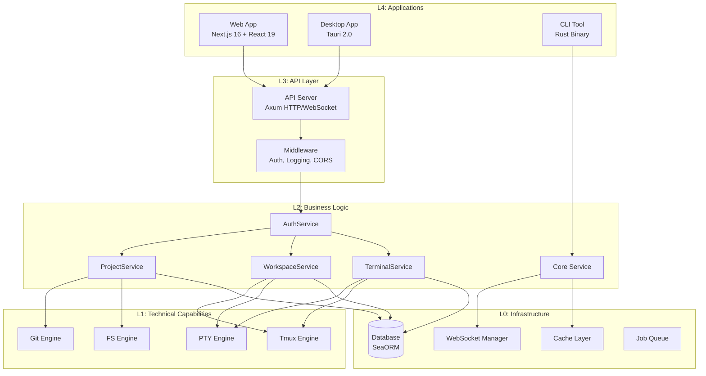
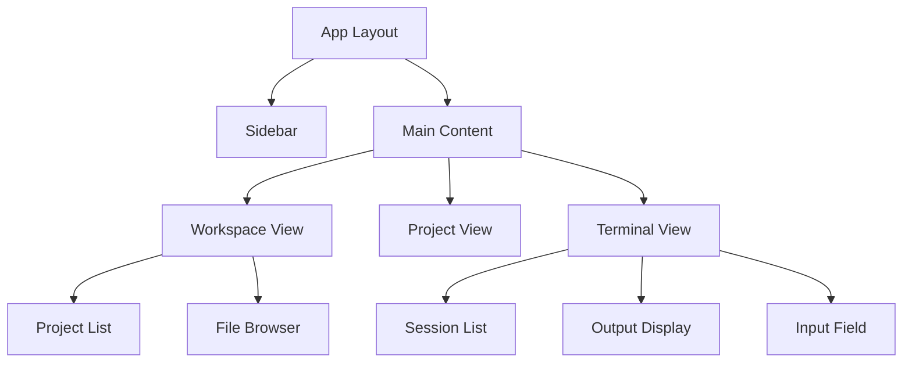
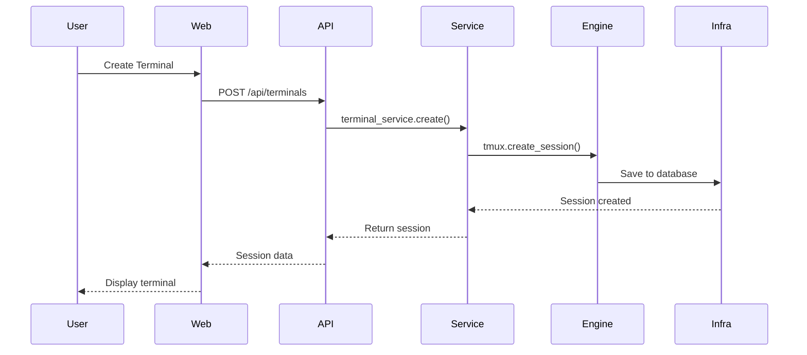
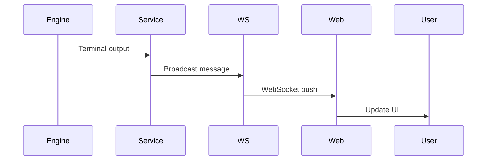
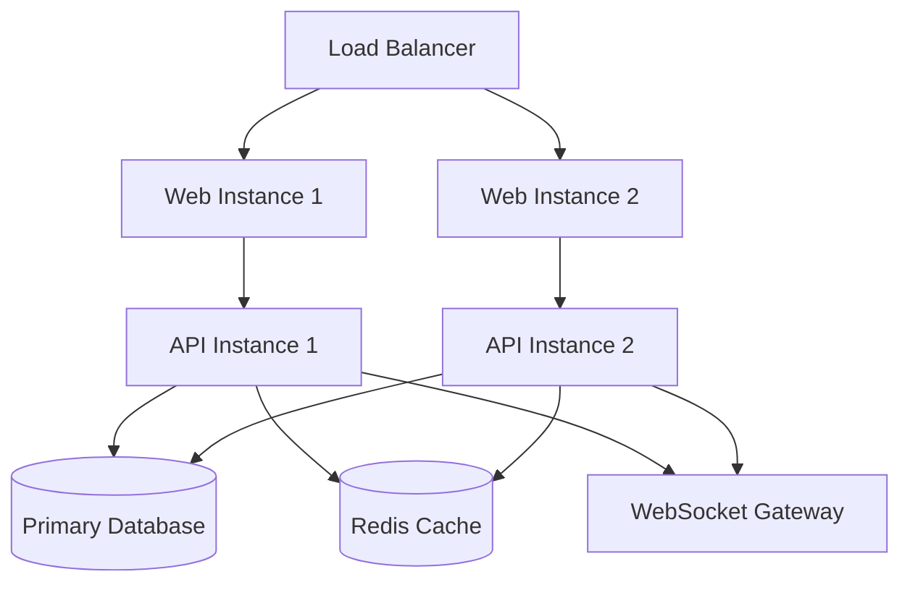

# Architecture Overview

ATMOS is built on a carefully designed layered architecture that separates concerns while maintaining high performance and flexibility. This architecture enables the system to handle persistent terminal sessions, manage multiple projects, and provide AI integration seamlessly. Understanding this architecture is key to effectively working with and extending ATMOS.

## Architectural Philosophy

The ATMOS architecture follows several core principles:

**Separation of Concerns**
Each layer has a single, well-defined responsibility and depends only on layers below it. This creates a clear dependency hierarchy and makes the codebase easier to understand and maintain.

**Performance First**
The Rust backend ensures low-latency operations for terminal I/O and file system operations, while the React frontend provides a responsive user interface with real-time updates.

**AI-Native Design**
The system is designed from the ground up to integrate with AI assistants, with structured data flows and preserved context across sessions.

**Interface Flexibility**
The core logic is interface-agnostic, supporting web, desktop, and CLI access through the same backend services.

## The Four-Layer Architecture

ATMOS is organized into four distinct layers, each building on the capabilities of the layers below:



## Layer 0: Infrastructure (L1)

**Location**: `/Users/lurunrun/own_space/OpenSource/atmos/crates/infra/`

The infrastructure layer provides the foundational services that all other layers depend on. It handles raw data persistence, connectivity, and system resources.

**Core Components:**

**Database (db/)**
- Uses SeaORM for type-safe database operations
- Entities defined in `db/entities/` inherit from `base.rs`
- Repository pattern in `db/repo/` abstracts database access
- Supports SQLite (development) and PostgreSQL (production)

```rust
// Example: Repository pattern
// crates/infra/src/db/repo/message_repo.rs
pub struct MessageRepo {
    db: Arc<DatabaseConnection>,
}

impl MessageRepo {
    pub async fn save(&self, msg: &Message) -> Result<(), RepoError> {
        // Save to database
        // ...
    }
}
```

*Source: `/Users/lurunrun/own_space/OpenSource/atmos/crates/infra/AGENTS.md`*

**WebSocket (websocket/)**
- Connection management with automatic reconnection
- Heartbeat/ping-pong for connection health
- Message routing to connected clients
- Session tracking and authentication

**System Services (cache/jobs/queue/)**
- In-memory caching layer for frequently accessed data
- Job queue for async task processing
- Future-ready infrastructure for background jobs

## Layer 1: Core Engine (L2)

**Location**: `/Users/lurunrun/own_space/OpenSource/atmos/crates/core-engine/`

The engine layer encapsulates complex technical operations into reusable modules. It provides high-level APIs over low-level system operations without business logic.

**Core Modules:**

**PTY Engine (pty/)**
- Manages pseudo-terminals for process execution
- Process pool for efficient resource utilization
- I/O handling with proper escape sequence processing
- Session lifecycle management

```rust
// Example: PTY session creation
// crates/core-engine/src/pty/mod.rs
pub struct PtySession {
    id: SessionId,
    process: Child,
}

impl PtySession {
    pub fn write(&mut self, data: &[u8]) -> Result<(), PtyError> {
        self.process.stdin.write_all(data)
    }
}
```

*Source: `/Users/lurunrun/own_space/OpenSource/atmos/crates/core-engine/AGENTS.md`*

**Git Engine (git/)**
- Wrappers for git operations (clone, commit, checkout)
- Worktree management for multi-branch development
- Status and diff operations
- Remote repository handling

**Tmux Engine (tmux/)**
- Session creation and attachment
- Window and pane management
- Output capture and streaming
- Socket-based communication

**File System Engine (fs/)**
- File watching with debouncing
- Specialized I/O operations
- Directory traversal and indexing
- Permission handling

## Layer 2: Core Service (L3)

**Location**: `/Users/lurunrun/own_space/OpenSource/atmos/crates/core-service/`

The service layer implements business logic and domain rules by orchestrating engines and infrastructure. This is where the actual product features live.

**Key Services:**

**AuthService**
- User authentication and session management
- Token generation and validation
- Permission checking
- Integration with external auth providers

**ProjectService**
- Project CRUD operations
- Git repository management
- Worktree creation and cleanup
- Project metadata management

```rust
// Example: Service orchestration
// crates/core-service/src/project_service.rs
pub struct ProjectService {
    git_engine: Arc<GitEngine>,
    fs_engine: Arc<FsEngine>,
    project_repo: Arc<ProjectRepo>,
}

impl ProjectService {
    pub async fn create_project(&self, spec: ProjectSpec) -> Result<Project, ServiceError> {
        // 1. Clone repository via git engine
        let repo = self.git_engine.clone(&spec.url).await?;

        // 2. Index files via fs engine
        let files = self.fs_engine.index(&repo.path).await?;

        // 3. Save to database via repo
        let project = self.project_repo.create(spec).await?;

        Ok(project)
    }
}
```

*Source: `/Users/lurunrun/own_space/OpenSource/atmos/crates/core-service/AGENTS.md`*

**WorkspaceService**
- Workspace lifecycle management
- Project grouping and organization
- Terminal session orchestration
- Resource allocation and cleanup

**TerminalService**
- Terminal session creation and management
- Output streaming and buffering
- Session persistence and recovery
- Integration with Tmux and PTY engines

**WsMessageService**
- WebSocket message processing
- Business logic for real-time updates
- Event routing and handling
- Logging and audit trail

**MessagePushService**
- Manages latest message state
- Push notifications via WebSocket
- Thread-safe state management with Arc<RwLock<>>

## Layer 3: API Layer

**Location**: `/Users/lurunrun/own_space/OpenSource/atmos/apps/api/`

The API layer exposes backend services to external clients via HTTP and WebSocket protocols.

**Core Components:**

**HTTP Server (Axum)**
- RESTful API endpoints
- JSON request/response handling
- Middleware pipeline (auth, logging, CORS)
- Error handling and response formatting

```rust
// Example: API handler
// apps/api/src/api/project.rs
pub async fn create_project(
    State(state): State<AppState>,
    Json(req): Json<CreateProjectReq>,
) -> Result<Json<Project>, ApiError> {
    // Call service layer
    let project = state.project_service
        .create_project(req.into())
        .await?;

    Ok(Json(project.into()))
}
```

*Source: `/Users/lurunrun/own_space/OpenSource/atmos/apps/api/AGENTS.md`*

**WebSocket Handler**
- Real-time bidirectional communication
- Connection authentication
- Message routing to services
- Broadcast capabilities

**DTOs (Data Transfer Objects)**
- Defined in `api/dto.rs`
- Base types for consistency (BaseReq, BasePageReq)
- From traits for type conversion
- Strict alignment with frontend types

**Middleware**
- JWT authentication
- Request logging
- CORS handling
- Error recovery

## Application Layer (L4)

**Locations**:
- Web: `/Users/lurunrun/own_space/OpenSource/atmos/apps/web/`
- Desktop: `/Users/lurunrun/own_space/OpenSource/atmos/apps/desktop/`
- CLI: `/Users/lurunrun/own_space/OpenSource/atmos/apps/cli/`

The application layer provides user interfaces to the underlying services.

**Web Application (Next.js 16 + React 19)**
- App Router for page and layout organization
- Server components for optimal performance
- Client components for interactivity
- API client layer for backend communication

```typescript
// Example: API client usage
// apps/web/src/api/client.ts
export const apiClient = {
  async createProject(spec: ProjectSpec): Promise<Project> {
    const response = await fetch('/api/projects', {
      method: 'POST',
      body: JSON.stringify(spec),
    });
    return response.json();
  }
};
```

*Source: `/Users/lurunrun/own_space/OpenSource/atmos/apps/web/AGENTS.md`*

**Desktop Application (Tauri 2.0)**
- Native window management
- System tray integration
- Local file system access
- Same web UI as the browser version

**CLI Tool (Rust)**
- Command-line interface to core services
- Scriptable operations
- Integration with shell workflows
- Direct service access without API layer

## Frontend Architecture

The frontend follows a component-based architecture with clear separation of concerns:

**Directory Structure**
```
apps/web/src/
├── app/              # Next.js App Router pages
├── components/       # React components
├── api/             # API client layer
├── types/           # TypeScript definitions
├── hooks/           # Custom React hooks
└── lib/             # Utility functions
```

**Component Hierarchy**


## Data Flow

Understanding how data flows through the system is crucial:

**User Action Flow**


**Real-time Update Flow**


## Dependency Management

**Backend (Rust Workspace)**
```toml
[workspace]
members = [
    "apps/api",
    "crates/*",
]

[workspace.dependencies]
# Shared dependency versions
serde = { version = "1.0", features = ["derive"] }
tokio = { version = "1.0", features = ["full"] }
sea-orm = { version = "1.0" }
axum = { version = "0.7" }
```

*Source: `/Users/lurunrun/own_space/OpenSource/atmos/Cargo.toml`*

**Frontend (Bun Workspace)**
```json
{
  "workspaces": ["apps/*", "packages/*"],
  "catalog": {
    "next": "16.1.2",
    "react": "19.2.3",
    "tailwindcss": "^4"
  }
}
```

*Source: `/Users/lurunrun/own_space/OpenSource/atmos/package.json`*

## Communication Protocols

**HTTP/REST API**
- Used for CRUD operations
- JSON request/response format
- Stateless authentication via JWT
- Standard REST verbs (GET, POST, PUT, DELETE)

**WebSocket**
- Real-time bidirectional communication
- Used for terminal output streaming
- Live file system updates
- Presence and collaboration features

**Direct Function Calls (CLI)**
- CLI calls services directly
- No HTTP overhead
- Ideal for scripting and automation
- Same business logic as API

## Security Architecture

**Authentication**
- JWT-based stateless authentication
- Token generation via AuthService
- Refresh token rotation
- Multi-factor authentication support

**Authorization**
- Role-based access control (RBAC)
- Resource-level permissions
- Workspace isolation
- API-level middleware enforcement

**Data Security**
- Encrypted database connections
- Secure WebSocket with WSS
- Environment-based configuration
- Secrets management

## Performance Considerations

**Backend Optimizations**
- Async I/O via Tokio runtime
- Connection pooling for database
- Efficient serialization with serde
- Minimal memory allocations

**Frontend Optimizations**
- Server Components reduce JavaScript
- Automatic code splitting via Next.js
- Image optimization and lazy loading
- Efficient re-rendering with React 19

**Caching Strategy**
- In-memory cache for frequently accessed data
- CDN for static assets
- Browser caching headers
- WebSocket connection reuse

## Scalability Architecture

The architecture supports horizontal scaling:



## Key Source Files

| File | Purpose |
|------|---------|
| `/Users/lurunrun/own_space/OpenSource/atmos/AGENTS.md` | Navigation guide for all modules |
| `/Users/lurunrun/own_space/OpenSource/atmos/Cargo.toml` | Rust workspace configuration |
| `/Users/lurunrun/own_space/OpenSource/atmos/crates/infra/AGENTS.md` | Infrastructure layer details |
| `/Users/lurunrun/own_space/OpenSource/atmos/crates/core-engine/AGENTS.md` | Engine layer details |
| `/Users/lurunrun/own_space/OpenSource/atmos/crates/core-service/AGENTS.md` | Service layer details |
| `/Users/lurunrun/own_space/OpenSource/atmos/apps/api/AGENTS.md` | API layer details |
| `/Users/lurunrun/own_space/OpenSource/atmos/apps/web/AGENTS.md` | Web app details |

## Next Steps

Now that you understand the architecture, explore:

- [Key Concepts](./key-concepts) - Learn workspaces, projects, and sessions
- [Configuration Guide](./configuration) - Customize your ATMOS setup
- [Infrastructure Deep Dive](../deep-dive/infra) - Database and WebSocket details
- [Core Engine Deep Dive](../deep-dive/core-engine) - PTY, Git, and Tmux engines

For specific implementation details, refer to each layer's AGENTS.md file for navigation and development guidelines.
