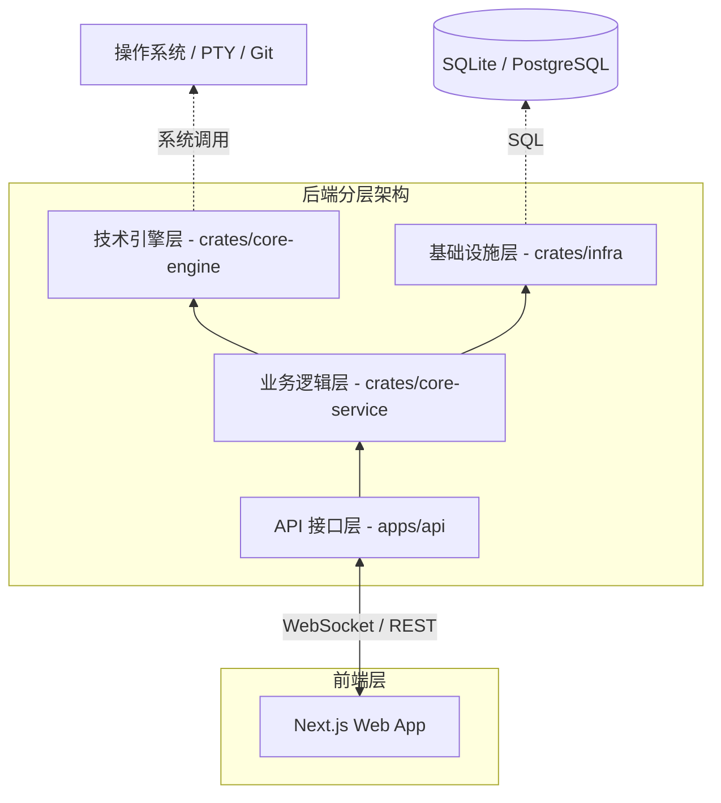
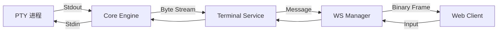

# 架构概览

Atmos 采用高度模块化的分层架构设计。这种架构不仅确保了系统的高性能和稳定性，还极大地降低了各组件之间的耦合度，使得 Atmos 能够轻松应对从简单的本地终端管理到复杂的云端开发环境编排的各种需求。

## 设计哲学：分层与解耦

Atmos 的核心设计理念是将“技术能力”与“业务逻辑”彻底分离。底层模块专注于如何与操作系统、网络和数据库进行高效交互，而上层模块则专注于如何将这些能力组合成对用户有价值的功能。

## 四层架构模型

Atmos 的后端逻辑被清晰地划分为四个层级，每一层都通过严格定义的接口与上下层通信。

### 1. API 层 (apps/api)
这是系统的最外层，直接面向前端应用。
- **核心职责**:
    - **路由分发**: 处理 HTTP RESTful 请求。
    - **实时通信**: 管理 WebSocket 连接的握手、心跳和协议解析。
    - **数据转换**: 将内部业务对象转换为前端易于消费的 DTO (Data Transfer Objects)。
    - **中间件**: 处理身份验证、日志记录和错误拦截。
- **关键组件**: `Axum` 路由器、WebSocket 处理器、请求验证器。

### 2. 业务逻辑层 (crates/core-service)
这是系统的核心，实现了所有的业务规则。
- **核心职责**:
    - **生命周期管理**: 协调工作区、项目和终端的创建、启动与销毁。
    - **流程编排**: 调用底层引擎完成复杂的复合任务（例如：初始化 Git 仓库并同时配置 PTY）。
    - **状态维护**: 确保内存中的业务状态与数据库中的持久化状态保持一致。
- **关键组件**: `WorkspaceService`, `ProjectService`, `TerminalService`。

### 3. 技术能力层 (crates/core-engine)
这一层封装了所有与操作系统直接交互的非业务逻辑。
- **核心职责**:
    - **进程管理**: 伪终端 (PTY) 的创建、信号处理和 I/O 流转发。
    - **Git 引擎**: 封装 Git 命令行或库调用，提供高层的仓库操作接口。
    - **文件系统**: 提供受控、安全的文件读写和目录遍历能力。
    - **Tmux 交互**: 管理后台持久化会话的创建与附加。
- **关键组件**: `PtyManager`, `GitExecutor`, `FsGuard`。

### 4. 基础设施层 (crates/infra)
提供全系统共享的基础设施支持。
- **核心职责**:
    - **持久化**: 数据库连接池管理、ORM 实体映射和迁移执行。
    - **消息路由**: 全局 WebSocket 消息分发器，支持主题订阅机制。
    - **缓存与队列**: 提供异步任务调度和临时数据存储。
- **关键组件**: `SeaORM` 数据库层、`WebSocketManager`、`TaskQueue`。

## 架构关系图

## 核心交互流程：以“创建并启动工作区”为例

为了更好地理解各层如何协作，我们来看一个典型业务流程的数据流向：

1. **前端 (Web)**: 用户点击“创建工作区”，发送 POST 请求到 API 层。
2. **API 层 (apps/api)**: 验证请求参数，调用 `WorkspaceService`。
3. **业务层 (core-service)**: 
    - 调用 `Infra` 层在数据库中创建记录。
    - 调用 `Engine` 层在磁盘上创建物理目录。
    - 调用 `Engine` 层执行 `git clone`（如果需要）。
4. **引擎层 (core-engine)**: 执行具体的系统指令，并向业务层返回执行结果。
5. **业务层 (core-service)**: 更新数据库状态为“就绪”，返回给 API 层。
6. **API 层 (apps/api)**: 将成功响应返回给前端。
7. **前端 (Web)**: 接收到成功响应，通过 WebSocket 订阅该工作区的状态，并请求开启终端。

## 实时数据流架构

Atmos 的实时性是通过一套精妙的流处理机制实现的：

## 关键设计决策

### 异步非阻塞 I/O
Atmos 全面拥抱 Rust 的 `async/await` 生态。无论是处理数千个并发的 WebSocket 连接，还是监控大量的终端 PTY 输出，系统都能在极低的资源占用下保持极高的响应速度。

### 类型安全的业务模型
通过在 `core-service` 中定义严格的领域模型，并在 `infra` 层使用 SeaORM 进行映射，Atmos 在编译期就能拦截大部分常见的逻辑错误和数据一致性问题。

### 插件化引擎设计
`core-engine` 的设计允许我们轻松替换底层实现。例如，我们可以从直接调用 Git 命令行切换到使用 `libgit2` 库，而无需修改任何上层业务代码。

## 总结

Atmos 的架构设计是其强大功能和卓越性能的根基。通过清晰的分层、严格的职责划分以及高效的异步流处理，Atmos 构建了一个既能深入底层操作系统、又能提供现代化 Web 体验的复杂系统。

## 下一步建议

- **[深入探索](../deep-dive/index.md)**: 详细了解每个模块的具体实现代码。
- **[核心概念](./key-concepts.md)**: 掌握 Atmos 的核心术语。
- **[项目概览](./overview.md)**: 了解 Atmos 的整体功能和价值。
- **[快速开始](./quick-start.md)**: 亲自动手运行 Atmos。
