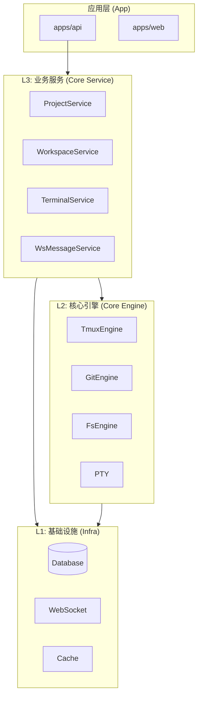
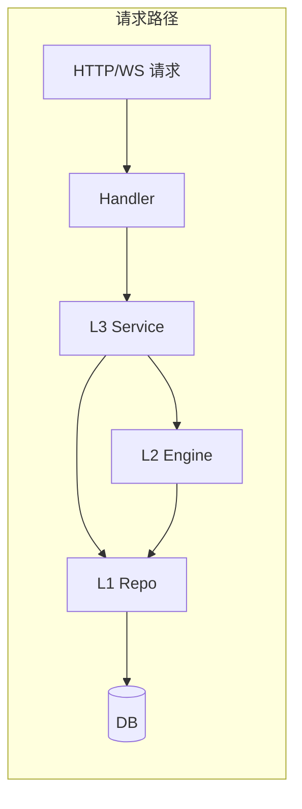
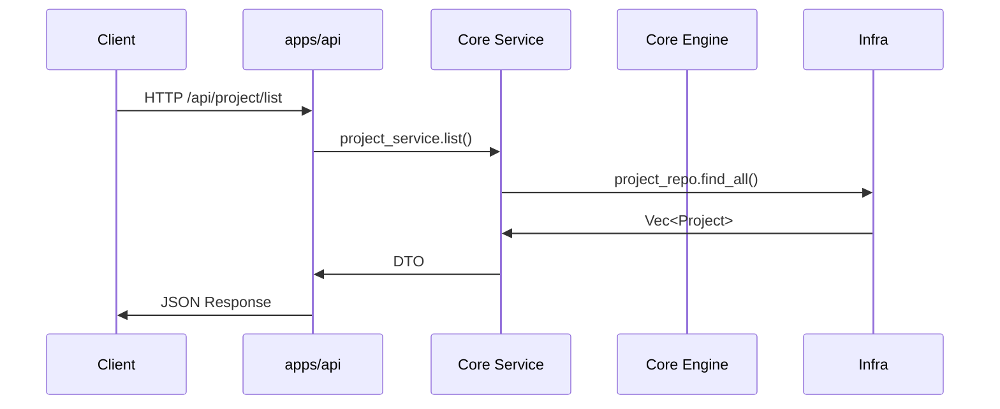

# 架构概览

本文介绍 ATMOS 的总体架构设计，包括 L1/L2/L3/App 分层、模块职责和数据流向。阅读后你将理解各层如何协作，以及请求从 API 到存储的完整路径。

## Overview

ATMOS 采用 **L1 → L2 → L3 → App** 的分层架构。L1（Infra）提供数据库、WebSocket、缓存等基础设施；L2（Core Engine）提供 PTY、Git、Tmux、文件系统等技术能力；L3（Core Service）实现业务逻辑，编排 L2 与 L1；App 层（API、Web）负责对外暴露接口与 UI。

数据流是自下而上的：App 接收请求 → L3 编排 → L2 执行技术操作 → L1 持久化或通信。

## Architecture

## 分层职责

| 层级 |  crate | 职责 |
|------|--------|------|
| L1 | infra | DB、WebSocket、缓存、队列 |
| L2 | core-engine | PTY、Git、Tmux、FS、Search |
| L3 | core-service | Project、Workspace、Terminal、WsMessage |
| App | apps/api | HTTP/WS 路由、DTO、中间件 |

## 依赖规则

- L2 不依赖 L3，L3 依赖 L2
- L3 通过 Repo 访问 L1，不直接操作 DB
- App 通过 AppState 注入 L3 服务，不直接调用 L1/L2

## Key Source Files

| File | Purpose |
|------|---------|
| `AGENTS.md` | 架构决策树与导航 |
| `crates/infra/src/lib.rs` | L1 模块导出 |
| `crates/core-engine/src/lib.rs` | L2 模块导出 |
| `crates/core-service/src/lib.rs` | L3 模块导出 |
| `apps/api/src/main.rs` | API 启动与服务装配 |

## Next Steps

- **[核心概念](key-concepts.md)** — 术语与设计模式
- **[基础设施层](../deep-dive/infra/index.md)** — L1 实现细节
- **[业务服务层](../deep-dive/core-service/index.md)** — L3 实现细节
