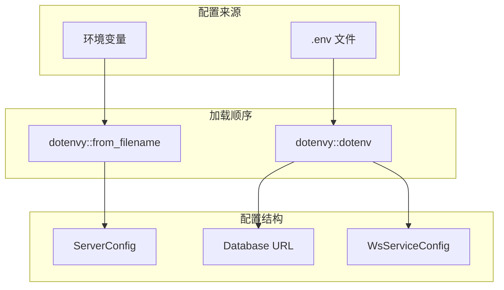

# 配置指南

本文汇总 ATMOS 中与 API 服务相关的环境变量、WebSocket 配置和 CORS 设置。配置通过环境变量加载，支持 `.env` 文件。

## Overview

API 服务（`apps/api`）从环境变量读取配置，主要包括服务器地址、数据库连接、CORS 和白名单、WebSocket 心跳等。配置在应用启动时一次性加载，运行时不可热更新。

## Architecture

## 环境变量

| 变量 | 默认 | 说明 |
|------|------|------|
| `SERVER_HOST` | `0.0.0.0` | API 监听地址 |
| `SERVER_PORT` | `8080` | API 监听端口 |
| `DATABASE_URL` | 必填 | 数据库连接串（SQLite/PostgreSQL） |
| `CORS_ORIGIN` | `*`（开发） | CORS 允许来源，生产环境必须显式配置 |
| `RUST_ENV` | - | 设为 `production` 时强制要求 CORS_ORIGIN |
| `heartbeat_interval_secs` | 10 | WebSocket 心跳间隔（秒） |
| `connection_timeout_secs` | 30 | WebSocket 连接超时（秒） |

## CORS 配置

- 开发环境：`CORS_ORIGIN` 未设置或为 `*` 时，允许任意来源
- 生产环境：`RUST_ENV=production` 时必须设置 `CORS_ORIGIN`，不能使用 `*`

## WebSocket 配置

WebSocket 心跳与超时在 `main.rs` 中通过 `WsServiceConfig` 传入，当前为硬编码：心跳 10 秒，超时 30 秒。

## Key Source Files

| File | Purpose |
|------|---------|
| `apps/api/src/config/mod.rs` | ServerConfig、CORS 逻辑 |
| `apps/api/.env.example` | 环境变量示例 |
| `crates/infra/src/websocket/service.rs` | WebSocket 服务与心跳配置 |

## Next Steps

- **[安装与配置](installation.md)** — 部署时的配置实践
- **[API 层](../deep-dive/api/index.md)** — API 路由与中间件
