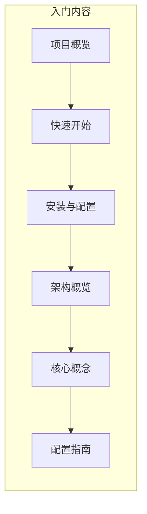
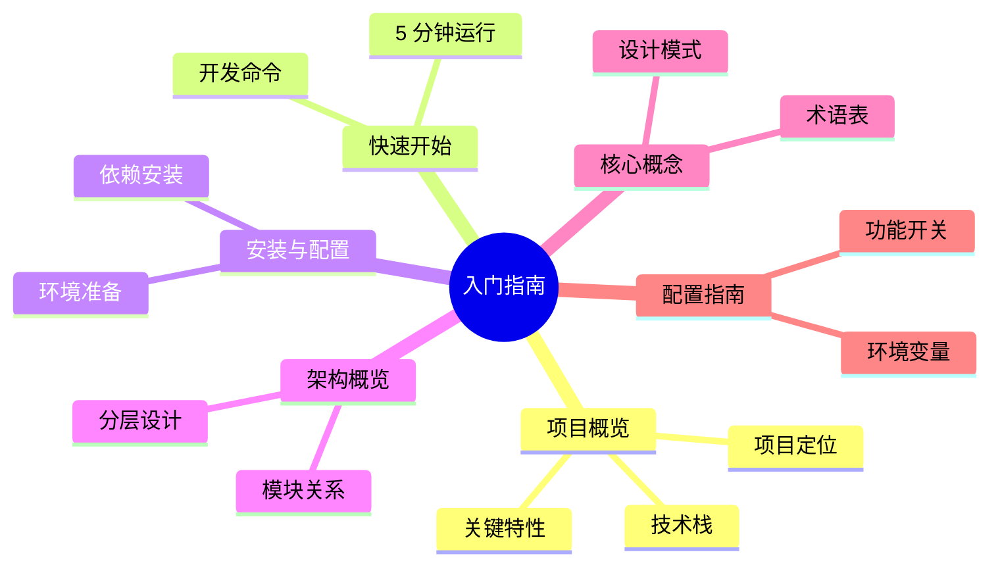

# 入门指南

欢迎来到 ATMOS（原 ATMOS）项目文档。本章节面向新用户和开发者，帮助你快速理解项目是什么、能做什么，以及如何运行它。阅读完本章节后，你将掌握项目概览、快速上手指南、安装配置、架构脉络和核心概念，为后续深入探索打好基础。

## Overview

ATMOS 是一个 **AI 优先的 Workspace 生态系统**，灵感来自 DeepMind 风格的工作流设计。项目采用单体仓库（Monorepo）架构，后端使用高性能 Rust 实现，前端使用 Next.js 16、React 19 和 Tauri 2.0，形成跨平台的 Web 与桌面应用能力。

入门指南包含六个核心文档，按阅读顺序组织：从项目概览开始，经过快速开始和详细安装，再到架构与核心概念，最后是配置说明。

## Architecture

## 文档导航

| 文档 | 内容 | 预计阅读 |
|------|------|----------|
| [项目概览](overview.md) | 项目定位、特性、技术栈 | 8 分钟 |
| [快速开始](quick-start.md) | 5 分钟内运行项目 | 6 分钟 |
| [安装与配置](installation.md) | 详细安装与故障排查 | 8 分钟 |
| [架构概览](architecture.md) | 分层架构与模块关系 | 10 分钟 |
| [核心概念](key-concepts.md) | 术语、模式与心智模型 | 7 分钟 |
| [配置指南](configuration.md) | 环境变量与配置项 | 8 分钟 |

## Next Steps

- **[项目概览](overview.md)** — 了解 ATMOS 的定位、特性和目标用户
- **[快速开始](quick-start.md)** — 在 5 分钟内运行 Web 和 API 服务
