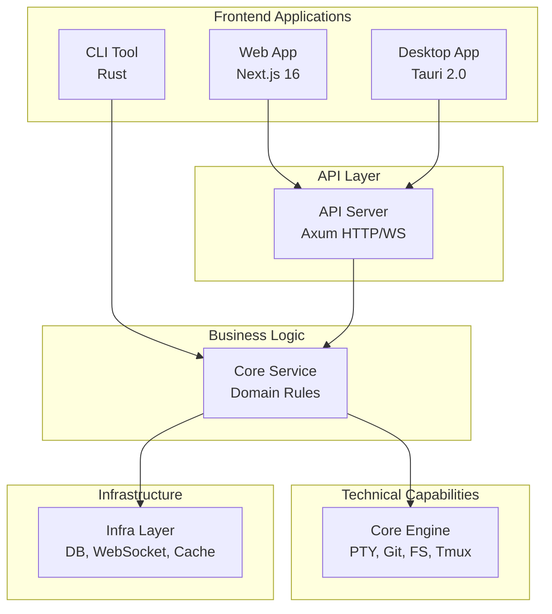

# Getting Started with ATMOS

Welcome to ATMOS, a Visual Terminal Workspace that reimagines how developers interact with their code. This AI-first workspace ecosystem combines the raw power of Rust with the flexibility of modern web technologies, creating an environment where terminal sessions, project management, and AI assistance converge into a seamless experience.

## What is ATMOS?

ATMOS is more than just a code editor or terminal multiplexer—it's a comprehensive workspace ecosystem designed for modern development workflows. At its core, ATMOS provides:

- **Persistent Terminal Sessions**: Using tmux integration, your terminal sessions survive network disconnections and system restarts
- **Multi-Project Management**: Leverage git worktrees to work on multiple branches of the same project simultaneously
- **AI-Native Architecture**: Built from the ground up to integrate with AI coding agents and assistants
- **Visual Workspace**: A modern web interface built with Next.js 16 and React 19 provides intuitive project navigation
- **High-Performance Backend**: Rust-based infrastructure ensures low-latency operations and efficient resource management

## Who Should Use ATMOS?

ATMOS is ideal for developers who:

- Work across multiple projects and branches simultaneously
- Need persistent terminal sessions for long-running processes
- Want to integrate AI assistants into their daily workflow
- Require both CLI tools and a visual interface
- Value performance and reliability in their development environment

## How to Use This Guide

The Getting Started section is designed to take you from zero to productive with ATMOS. We recommend following these articles in order:

1. **[Project Overview](./overview)** - Understand what ATMOS is and how it works
2. **[Quick Start](./quick-start)** - Get up and running in under 10 minutes
3. **[Installation & Setup](./installation)** - Detailed setup instructions for your environment
4. **[Architecture Overview](./architecture)** - Learn about ATMOS's layered design
5. **[Key Concepts](./key-concepts)** - Master the core concepts and terminology
6. **[Configuration Guide](./configuration)** - Customize ATMOS for your workflow

## Prerequisites

Before diving in, ensure you have:

- **Bun** - For managing frontend dependencies and running web applications
- **Rust** - For building and running the backend services
- **Just** - For executing development tasks via the justfile
- **Git** - For version control and worktree management
- **Tmux** - For persistent terminal sessions (optional but recommended)

## Quick Reference

Here are the essential commands you'll use frequently:

```bash
# Install dependencies
bun install

# Start development servers
just dev-web    # Launch the web interface
just dev-api    # Start the backend API
just dev-cli    # Run the CLI tool

# Build for production
just build-all  # Build all components
```

*Source: `/Users/username/projects/atmos/justfile`*

## Architecture at a Glance

ATMOS follows a **layered monorepo architecture** that separates concerns across four distinct layers:



## Project Structure

The ATMOS codebase is organized as a monorepo with clear separation of concerns:

```
atmos/
├── crates/              # Rust backend packages
│   ├── infra/          # L1: Database, WebSocket, Jobs
│   ├── core-engine/    # L2: PTY, Git, FS, Tmux
│   └── core-service/   # L3: Business logic
├── apps/               # Applications
│   ├── api/            # Rust/Axum API server
│   ├── web/            # Next.js web application
│   ├── cli/            # Rust CLI tool
│   └── desktop/        # Tauri desktop app
└── packages/           # Shared JavaScript/TypeScript
    ├── ui/             # shadcn/ui components
    └── shared/         # Utilities and hooks
```

*Source: `/Users/username/projects/atmos/AGENTS.md`*

## Next Steps

Ready to dive deeper? Continue your journey with these resources:

- [Project Overview](./overview) - Comprehensive introduction to ATMOS
- [Quick Start](./quick-start) - Get ATMOS running in minutes
- [Architecture Overview](./architecture) - Deep dive into the system design
- [Key Concepts](./key-concepts) - Understand workspaces, projects, and sessions

For technical details and agent navigation, refer to the main [AGENTS.md](https://github.com/AruNi-01/atmos/blob/main/AGENTS.md) file.
