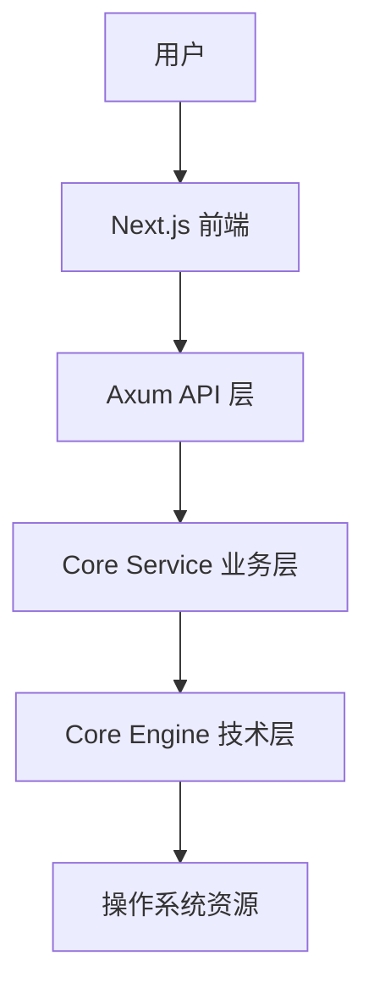

# 入门指南 (Getting Started)

欢迎来到 Atmos 官方 Wiki。本章节旨在帮助新用户和开发者快速了解 Atmos 的核心价值、安装步骤以及基本架构。

## 概览

Atmos 是一个现代化的云原生开发环境管理平台。它不仅提供了一个高性能的终端界面，还通过分层架构将底层技术能力（如 PTY、Git、Tmux）与上层业务逻辑（工作区管理、项目协作）完美结合。

## 目录

本章节包含以下内容：

- **[项目概览](./overview.md)**: 了解 Atmos 的核心功能、技术栈和适用场景。
- **[快速开始](./quick-start.md)**: 5 分钟内完成安装并启动你的第一个工作区。
- **[安装与配置](./installation.md)**: 详细的环境要求、安装指南及故障排查。
- **[架构概览](./architecture.md)**: 从高层视角审视 Atmos 的分层设计与模块交互。
- **[核心概念](./key-concepts.md)**: 掌握使用和开发 Atmos 所需的基本术语和思维模型。

## 架构图

## 下一步

如果你是第一次接触 Atmos，建议从 **[项目概览](./overview.md)** 开始阅读。
