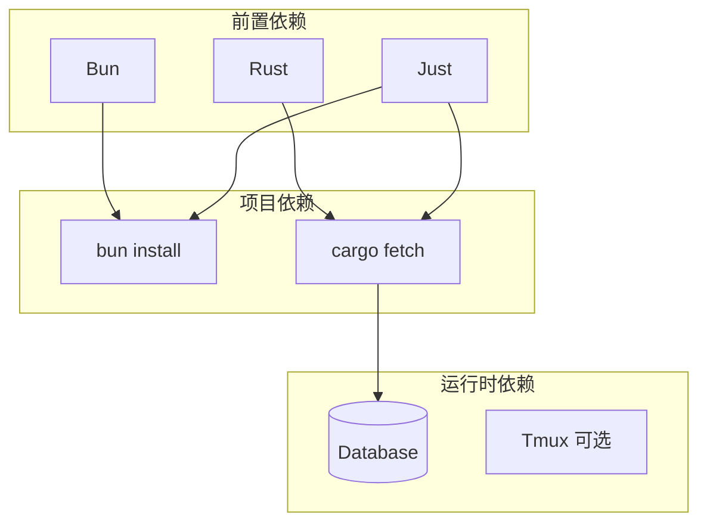

# 安装与配置

本文提供 ATMOS 的详细安装步骤、环境要求、数据库配置和常见问题排查。适用于需要在不同操作系统或环境中部署的开发者。

## Overview

ATMOS 的安装分为前端与后端两部分。前端依赖 Bun 和 Node 生态；后端依赖 Rust 工具链、数据库（如 SQLite/PostgreSQL）以及可选系统工具（如 Tmux，用于终端持久化）。API 启动时会自动执行数据库迁移，无需手动建表。

## Architecture

## 环境要求

| 组件 | 用途 |
|------|------|
| Bun | 前端包管理、脚本运行 |
| Rust (1.70+) | 后端编译 |
| Just | 任务编排 |
| SQLite 或 PostgreSQL | 默认支持 SQLite，可配置 PostgreSQL |

## 安装步骤

1. **安装 Bun**：`curl -fsSL https://bun.sh/install | bash`
2. **安装 Rust**：`curl --proto '=https' --tlsv1.2 -sSf https://sh.rustup.rs | sh`
3. **安装 Just**：`cargo install just` 或 `brew install just`
4. **克隆并进入项目**：`git clone <repo> && cd atmos`
5. **安装依赖**：`bun install` 与 `cargo fetch`
6. **配置 API**：复制 `apps/api/.env.example` 为 `apps/api/.env`，设置 `DATABASE_URL` 等
7. **启动服务**：`just dev-all` 或分别启动 `just dev-web` 与 `just dev-api`

## 故障排查

- **数据库连接失败**：检查 `DATABASE_URL` 格式与数据库进程
- **端口占用**：修改 `SERVER_PORT`（API）或 Next.js 端口（Web）
- **Tmux 未找到**：终端持久化需要 Tmux，可暂时跳过或安装 `tmux`

## Key Source Files

| File | Purpose |
|------|---------|
| `apps/api/.env.example` | 环境变量示例 |
| `crates/infra/src/db/connection.rs` | 数据库连接逻辑 |
| `justfile` | 安装与运行命令 |

## Next Steps

- **[配置指南](configuration.md)** — 所有配置项说明
- **[架构概览](architecture.md)** — 理解分层与数据流
