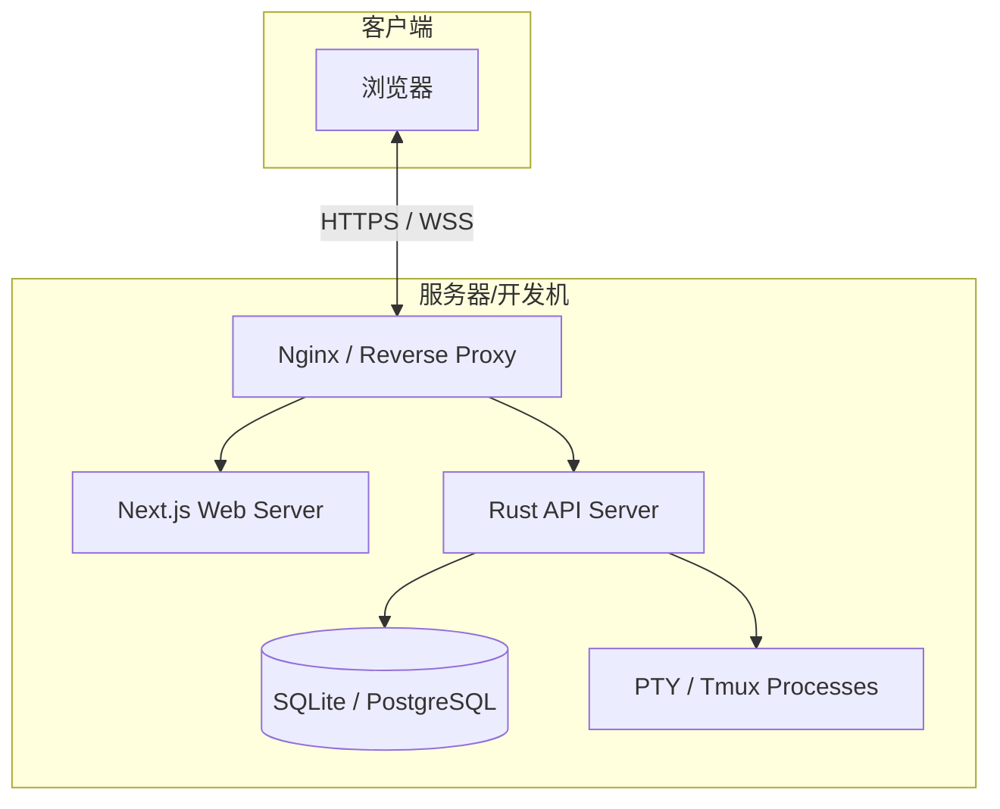

# 安装与配置

本指南旨在为不同技术背景的用户提供详尽的 Atmos 安装与配置说明。无论你是想在本地 macOS 上进行尝试，还是在 Linux 服务器上部署生产级环境，都能在这里找到所需的指引。

## 系统环境要求

在安装 Atmos 之前，请确保你的系统满足以下最低要求：

### 1. 硬件建议
- **CPU**: 2 核或更多 (推荐 4 核以获得流畅的编译和终端体验)。
- **内存**: 4GB RAM (推荐 8GB+，尤其是运行大型项目时)。
- **磁盘**: 至少 1GB 可用空间用于安装，另需空间存储你的开发项目。

### 2. 操作系统支持
- **macOS**: 12.0 (Monterey) 或更高版本。
- **Linux**: 现代发行版如 Ubuntu 20.04+, Debian 11+, Fedora 36+, Arch Linux 等。
- **Windows**: 必须通过 **WSL2** (Windows Subsystem for Linux) 使用。不支持原生 Windows 环境。

### 3. 核心依赖
Atmos 的运行依赖于以下工具链，请务必预先安装：

| 工具 | 推荐版本 | 用途 |
|:---|:---|:---|
| **Rust** | 1.75.0+ | 后端核心引擎编译 |
| **Node.js** | v18.x 或 v20.x | 前端应用运行环境 |
| **Bun** | 最新版 | 前端包管理与构建 (极速) |
| **Tmux** | 3.0+ | 终端会话持久化 (核心特性) |
| **Git** | 2.30+ | 源码管理与工作区初始化 |

## 详细安装步骤

### 第一步：获取源码
```bash
git clone https://github.com/lurunrun/atmos.git
cd atmos
```

### 第二步：安装前端依赖
Atmos 使用 Bun 作为包管理器，这比 npm/yarn 快得多：
```bash
bun install
```

### 第三步：配置环境变量
Atmos 默认提供了一个模板。复制并根据需要修改：
```bash
cp .env.example .env
```
**关键配置项说明：**
- `DATABASE_URL`: 数据库连接字符串。默认使用本地 SQLite (`sqlite://atmos.db`)。
- `HOST` & `PORT`: 后端 API 监听的地址和端口 (默认 `127.0.0.1:8080`)。
- `LOG_LEVEL`: 日志级别 (推荐开发环境设为 `debug`，生产环境设为 `info`)。

### 第四步：初始化数据库
Atmos 使用 SeaORM 进行迁移。运行以下命令准备数据库结构：
```bash
just reset-db # 这将清除旧数据并重新运行所有迁移
```

## 运行与开发

我们推荐使用 `just` 命令运行器来简化日常操作：

### 1. 开发模式启动
你需要开启两个终端窗口：
```bash
# 窗口 1: 启动后端 API
just dev-api

# 窗口 2: 启动前端 Web
just dev-web
```

### 2. 生产环境构建
如果你打算长期运行 Atmos，建议进行生产构建以获得最佳性能：
```bash
# 构建后端二进制文件
cargo build --release -p atmos-api

# 构建前端静态资源
bun run build --filter atmos-web
```

## 进阶配置指南

### Tmux 深度集成
Atmos 会自动尝试在系统路径中寻找 `tmux`。如果你的 `tmux` 安装在特殊位置，可以通过环境变量指定：
```env
TMUX_BINARY_PATH=/custom/path/to/tmux
```

### 网络与跨域 (CORS)
如果你将 Atmos 部署在服务器上并通过浏览器远程访问，请务必配置 `ALLOWED_ORIGINS`：
```env
ALLOWED_ORIGINS=https://your-domain.com,http://localhost:3000
```

## 部署拓扑图



## 故障排查 (Troubleshooting)

### 1. 编译 Rust 时报错？
- 确保运行了 `rustup update` 升级到最新稳定版。
- Linux 用户请确保安装了基础开发库：`sudo apt install build-essential libssl-dev pkg-config`。

### 2. 终端无法显示字符？
- 检查系统是否安装了 `tmux`。
- 确认 `.env` 中的 `DATABASE_URL` 路径是否正确且具有写入权限。

### 3. 前端无法连接到后端？
- 检查浏览器控制台的 Network 标签页，确认 WebSocket 连接地址是否正确。
- 确保后端 API 进程正在运行且没有被防火墙拦截。

## 下一步建议

- **[快速开始](./quick-start.md)**: 5 分钟内启动你的第一个工作区。
- **[项目概览](./overview.md)**: 了解 Atmos 的完整功能。
- **[架构概览](./architecture.md)**: 探索 Atmos 的分层设计。
- **[核心概念](./key-concepts.md)**: 掌握工作区、项目等术语。
