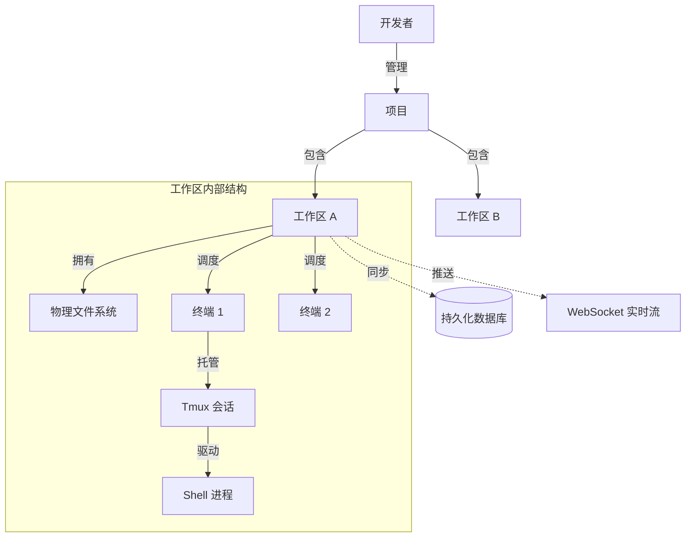

# 核心概念

在使用 Atmos 之前，理解其核心领域模型和设计模式至关重要。Atmos 并非简单的工具堆砌，而是围绕着一套严谨的开发环境管理哲学构建的。本章将详细介绍支撑 Atmos 运行的五大核心概念。

## 1. 项目 (Project)

项目是 Atmos 中最高层级的逻辑组织单位。它定义了开发工作的边界和共享配置。

- **定义**: 通常对应一个独立的软件仓库（如 GitHub 上的一个 Repo）。
- **职责**: 存储仓库元数据（URL、目标分支）、默认构建指令、以及项目级的环境变量。
- **持久化**: 在数据库中表现为 `projects` 表，是所有工作区的父节点。

## 2. 工作区 (Workspace)

工作区是 Atmos 的核心操作实体，是开发者日常工作的物理承载。

- **定义**: 项目的一个具体“运行实例”。
- **隔离性**: 每个工作区拥有独立的物理目录和进程空间。你可以为同一个项目创建多个工作区（例如：`feature-a` 和 `bugfix-b`），它们互不干扰。
- **生命周期**: 拥有从 `Pending` (待创建) 到 `Running` (运行中) 再到 `Archived` (已归档) 的完整状态流转。

## 3. 终端与 PTY (Terminal & Pseudo-Terminal)

终端是用户与工作区交互的主要手段。在 Atmos 中，终端被视为一种受管理的资源。

- **PTY (伪终端)**: 底层技术实现。Atmos 在后端为每个终端开启一个 PTY 进程，模拟真实的物理终端行为。
- **流式交互**: 所有的按键输入和屏幕输出都通过 WebSocket 以二进制流的形式实时传输。
- **多实例支持**: 一个工作区可以同时开启多个终端，分别用于编译、调试和日志监控。

## 4. 会话持久化 (Session Persistence & Tmux)

这是 Atmos 区别于传统 Web 终端的关键特性。

- **Tmux 集成**: Atmos 利用 Tmux 作为后台进程管理器。
- **断开重连**: 当你关闭浏览器或网络不稳定时，工作区内的进程（如正在运行的测试）不会停止。当你重新打开 Atmos 时，可以无缝恢复到之前的终端状态。
- **原理**: 所有的 PTY 进程实际上是托管在 Tmux 会话中的，Atmos 后端仅作为数据的中转站。

## 5. 实时同步 (Real-time Sync)

Atmos 强调“所见即所得”的协作体验。

- **事件驱动**: 无论是文件系统的变更、Git 状态的更新，还是其他成员的操作，都会通过消息总线实时推送到你的界面。
- **WebSocket 骨干**: 全系统共享一套高效的 WebSocket 通信协议，确保状态变更的延迟降至最低。

## 概念关系图

## 核心术语对照表

| 术语 | 英文 | 描述 |
|:---|:---|:---|
| **项目** | Project | 逻辑容器，对应一个代码仓库。 |
| **工作区** | Workspace | 物理环境，包含代码副本和运行进程。 |
| **伪终端** | PTY | 后端模拟的终端接口。 |
| **持久化会话** | Persistent Session | 即使连接断开也能保持运行的会话。 |
| **归档** | Archive | 冻结工作区资源，保留数据但不占用运行内存。 |

## 总结

- **项目** 解决了“我们要开发什么”的问题。
- **工作区** 解决了“我们在哪里开发”的问题。
- **终端与持久化** 解决了“我们如何高效开发”的问题。

理解了这些概念，你就掌握了 Atmos 的灵魂。接下来，你可以通过 **[架构概览](./architecture.md)** 了解这些概念是如何在代码中实现的。

## 下一步建议

- **[快速开始](./quick-start.md)**: 亲手创建一个项目和工作区。
- **[架构概览](./architecture.md)**: 探索分层架构如何支撑这些核心概念。
- **[工作区生命周期](../deep-dive/core-service/workspace.md)**: 深入了解工作区的内部状态转换。
- **[安装与配置](./installation.md)**: 准备好你的开发环境。
