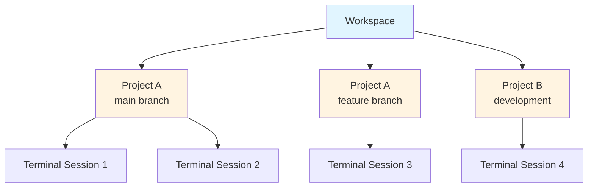
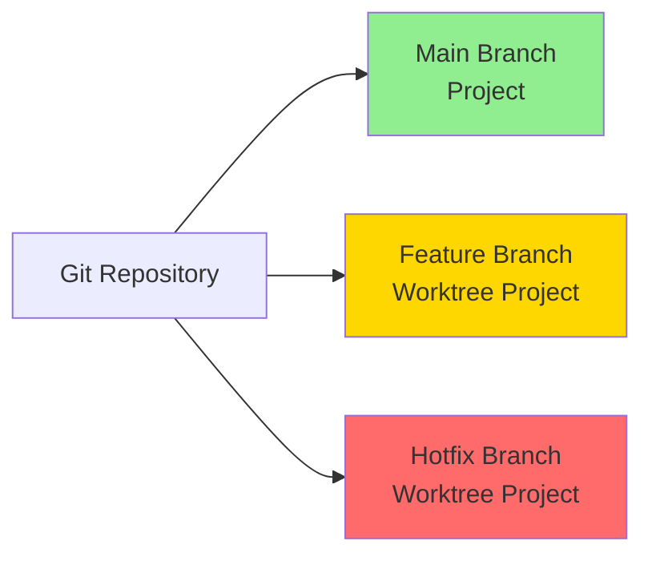
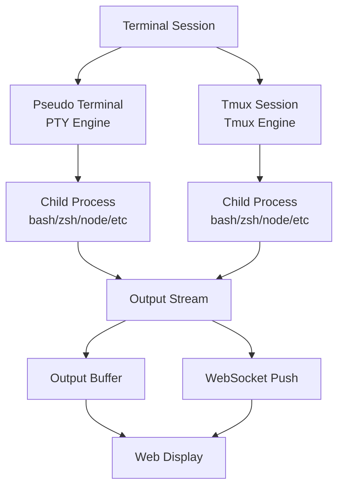
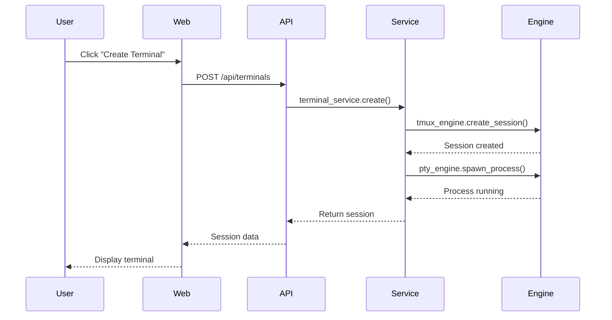
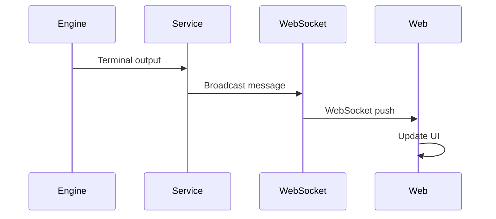

# Key Concepts

Understanding ATMOS's core concepts and terminology is essential for effectively using and extending the system. This guide introduces the fundamental building blocks that make up the ATMOS workspace ecosystem.

## Workspace Ecosystem

ATMOS organizes development environments around the concept of a workspace—a unified environment that contains multiple projects, terminal sessions, and AI-assisted workflows. Think of a workspace as a virtual desk where everything you need for a particular task or area of work is readily accessible.



## Workspaces

**Definition**
A workspace is the top-level container in ATMOS that groups related projects and provides a unified context for development work. Each workspace maintains its own set of projects, terminal sessions, and AI conversations.

**Key Characteristics**
- **Isolated Environment**: Each workspace operates independently with its own configuration
- **Project Collection**: Contains multiple related projects (different repositories or branches)
- **Shared Resources**: Terminal sessions and AI context are shared within a workspace
- **Persistent State**: Workspace state persists across sessions and restarts

**Use Cases**
- **Personal Development**: One workspace for all your personal projects
- **Team Collaboration**: Shared workspaces for team projects
- **Client Work**: Separate workspace per client
- **Feature Development**: Workspace for a specific feature spanning multiple repos

**Workspace Lifecycle**
```rust
// Creating a workspace
let workspace = workspace_service.create(WorkspaceSpec {
    name: "My Project Workspace".to_string(),
    base_path: PathBuf::from("~/dev/my-project"),
    description: Some("Development workspace for My Project".to_string()),
}).await?;
```

**Management**
- Create workspaces via the web interface or CLI
- Switch between workspaces instantly
- Each workspace maintains separate terminal sessions
- Workspaces can be exported and imported for sharing

## Projects

**Definition**
A project in ATMOS represents a version-controlled codebase. It can be an entire repository or a specific branch checked out via git worktree.

**Key Characteristics**
- **Git Integration**: Projects are backed by git repositories
- **Worktree Support**: Multiple branches of the same repository as separate projects
- **File Indexing**: Automatic indexing of project files for navigation
- **Metadata**: Stores additional information like description, tags, and notes

**Project Types**


**Git Worktree Integration**
One of ATMOS's most powerful features is the use of git worktrees, allowing you to work on multiple branches simultaneously:

```bash
# Traditional approach - one branch at a time
cd my-project
git checkout feature-branch  # Switches entire working directory

# ATMOS approach - multiple branches at once
# Project 1: Main branch
my-project/

# Project 2: Feature branch (worktree)
my-project-feature/

# Project 3: Hotfix branch (worktree)
my-project-hotfix/
```

**Project Operations**
- **Clone**: Import repositories via URL or local path
- **Create Worktree**: Create a new project from a specific branch
- **Update**: Pull latest changes from remote
- **Index**: Re-index files for search and navigation
- **Delete**: Remove project from workspace (keeps files on disk)

**Project Structure**
```
~/dev/my-workspace/
├── project-main/           # Main branch project
│   ├── src/
│   ├── tests/
│   └── .git/
├── project-feature/        # Feature branch worktree
│   ├── src/
│   ├── tests/
│   └── .git/              # Worktree git directory
└── project-hotfix/         # Hotfix branch worktree
    ├── src/
    ├── tests/
    └── .git/
```

## Terminal Sessions

**Definition**
Terminal sessions are persistent command-line environments managed by ATMOS using tmux. Unlike traditional terminal windows, these sessions survive browser closures and network disconnections.

**Key Characteristics**
- **Persistent**: Sessions continue running even when you disconnect
- **Accessible**: Connect from web, desktop, or CLI interfaces
- **Buffered**: Output is captured and stored for replay
- **Managed**: Session lifecycle controlled by ATMOS

**Session Types**


*Source: `/Users/lurunrun/own_space/OpenSource/atmos/crates/core-engine/AGENTS.md`*

**Persistence Model**
```rust
// Session persistence architecture
pub struct TerminalSession {
    id: SessionId,
    project_id: ProjectId,
    tmux_session: TmuxSession,  // Managed by tmux
    output_buffer: Arc<RwLock<Vec<OutputLine>>>,  // Captured output
    created_at: DateTime<Utc>,
    last_activity: DateTime<Utc>,
}
```

**Session Lifecycle**
1. **Creation**: User requests new terminal for a project
2. **Initialization**: ATMOS creates tmux session and PTY
3. **Running**: Process executes, output captured and streamed
4. **Disconnection**: User closes browser, session continues
5. **Reconnection**: User reconnects, sees full session history
6. **Termination**: User explicitly closes or process exits

**Session Features**
- **Full Scrollback**: Access entire session history
- **Search**: Search through session output
- **Multiple Panes**: Split into multiple windows/panes (tmux feature)
- **Process Monitoring**: Track running processes
- **Resource Limits**: Configure CPU/memory limits per session

## AI Integration

**Definition**
ATMOS is designed from the ground up to integrate with AI coding assistants. The workspace maintains context that AI agents can leverage for more effective assistance.

**AI Context**
- **Workspace Context**: All projects in workspace are visible to AI
- **Session History**: Terminal sessions provide execution context
- **File Contents**: AI can read and analyze project files
- **Conversation Memory**: Multi-turn conversations preserved

**AI-Native Features**
```typescript
// AI context structure
interface AIContext {
  workspace: {
    name: string;
    projects: Project[];
    activeTerminal?: TerminalSession;
  };
  conversation: Message[];
  fileContext: {
    path: string;
    content: string;
  }[];
}
```

**Integration Points**
- **Chat Interface**: Built-in AI chat panel
- **Code Assistance**: AI can read/write project files
- **Terminal Control**: AI can execute commands (with permission)
- **Workspace Awareness**: AI understands full project structure

## Services Architecture

**Definition**
ATMOS backend is organized into services that implement specific business logic. Understanding these services helps in navigating the codebase.

**Core Services**

**AuthService**
- Handles user authentication and authorization
- Manages JWT tokens and sessions
- Enforces permission checks
- Integrates with external auth providers

**ProjectService**
- Orchestrates project CRUD operations
- Manages git worktrees
- Coordinates GitEngine and FsEngine
- Updates project metadata

```rust
// Service orchestration example
impl ProjectService {
    pub async fn create_project(&self, spec: ProjectSpec) -> Result<Project> {
        // 1. Clone repository via GitEngine
        let repo = self.git_engine.clone(&spec.url).await?;

        // 2. Create worktree if branch specified
        if let Some(branch) = &spec.branch {
            self.git_engine.create_worktree(&repo, branch).await?;
        }

        // 3. Index files via FsEngine
        let files = self.fs_engine.index(&repo.path).await?;

        // 4. Save to database via ProjectRepo
        let project = self.project_repo.create(spec).await?;

        Ok(project)
    }
}
```

*Source: `/Users/lurunrun/own_space/OpenSource/atmos/crates/core-service/AGENTS.md`*

**WorkspaceService**
- Manages workspace lifecycle
- Organizes projects into workspaces
- Allocates resources
- Handles workspace-scoped operations

**TerminalService**
- Creates and manages terminal sessions
- Coordinates PTY and Tmux engines
- Streams output via WebSocket
- Manages session persistence

**WsMessageService**
- Processes WebSocket messages
- Routes real-time updates
- Handles bidirectional communication
- Logs message history

## Engines Layer

**Definition**
Engines are technical capabilities that services use to perform complex operations. They encapsulate low-level system interactions.

**Core Engines**

**PTY Engine**
- Manages pseudo-terminals for process execution
- Handles process lifecycle (spawn, monitor, terminate)
- Captures stdout/stderr/stdin
- Provides clean API over raw PTY operations

**Git Engine**
- Wraps git operations in type-safe API
- Manages repository cloning
- Creates and manages worktrees
- Handles branch operations and status

**Tmux Engine**
- Creates and manages tmux sessions
- Attaches/detaches from sessions
- Captures session output
- Manages session lifecycle

**File System Engine**
- Monitors file system changes
- Provides async file operations
- Indexes project files
- Watches for modifications

## Infrastructure Layer

**Definition**
Infrastructure provides the foundational services that all other layers build upon.

**Database**
- SeaORM for type-safe database access
- Repository pattern for abstraction
- Entities for data modeling
- Migrations for schema management

**WebSocket Manager**
- Connection management
- Message routing and broadcasting
- Heartbeat and reconnection
- Session tracking

**Cache Layer**
- In-memory caching for performance
- Query result caching
- Session state caching
- Invalidation strategies

## API Layer

**Definition**
The API layer exposes backend services via HTTP and WebSocket protocols.

**HTTP API**
- RESTful endpoints for CRUD operations
- JSON request/response format
- JWT authentication
- Structured error handling

**WebSocket API**
- Real-time bidirectional communication
- Used for terminal output streaming
- Live file system updates
- Presence and collaboration features

```rust
// API handler example
pub async fn create_terminal(
    State(state): State<AppState>,
    Json(req): Json<CreateTerminalReq>,
) -> Result<Json<TerminalResp>, ApiError> {
    // 1. Validate request
    // 2. Call service layer
    let session = state.terminal_service
        .create_session(req.project_id)
        .await?;

    // 3. Convert to response DTO
    Ok(Json(session.into()))
}
```

*Source: `/Users/lurunrun/own_space/OpenSource/atmos/apps/api/AGENTS.md`*

## Frontend Components

**Definition**
The frontend is organized into reusable components with clear responsibilities.

**Component Categories**

**Layout Components**
- App shell with navigation
- Sidebar for workspace/project selection
- Main content area
- Responsive design

**Feature Components**
- Workspace selector and manager
- Project list and details
- Terminal emulator with xterm.js
- File browser with syntax highlighting
- AI chat interface

**Shared Components**
- Button, input, modal basics from @workspace/ui
- Custom ATMOS-specific components
- Theme-aware (light/dark mode)

## Data Flow Patterns

**Request-Response Flow**


**Real-time Update Flow**


## Common Workflows

**Creating a New Project**
1. Create or select a workspace
2. Click "Add Project"
3. Enter repository URL or local path
4. Select branch (optional)
5. ATMOS clones repository or creates worktree
6. Project indexed and added to workspace

**Starting Development**
1. Select project from sidebar
2. Click "New Terminal"
3. Session created in background
4. Terminal appears in UI
5. Run commands as needed
6. Close browser - session continues
7. Reconnect later to resume

**Branch Development with Worktrees**
1. Open project
2. Click "Create Worktree"
3. Select branch (e.g., feature/new-auth)
4. New project added for that branch
5. Switch between branches in sidebar
6. Each has independent terminal sessions

## Key Source Files

| File | Purpose |
|------|---------|
| `/Users/lurunrun/own_space/OpenSource/atmos/AGENTS.md` | Navigation guide for all modules |
| `/Users/lurunrun/own_space/OpenSource/atmos/crates/core-service/AGENTS.md` | Service layer documentation |
| `/Users/lurunrun/own_space/OpenSource/atmos/crates/core-engine/AGENTS.md` | Engine layer documentation |
| `/Users/lurunrun/own_space/OpenSource/atmos/apps/api/AGENTS.md` | API layer documentation |
| `/Users/lurunrun/own_space/OpenSource/atmos/apps/web/AGENTS.md` | Frontend documentation |

## Next Steps

Now that you understand the key concepts, explore:

- [Configuration Guide](./configuration) - Customize ATMOS for your workflow
- [Architecture Overview](./architecture) - Deep dive into system design
- [Terminal Service](../deep-dive/core-service/terminal) - Persistent sessions in detail
- [Workspace Service](../deep-dive/core-service/workspace) - Multi-project management

Ready to use these concepts? Jump to [Quick Start](./quick-start) to get hands-on experience with workspaces, projects, and terminal sessions.
