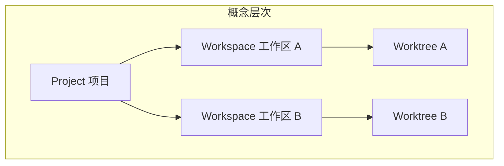
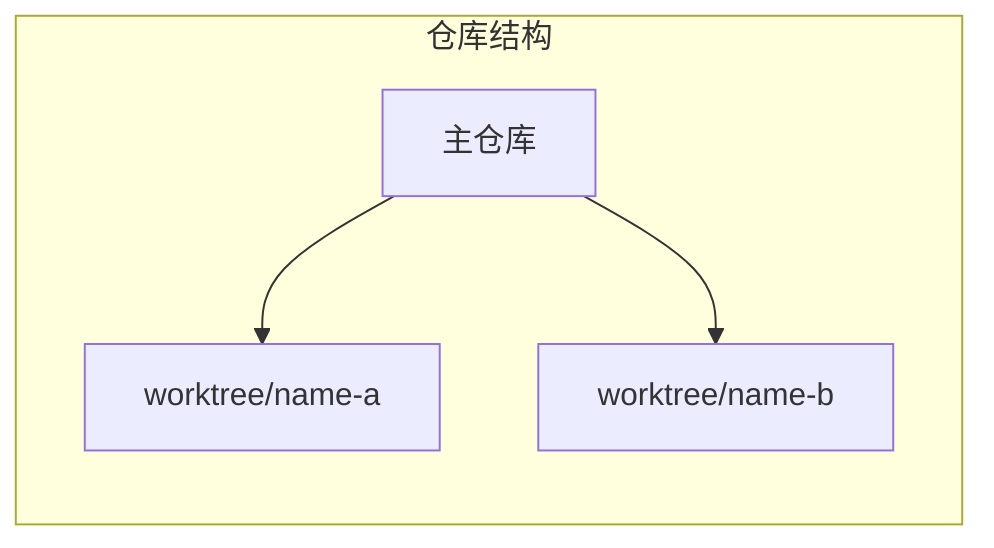

# 核心概念

本文介绍 ATMOS 中的核心术语、设计模式与心智模型，包括项目、工作区、Worktree、终端会话等。理解这些概念有助于高效使用和贡献代码。

## Overview

ATMOS 以 **项目（Project）** 和 **工作区（Workspace）** 为核心组织单元。每个项目对应一个 Git 仓库；每个工作区对应该仓库的一个 Git worktree，即同一仓库的一个分支工作副本。终端会话通过 Tmux 与会话持久化，与工作区绑定。

## Architecture

## 核心术语

| 术语 | 定义 |
|------|------|
| **Project** | 对应一个 Git 仓库，包含 `main_file_path`（仓库根路径）和元数据 |
| **Workspace** | 项目下的一个工作副本，对应一个 Git worktree，有唯一 `name`（分支或工作区名） |
| **Worktree** | Git 的 worktree，即同一仓库的不同检出目录，用于并行开发多分支 |
| **Terminal Session** | 与工作区绑定的 Tmux 会话，支持多窗口/多窗格 |
| **Client Type** | WebSocket 客户端类型：`WebClient`（浏览器）或 `TerminalClient`（终端工具） |

## 设计模式

- **Repository 模式**：L1 通过 Repo 封装 DB 访问，L3 只调用 Repo，不直接写 SQL
- **依赖注入**：AppState 在启动时装配所有服务，Handler 通过 `State<AppState>` 获取
- **分层解耦**：L2 不感知业务，L3 编排 L2 与 L1，保证可测试性与可替换性

## Key Source Files

| File | Purpose |
|------|---------|
| `crates/infra/src/db/entities/project.rs` | Project 实体定义 |
| `crates/infra/src/db/entities/workspace.rs` | Workspace 实体定义 |
| `crates/core-service/src/service/project.rs` | 项目业务逻辑 |
| `crates/core-service/src/service/workspace.rs` | 工作区业务逻辑 |

## Next Steps

- **[配置指南](configuration.md)** — 环境变量与功能开关
- **[工作区服务](../deep-dive/core-service/workspace.md)** — Workspace 的完整实现
