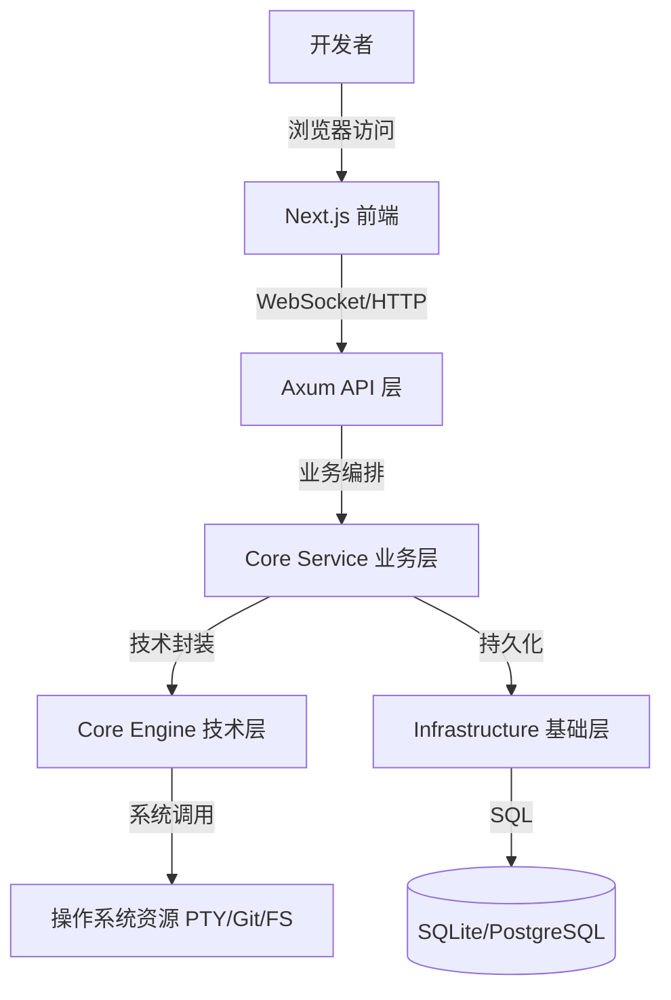
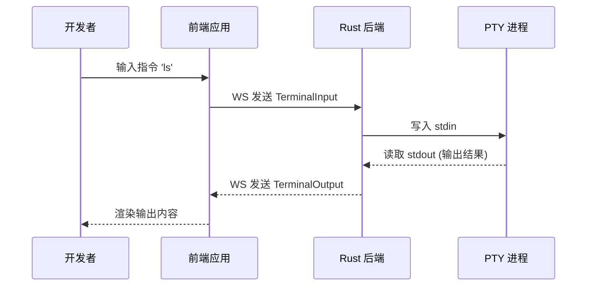

# 项目概览

Atmos 是一个为现代开发者量身定制的全栈式开发环境管理平台。它不仅是一个终端模拟器，更是一个集成了工作区生命周期管理、自动化 Git 协作、以及云原生能力的综合性开发基础设施。通过将复杂的底层技术（如 PTY、Tmux、Git）抽象为直观的“工作区”概念，Atmos 极大地提升了开发效率，确保了环境的一致性，并为团队协作提供了坚实的基础。

## 核心价值与愿景

在当今的软件开发领域，环境配置的复杂性往往成为生产力的瓶颈。Atmos 的诞生旨在解决以下核心痛点：

### 1. 开发环境的碎片化
开发者经常需要在不同的项目、不同的分支之间切换，每个项目可能都有独特的依赖、环境变量和工具链。Atmos 通过“工作区”隔离机制，确保每个开发任务都有其独立、干净的环境。

### 2. 终端管理的复杂性
传统的终端工具往往缺乏持久化能力，一旦网络断开或服务重启，正在运行的进程就会丢失。Atmos 集成了 Tmux，实现了真正的会话持久化，让开发者可以随时随地恢复工作。

### 3. 协作效率的低下
Atmos 提供了内置的 Git 自动化和实时状态同步功能。团队成员可以清晰地看到工作区的当前状态，减少了沟通成本。

## 核心功能深度解析

Atmos 提供了一系列强大的功能模块，共同支撑起 IDE 级的开发体验：

### 多终端管理与 PTY 流处理
Atmos 支持在单个工作区内开启无限多个终端会话。每个会话都由后端的伪终端 (PTY) 引擎驱动，支持完整的 ANSI 转义序列、颜色显示和复杂的 CLI 交互。通过高效的 WebSocket 流处理，终端输出能够以毫秒级的延迟呈现给用户。

### 工作区全生命周期管理
从创建、配置、启动到归档和删除，Atmos 提供了完整的工作区管理流程。
- **创建**: 自动准备物理目录，初始化 Git 仓库。
- **运行**: 动态分配 PTY 资源，建立实时通信通道。
- **归档**: 释放非必要资源，保留关键配置，方便日后快速恢复。

### 自动化 Git 集成
Atmos 不仅仅是运行 Git 命令，它还能感知仓库的状态。
- **状态感知**: 实时显示当前分支、未提交的更改和远程同步进度。
- **快捷操作**: 提供一键切换分支、拉取更新和提交代码的 UI 接口。

### 实时状态同步
基于先进的 WebSocket 架构，Atmos 确保了前端界面与后端状态的绝对同步。无论是终端输出、文件变更还是工作区状态切换，用户都能在第一时间得到反馈。

## 技术架构概览

Atmos 采用了前沿的技术栈，确保了系统的高性能、安全性和可扩展性。

### 后端：Rust 的力量
后端完全采用 Rust 编写，利用其卓越的内存安全性和并发性能。
- **Axum**: 用于构建高性能的 Web API 和 WebSocket 处理器。
- **Tokio**: 提供强大的异步运行时，支撑数千个并发 I/O 任务。
- **SeaORM**: 确保数据库操作的类型安全和高效。

### 前端：现代化的 Web 体验
前端基于 Next.js 构建，提供了流畅、响应迅速的用户界面。
- **Next.js**: 利用其优秀的路由系统和服务器端渲染能力。
- **Xterm.js**: 工业级的终端渲染引擎，确保终端体验不输原生。
- **Zustand**: 轻量级、高性能的状态管理方案。

## 系统架构图

## 部署与扩展性

Atmos 设计之初就考虑了多种部署场景：
- **本地开发**: 作为增强版的终端工具，管理本地多个项目。
- **远程开发服务器**: 部署在高性能服务器上，通过 Web 界面远程访问。
- **团队私有云**: 作为团队内部的开发基础设施，统一管理开发环境。

## 交互流程示意图

## 总结

Atmos 不仅仅是一个工具，它代表了一种全新的开发范式。通过深度整合底层技术与现代 Web 能力，Atmos 正在重新定义开发者与终端、与环境交互的方式。无论你是独立开发者还是大型团队的一员，Atmos 都能为你提供更高效、更稳定、更愉悦的开发体验。

## 下一步建议

- **[快速开始](./quick-start.md)**: 立即动手搭建你的第一个 Atmos 环境。
- **[架构概览](./architecture.md)**: 深入了解 Atmos 的分层设计原则。
- **[核心概念](./key-concepts.md)**: 掌握 Atmos 的核心术语和思维模型。
- **[安装与配置](./installation.md)**: 了解如何在你的系统中部署 Atmos。
