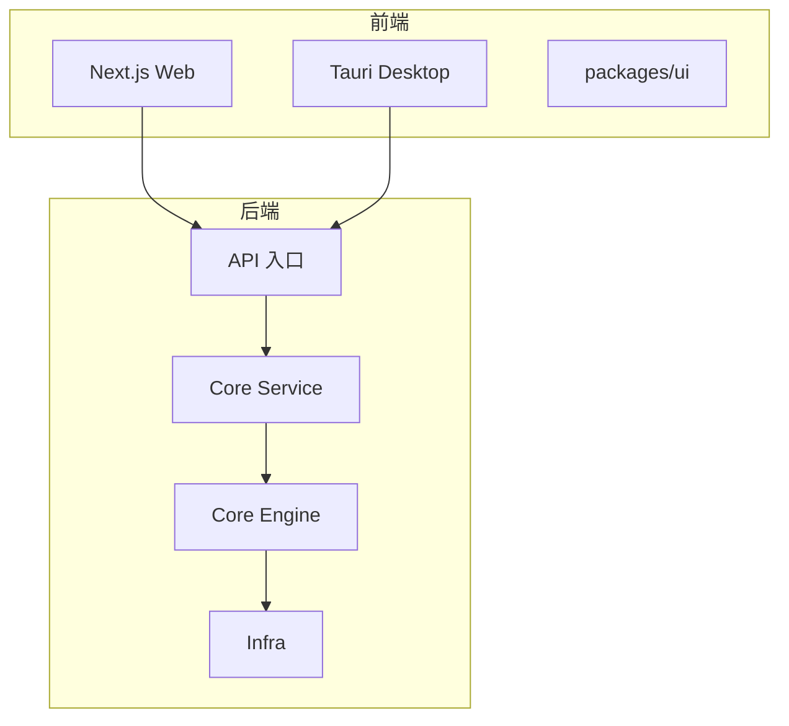
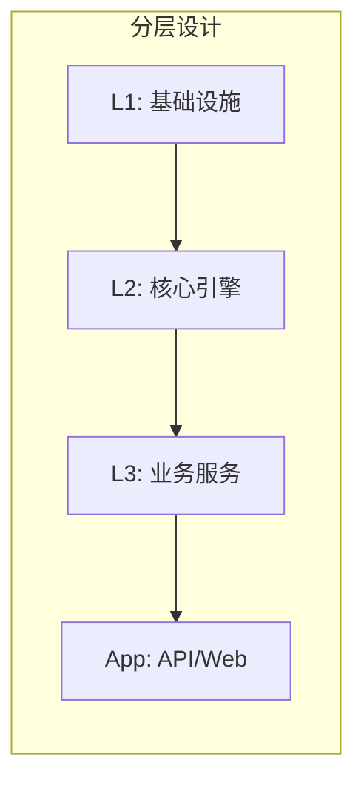

# 项目概览

本文介绍 ATMOS的项目定位、核心能力、技术栈以及目标用户。读完本文后，你将清楚了解这个项目解决什么问题、提供哪些关键特性，以及它适合谁使用。

## Overview

ATMOS 是一个 **DeepMind 风格的 AI 优先 Workspace 生态系统**。它不是一个单纯的终端模拟器，而是一个集成了项目管理、多工作区（Workspace）、终端持久化、文件系统操作、Git 集成等能力的开发环境平台。项目采用 Monorepo 组织，后端与前端共享统一的架构约定和开发流程。

核心价值在于：将 AI 代理（Agent）与开发者工作流深度融合，通过结构化的工作区与终端管理，支持多项目并行、多分支工作流，并为未来的 AI 辅助功能预留扩展空间。

## Architecture

## 关键特性

| 特性 | 描述 |
|------|------|
| **项目与工作区** | 以 Git 仓库为中心的项目管理，每个工作区对应一个 Git worktree，支持多分支并行开发 |
| **终端持久化** | 基于 Tmux 的会话持久化，WebSocket 断开后终端状态保留，重连后可恢复 |
| **实时通信** | WebSocket 支撑终端输出、文件变更、消息推送等实时能力 |
| **统一 API** | REST + WebSocket 混合架构，REST 处理 CRUD，WS 处理长连接与流式数据 |
| **AI 技能系统** | 支持将技能（Skill）挂载到项目中，便于 Agent 与工作流集成 |

## 技术栈

- **后端**：Rust（Axum）、SeaORM、Tokio
- **前端**：Next.js 16、React 19、Tauri 2.0、shadcn/ui
- **构建**：Cargo、Bun、Just

## 目标用户

- 需要多项目、多工作区并行开发的开发者
- 希望将 AI 能力集成进工作流的团队
- 需要远程或协作开发环境的研究者

## Key Source Files

| File | Purpose |
|------|---------|
| `README.md` | 项目简介与快速开始 |
| `AGENTS.md` | AI Agent 导航与架构决策树 |
| `Cargo.toml` | Rust 工作区与依赖 |
| `package.json` | 前端 Monorepo 与脚本 |

## Next Steps

- **[快速开始](quick-start.md)** — 5 分钟内运行项目
- **[架构概览](architecture.md)** — 理解 L1/L2/L3/App 分层设计
