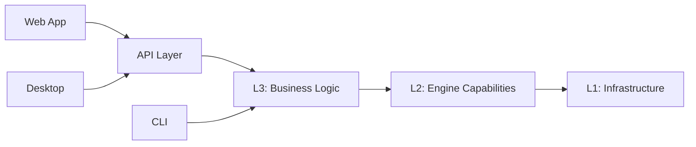

# Project Overview

ATMOS represents a paradigm shift in development workspace design, drawing inspiration from Deepmind's AI-first approach to create an environment where terminals, projects, and AI assistants coexist harmoniously. This Visual Terminal Workspace combines the raw performance of Rust with the modern capabilities of Next.js 16, React 19, and Tauri to deliver a development experience that is both powerful and intuitive.

## The Vision Behind ATMOS

Traditional development environments force developers to context-switch between terminal windows, code editors, file browsers, and AI assistants. Each switch costs mental energy and breaks flow. ATMOS addresses this fragmentation by providing a unified workspace where:

- **Terminal sessions are persistent**: Your work survives network interruptions and system restarts through tmux integration
- **Projects are first-class citizens**: Organize and switch between multiple projects and branches seamlessly
- **AI assistance is integrated**: Built-in support for AI coding agents without leaving your workflow
- **Multiple interfaces, one core**: Access your workspace via web browser, desktop app, or CLI

## Technology Stack

### Backend: High-Performance Rust

The backend is built with Rust and organized into three architectural layers:

```toml
[workspace]
members = [
    "apps/api",      # API Entry Point
    "crates/*",      # Shared packages
]
```

*Source: `/Users/username/projects/atmos/Cargo.toml`*

**Layer 1: Infrastructure (crates/infra/)**
- Database operations using SeaORM
- WebSocket engine for real-time communication
- Caching and job queue systems
- This layer handles raw data persistence and connectivity

**Layer 2: Core Engine (crates/core-engine/)**
- PTY management for terminal processes
- Git operations for version control
- Tmux session management
- File system watching and I/O
- This layer provides technical capabilities wrapped in clean APIs

**Layer 3: Core Service (crates/core-service/)**
- Business logic and domain rules
- Authentication and authorization
- Project and workspace orchestration
- Terminal session management
- This layer implements the actual product features

**API Layer (apps/api/)**
- Axum-based HTTP and WebSocket server
- Request handlers and DTOs
- Middleware for auth, logging, and CORS
- The bridge between frontend and backend services

### Frontend: Modern Web Technologies

The frontend leverages the latest JavaScript/TypeScript ecosystem:

```json
{
  "catalog": {
    "next": "16.1.2",
    "react": "19.2.3",
    "tailwindcss": "^4"
  }
}
```

*Source: `/Users/username/projects/atmos/package.json`*

**Web Application (apps/web/)**
- Next.js 16 with App Router
- React 19 for the latest features
- Tailwind CSS v4 for styling
- Server and client components for optimal performance

**Desktop Application (apps/desktop/)**
- Tauri 2.0 for cross-platform desktop apps
- Native performance with web technologies
- System tray integration
- Local-first capabilities

**Shared Packages (packages/)**
- @workspace/ui: shadcn/ui component library
- @workspace/shared: Custom hooks and utilities
- @workspace/config: ESLint and TypeScript configs
- @workspace/i18n: Internationalization support

## Key Features

### 1. Persistent Terminal Sessions

ATMOS uses tmux to provide terminal sessions that persist regardless of your connection state. This means:

- Long-running processes continue even if you close the browser
- Network disconnections don't kill your work
- Sessions are accessible from any interface (web, desktop, CLI)
- Full terminal capability with proper PTY support

### 2. Multi-Project Workspaces

Using git worktrees, ATMOS allows you to:

- Work on multiple branches simultaneously
- Switch between projects instantly
- Share a single working copy across branches
- Maintain independent development environments

### 3. AI-Native Design

Unlike tools where AI is an afterthought, ATMOS is built with AI in mind:

- Agent-aware workspace management
- Context preservation across sessions
- Integration hooks for AI assistants
- Structured data for LLM consumption

### 4. Visual Interface

The web interface provides:

- Real-time terminal output via WebSocket
- Project and workspace visualization
- File browser with syntax highlighting
- Integrated AI chat interface
- Responsive design for all screen sizes

## Development Philosophy

ATMOS follows several key design principles:

**Layered Architecture**
Each layer has a clear responsibility and depends only on layers below it. This makes the codebase easier to understand, test, and maintain.



**Type Safety Across Boundaries**
- Rust provides memory safety and performance
- TypeScript ensures frontend type safety
- DTOs align between Rust and TypeScript
- Shared types prevent integration bugs

**Developer Experience**
- Fast development iteration with hot reload
- Clear error messages and logging
- Comprehensive testing infrastructure
- Well-documented codebase

## Monorepo Organization

The project uses a monorepo structure with workspaces:

```bash
atmos/
├── crates/                    # Rust workspace
│   ├── infra/                # Infrastructure layer
│   ├── core-engine/          # Engine capabilities
│   └── core-service/         # Business logic
├── apps/                      # Applications
│   ├── api/                  # Rust API server
│   ├── web/                  # Next.js app
│   ├── desktop/              # Tauri app
│   └── cli/                  # CLI tool
└── packages/                  # JS/TS workspace
    ├── ui/                    # Shared components
    ├── shared/                # Shared utilities
    ├── config/                # Shared configs
    └── i18n/                  # Translations
```

This structure enables:
- Code sharing between applications
- Unified dependency management
- Consistent build processes
- Easier cross-team collaboration

## Use Cases

ATMOS excels in several scenarios:

**For Individual Developers**
- Manage personal projects across multiple repositories
- Maintain long-running development servers
- Switch contexts without losing state
- Integrate AI assistants into daily workflow

**For Development Teams**
- Shared workspace environments
- Collaborative debugging sessions
- Consistent tooling across team members
- Onboarding documentation integrated with environment

**For DevOps and SRE**
- Persistent terminal access to infrastructure
- Multi-environment management
- Automated workspace provisioning
- Integration with CI/CD pipelines

## Performance Considerations

The Rust backend ensures:

- **Sub-millisecond latency** for terminal I/O operations
- **Efficient resource usage** with async I/O via Tokio
- **Scalable WebSocket connections** for real-time updates
- **Minimal memory footprint** through careful memory management

The React frontend provides:

- **Fast initial load** with server components
- **Optimal interactivity** with selective client components
- **Efficient re-renders** through React 19's optimizations
- **Bundle optimization** with Next.js automatic code splitting

## Community and Contribution

ATMOS is an open-source project welcoming contributions. The codebase is designed to be approachable:

- Clear documentation in AGENTS.md files for each module
- Comprehensive README files in each crate
- Type definitions that serve as inline documentation
- Example implementations in test files

## Key Source Files

| File | Purpose |
|------|---------|
| `/Users/username/projects/atmos/README.md` | Project overview and quick start |
| `/Users/username/projects/atmos/AGENTS.md` | Navigation guide for all modules |
| `/Users/username/projects/atmos/Cargo.toml` | Rust workspace configuration |
| `/Users/username/projects/atmos/package.json` | JavaScript workspace configuration |
| `/Users/username/projects/atmos/justfile` | Development task runner |

## Next Steps

Now that you understand what ATMOS is and how it's built, continue your journey:

- [Quick Start](./quick-start) - Get ATMOS running on your machine
- [Installation & Setup](./installation) - Detailed setup instructions
- [Architecture Overview](./architecture) - Deep dive into system design
- [Key Concepts](./key-concepts) - Learn workspaces, projects, and sessions

Ready to start building? Check out the [development workflow](../deep-dive/build-system) to learn how to contribute to ATMOS.
