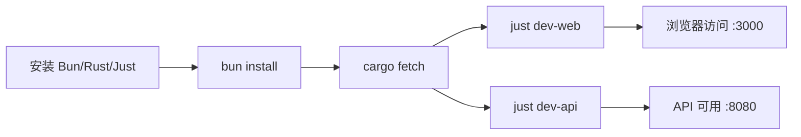
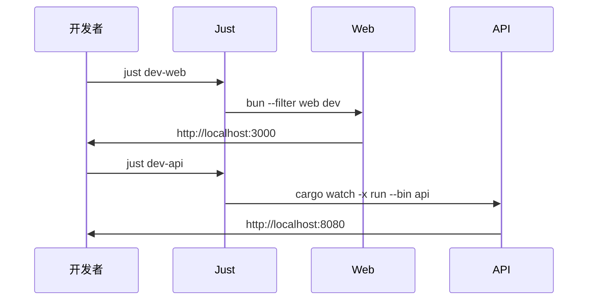

# 快速开始

本文帮助你在约 5 分钟内将 ATMOS 运行起来。你将完成环境检查、依赖安装和开发服务启动，并验证 Web 与 API 是否正常工作。

## Overview

快速开始流程分为三步：安装前提依赖、安装项目依赖、启动开发服务。项目使用 Bun 管理前端、Cargo 管理 Rust 后端、Just 作为统一任务入口。默认情况下，Web 运行在 3000 端口，API 运行在 8080 端口。

## Architecture

## 前置条件

- **Bun**：前端包管理与运行
- **Rust**：后端编译与运行
- **Just**：跨语言任务编排（如 `brew install just`）

## 安装步骤

1. **克隆仓库**（若尚未完成）
2. **安装前端依赖**：`bun install`
3. **配置 API 环境**：复制 `apps/api/.env.example` 为 `apps/api/.env`，按需修改数据库等配置
4. **启动 Web**：`just dev-web` 或 `bun --filter web dev`
5. **启动 API**：`just dev-api` 或 `cargo watch -x 'run --bin api' -w apps/api -w crates`

## 并行启动

`just dev-all` 会同时启动 Web 和 API，适合日常开发。

## Key Source Files

| File | Purpose |
|------|---------|
| `justfile` | 任务定义（dev-web、dev-api、build 等） |
| `README.md` | 快速开始说明 |
| `apps/api/.env.example` | API 环境变量模板 |

## Next Steps

- **[安装与配置](installation.md)** — 详细安装与环境排查
- **[架构概览](architecture.md)** — 理解整体架构
