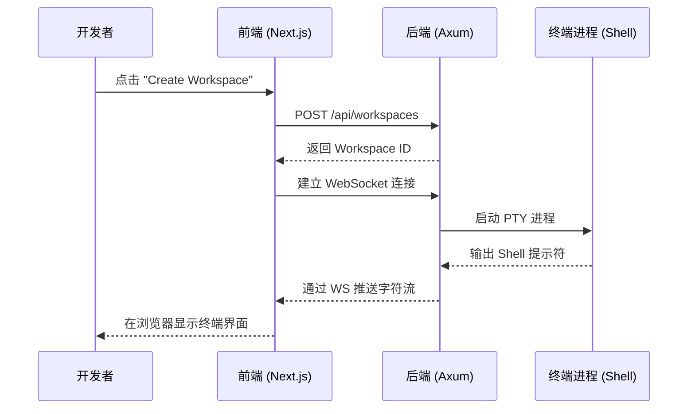

# 快速开始

本指南将带领你完成 Atmos 的基础安装，并在 5 分钟内启动你的第一个交互式开发工作区。无论你是想在本地管理项目，还是在为团队搭建远程开发环境，这都是最佳的起点。

## 核心流程预览

启动 Atmos 仅需四个核心步骤：环境检查、依赖安装、服务启动、工作区创建。


## 第一步：环境检查

在开始之前，请确保你的开发机已具备以下基础工具：

- **Rust 工具链**: 需要 `cargo` 1.75+。
- **Node.js 运行环境**: 推荐 v18 或 v20。
- **Bun**: Atmos 的前端包管理工具，极速安装体验。
- **Tmux**: 强烈推荐安装，用于实现终端会话的持久化。
- **Just**: 一个现代化的命令运行器（类似于 make），用于简化开发指令。

## 第二步：获取源码与安装依赖

克隆 Atmos 仓库并安装前端所需的 Node 模块：

```bash
# 克隆仓库
git clone https://github.com/lurunrun/atmos.git
cd atmos

# 安装前端依赖
bun install
```

## 第三步：启动 Atmos 服务

Atmos 采用前后端分离架构，你需要分别启动两个核心服务。

### 1. 启动后端 API 服务
在一个新的终端窗口中运行：
```bash
just dev-api
```
**它会做什么？**
- 自动编译 Rust 后端代码。
- 初始化本地 SQLite 数据库 (`atmos.db`)。
- 执行数据库迁移，准备好基础表结构。
- 在 `http://127.0.0.1:8080` 开启 API 服务。

### 2. 启动前端 Web 应用
在另一个终端窗口中运行：
```bash
just dev-web
```
**它会做什么？**
- 启动 Next.js 开发服务器。
- 在 `http://localhost:3000` 开启用户界面。

## 第四步：开启你的第一个工作区

现在，打开浏览器访问 `http://localhost:3000`。

1. **进入管理界面**: 你会看到一个简洁的欢迎页面。
2. **创建项目**: 点击“Create Project”，输入你的项目名称和本地代码路径。
3. **启动工作区**: 在项目详情页点击“New Workspace”。
4. **进入终端**: 工作区启动后，点击进入。你会看到一个全功能的 Web 终端，它已经自动定位到了你的项目目录。

## 交互流程示意图



## 常见问题排查 (FAQ)

### 1. 数据库连接失败？
检查项目根目录是否有写入权限。Atmos 默认在根目录创建 `atmos.db` 文件。

### 2. 终端显示“Tmux not found”？
虽然 Atmos 支持纯 PTY 模式，但为了最佳体验，建议安装 Tmux。你可以通过 `brew install tmux` (macOS) 或 `sudo apt install tmux` (Ubuntu) 进行安装。

### 3. 端口冲突？
如果 8080 或 3000 端口已被占用，你可以在 `.env` 文件中修改 `PORT` 变量。

## 下一步行动

- **[项目概览](./overview.md)**: 了解 Atmos 的完整功能版图。
- **[架构概览](./architecture.md)**: 探索 Atmos 的内部设计。
- **[核心概念](./key-concepts.md)**: 掌握工作区、项目等核心术语。
- **[安装与配置](./installation.md)**: 了解如何进行生产环境部署。
