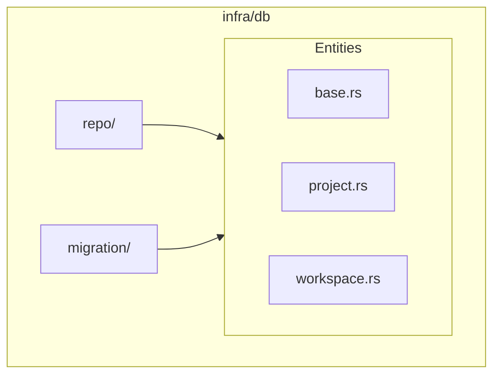

# 数据库与 ORM

## Overview

ATMOS 使用 SeaORM 作为 ORM 层，支持 SQLite 和 PostgreSQL。采用 Repository 模式将数据访问与业务逻辑解耦。实体定义在 `entities/`，仓库实现在 `repo/`，迁移脚本在 `migration/`。

## Architecture



## 实体示例

Workspace 实体定义：

```rust
#[derive(Clone, Debug, PartialEq, Eq, DeriveEntityModel, Serialize, Deserialize)]
#[sea_orm(table_name = "workspace")]
pub struct Model {
    #[sea_orm(primary_key, auto_increment = false)]
    pub guid: String,
    pub project_guid: String,
    pub created_at: DateTime,
    pub updated_at: DateTime,
    pub is_deleted: bool,
    pub name: String,
    pub branch: String,
    pub sidebar_order: i32,
    pub is_pinned: bool,
    pub pinned_at: Option<DateTime>,
    pub is_archived: bool,
    pub archived_at: Option<DateTime>,
    pub terminal_layout: Option<String>,
    pub maximized_terminal_id: Option<String>,
}
```

> **Source**: [crates/infra/src/db/entities/workspace.rs](../../../crates/infra/src/db/entities/workspace.rs)

## 迁移

迁移位于 `migration/`，使用 SeaORM Migrator 在启动时自动执行：

```rust
Migrator::up(&db_connection.conn, None).await?;
```

> **Source**: [apps/api/src/main.rs](../../../apps/api/src/main.rs#L39-L40)

## 相关链接

- [基础设施层索引](index.md)
- [WebSocket 服务](websocket.md)
- [工作区服务](../core-service/workspace.md)
