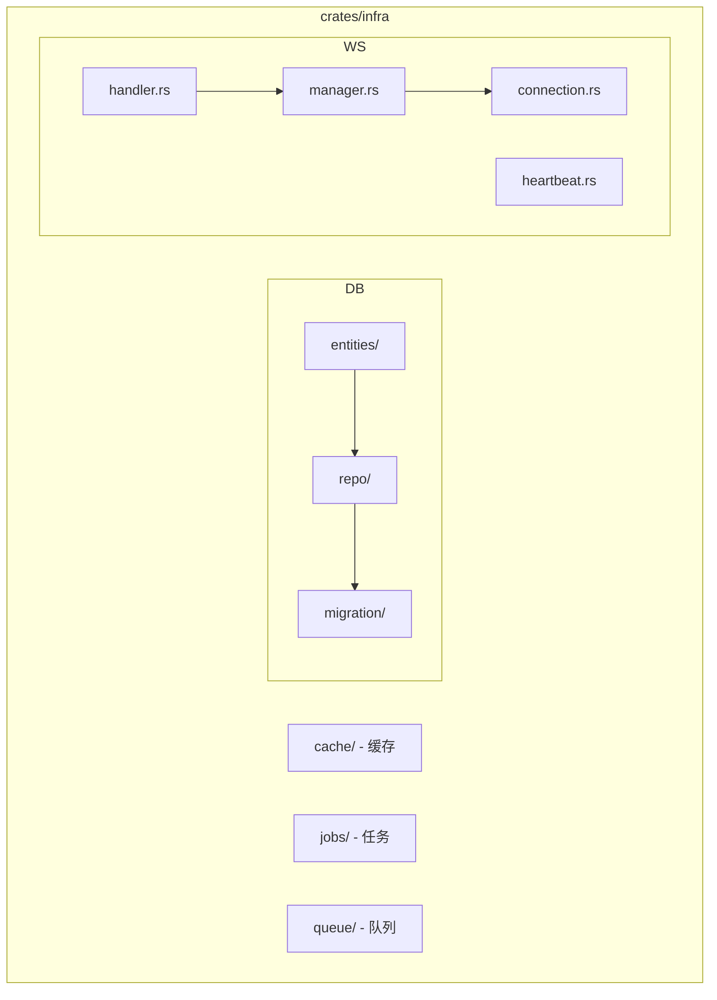

# 基础设施层 (L1)

## Overview

基础设施层是 ATMOS 的骨干，负责直接与数据提供方和底层系统交互。核心职责包括：数据库（SeaORM 实体、仓库、迁移）、WebSocket（连接管理、心跳、消息路由）、以及未来扩展的 cache/jobs/queue 等系统能力。

## Architecture

## 核心模块

| 模块 | 职责 |
|------|------|
| **db/** | SeaORM 实体、Repository 模式、迁移 |
| **websocket/** | 连接注册、消息发送、心跳监控 |
| **cache/** | 缓存（预留） |
| **jobs/** | 异步任务（预留） |
| **queue/** | 消息队列（预留） |

## 工作模式

- **实体**：定义于 `db/entities/`，必须继承 `base.rs` 字段
- **仓库**：`db/repo/` 使用 Repository 模式，将 SeaORM 与业务逻辑解耦
- **WebSocket**：实时信令逻辑位于 `websocket/manager.rs`

> **Source**: [crates/infra/AGENTS.md](../../../crates/infra/AGENTS.md)

## 相关链接

- [数据库与 ORM](database.md)
- [WebSocket 服务](websocket.md)
- [核心引擎层](../core-engine/index.md)
