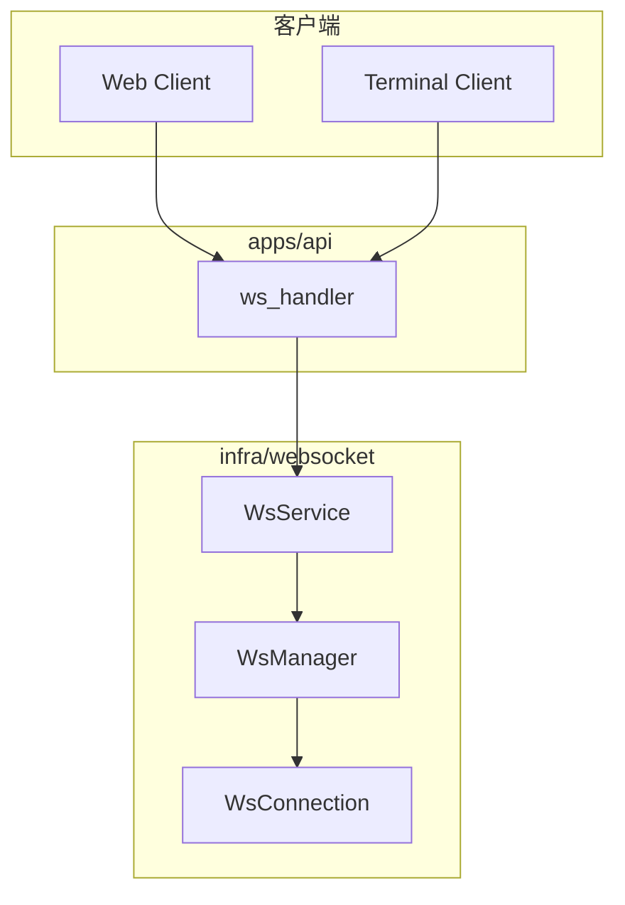

# WebSocket 服务

## Overview

WebSocket 服务负责连接注册、消息路由和心跳监控。`WsManager` 维护所有活跃连接，支持按 ID 发送消息。HTTP 升级后，Axum 将 socket 委托给 `infra::WsService` 处理消息。

## Architecture



## WsManager 核心 API

```rust
pub struct WsManager {
    connections: Arc<RwLock<HashMap<String, WsConnection>>>,
}

impl WsManager {
    pub async fn register_connection(
        &self,
        client_type: ClientType,
        sender: mpsc::Sender<String>,
    ) -> String {
        let connection = WsConnection::new(client_type, sender);
        let id = connection.id.clone();
        let mut connections = self.connections.write().await;
        connections.insert(id.clone(), connection);
        info!("WebSocket connection registered: {}", id);
        id
    }

    pub async fn send_to(&self, id: &str, message: &WsMessage) -> WsResult<()> {
        let json = message.to_json()?;
        let connections = self.connections.read().await;
        if let Some(connection) = connections.get(id) {
            connection.send(json).await?;
            Ok(())
        } else {
            Err(WsError::ConnectionNotFound(id.to_string()))
        }
    }
}
```

> **Source**: [crates/infra/src/websocket/manager.rs](../../../crates/infra/src/websocket/manager.rs#L11-L79)

## HTTP 升级流程

```rust
pub async fn ws_handler(
    ws: WebSocketUpgrade,
    Query(params): Query<WsQueryParams>,
    State(state): State<AppState>,
) -> Response {
    let client_type = ClientType::from_str(&params.client_type);
    ws.on_upgrade(move |socket| handle_socket(socket, state, client_type))
}
```

> **Source**: [apps/api/src/api/ws/handlers.rs](../../../apps/api/src/api/ws/handlers.rs#L33-L40)

## 配置

- `heartbeat_interval_secs`: 心跳间隔（默认 10 秒）
- `connection_timeout_secs`: 连接超时（默认 30 秒）

> **Source**: [apps/api/src/main.rs](../../../apps/api/src/main.rs#L73-L76)

## 相关链接

- [基础设施层索引](index.md)
- [数据库与 ORM](database.md)
- [HTTP 路由与 WebSocket](../api/routes.md)
