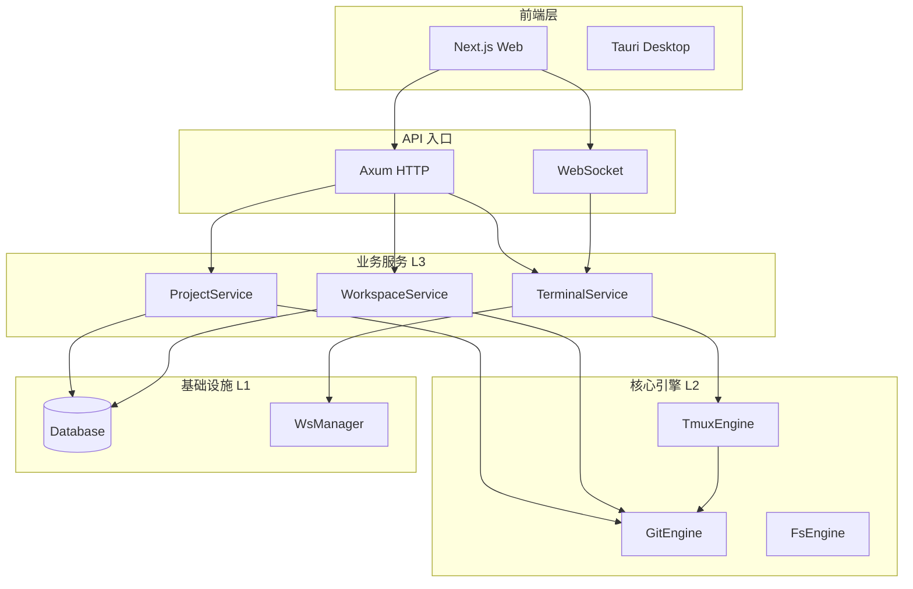

# ATMOS 项目概览

## Overview

ATMOS 是一个可视化终端工作空间项目，采用多层 monorepo 架构。项目将高性能 Rust 后端（划分为 infra、core-engine、core-service 三层）与 Next.js/Tauri 前端相结合，提供基于 Web 的终端协作与项目管理能力。

## Architecture

## 核心特性

- **可视化终端工作空间**：基于 tmux 的持久化终端会话
- **项目管理**：Git 仓库作为项目的管理单元
- **工作区管理**：基于 Git worktree 的多工作区支持
- **实时通信**：WebSocket 驱动的终端 I/O 与消息推送

## 相关链接

- [快速开始](quick-start.md)
- [技术栈](tech-stack.md)
- [Monorepo 结构](monorepo.md)
- [基础设施层](../infra/index.md)
- [核心引擎层](../core-engine/index.md)
- [业务服务层](../core-service/index.md)
