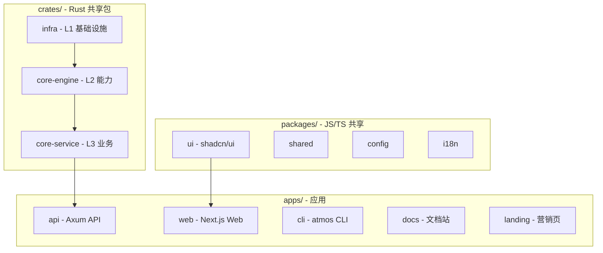

# Monorepo 结构

## Overview

ATMOS 采用标准化 monorepo 布局：`crates/` 存放共享 Rust 包，`apps/` 存放应用，`packages/` 存放共享 JS/TS 包。变更流向：infra → core-engine → core-service → api（后端）；packages/ui → apps/web（前端）。

## Architecture



## 目录结构

```
atmos/
├── crates/                    # 🦀 Rust 共享包
│   ├── infra/                 # L1: 数据库、WebSocket、Jobs
│   ├── core-engine/           # L2: PTY、Git、FS、Tmux
│   └── core-service/          # L3: 业务逻辑
├── apps/                      # 🚀 应用
│   ├── api/                   # Rust/Axum API
│   ├── web/                   # Next.js Web
│   ├── cli/                   # atmos CLI
│   ├── docs/                  # 文档站
│   └── landing/               # 营销页
├── packages/                  # 📦 JS/TS 共享
│   ├── ui/                    # @workspace/ui
│   ├── shared/                # Hooks/Utils
│   ├── config/                # ESLint/TS
│   └── i18n/                  # 国际化
├── docs/                      # 设计文档
└── specs/                     # PRD 与技术规划
```

> **Source**: [AGENTS.md](../../../AGENTS.md)

## 变更流向

### 后端

`infra` (数据) → `core-engine` (能力) → `core-service` (业务) → `api` (端点)

### 前端

`packages/ui` (样式) → `apps/web/src/api` (API 客户端) → `apps/web` (功能)

## 组件约定

- **UI 组件**：使用 `@workspace/ui/components/ui/*`
- **后端访问**：各 app 维护自己的 `api/client.ts` 和 `types/api.ts`
- **Rust 服务**：通过 `AppState` 注入到 `apps/api`

## 相关链接

- [快速开始](quick-start.md)
- [技术栈](tech-stack.md)
- [基础设施层](../infra/index.md)
- [核心引擎层](../core-engine/index.md)
- [业务服务层](../core-service/index.md)
