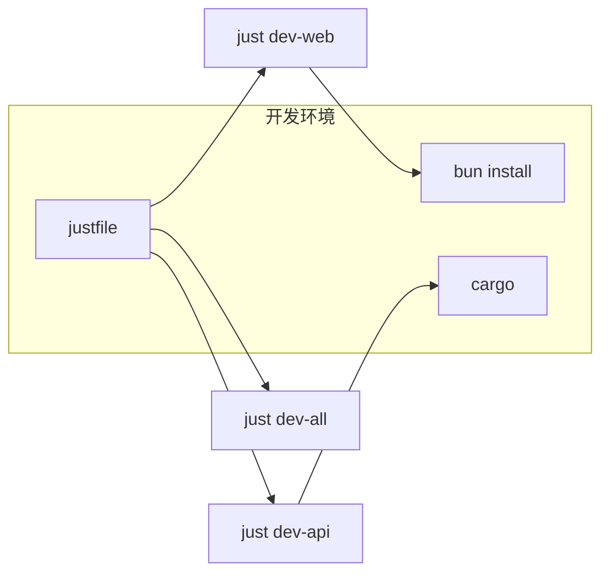

# 快速开始

## Overview

本文档介绍如何快速启动 ATMOS 开发环境。项目使用 Just 作为任务运行器，Bun 管理前端依赖，Cargo 管理 Rust 后端。

## Architecture



## 安装依赖

```bash
# 安装前端依赖
bun install

# Rust 依赖由 Cargo 自动管理
cargo fetch
```

> **Source**: [AGENTS.md](../../../AGENTS.md)

## 启动服务

```bash
# 启动 API 服务器（带热重载）
just dev-api

# 启动 Web 应用
just dev-web

# 同时启动 API + Web（并行运行）
just dev-all
```

> **Source**: [justfile](../../../justfile#L33-L44)

## 常用命令

| 命令 | 说明 |
|------|------|
| `just dev-api` | 启动 API 服务器（cargo watch 热重载） |
| `just dev-web` | 启动 Next.js Web 应用 |
| `just dev-landing` | 启动营销站点 |
| `just dev-docs` | 启动文档站点 |
| `just dev-cli` | 运行 CLI 帮助 |
| `just lint` | 运行 lint 检查 |
| `just test` | 运行所有测试 |
| `just build-all` | 构建所有项目 |

> **Source**: [justfile](../../../justfile)

## 环境配置

API 服务器会尝试加载环境变量：

- `apps/api/.env`
- 项目根目录 `.env`

> **Source**: [apps/api/src/main.rs](../../../apps/api/src/main.rs#L22-L24)

## 相关链接

- [技术栈](tech-stack.md)
- [项目概览](index.md)
- [API 路由](../api/index.md)
