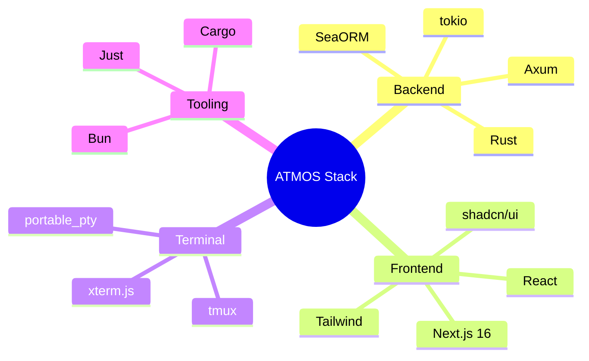

# 技术栈

## Overview

ATMOS 采用 Rust + TypeScript 双栈架构。后端使用 Rust 生态（Axum、SeaORM、tokio），前端使用 Next.js 16、React 和 shadcn/ui。终端持久化依赖 tmux，前端终端渲染使用 xterm.js。

## Architecture

## 后端技术

| 技术 | 用途 |
|------|------|
| **Rust** | 系统编程语言 |
| **Axum** | HTTP 与 WebSocket 框架 |
| **SeaORM** | 异步 ORM，SQLite/PostgreSQL |
| **tokio** | 异步运行时 |
| **portable_pty** | 跨平台 PTY 抽象 |
| **tmux** | 终端会话持久化 |

> **Source**: [Cargo.toml](../../../Cargo.toml)

## 前端技术

| 技术 | 用途 |
|------|------|
| **Next.js 16** | React 框架，App Router |
| **React** | UI 库 |
| **shadcn/ui** | 组件库（packages/ui） |
| **Tailwind CSS** | 样式 |
| **xterm.js** | 终端模拟器 |
| **Bun** | 包管理与运行 |

> **Source**: [apps/web/package.json](../../../apps/web/package.json)

## 开发工具

| 工具 | 用途 |
|------|------|
| **Just** | 任务运行器（替代 Makefile） |
| **Cargo** | Rust 包管理 |
| **Bun** | 前端包管理 |

## 相关链接

- [快速开始](quick-start.md)
- [Monorepo 结构](monorepo.md)
- [核心引擎层](../core-engine/index.md)
