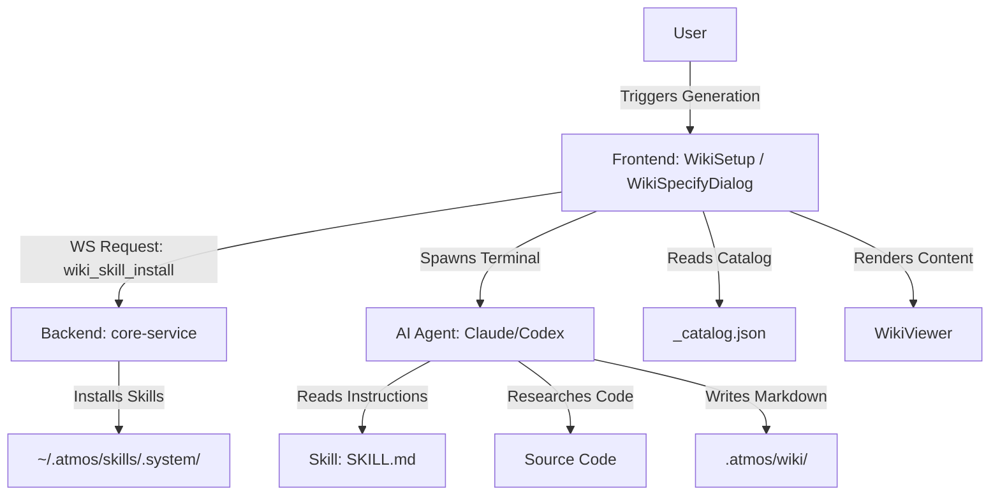

# Explore how Project Wiki is Implemented

## Introduction

The ATMOS Project Wiki is a sophisticated documentation system that bridges the gap between source code and human-readable documentation. It is designed to be "agent-driven," meaning it leverages AI agents to perform deep research into the codebase and generate structured, navigable documentation stored as Markdown files within the project itself.

## Overview

The wiki system consists of three main layers:
1.  **Skill Layer**: Defines the logic and instructions for AI agents to research and write documentation.
2.  **Infrastructure Layer (Backend)**: Handles the installation of skills and provides the necessary APIs for the frontend to interact with the wiki and trigger generation.
3.  **UI Layer (Frontend)**: Provides a rich, 3-column viewer for reading the wiki and dialogs for triggering generation or updates.

## Architecture

The following diagram illustrates the high-level flow of wiki generation and viewing:

## Implementation Details

### 1. Skill-Based Generation

The core logic of the wiki is not hardcoded in the backend but defined in **Skills**. Skills are sets of instructions (Markdown files) and supporting scripts that guide an AI agent.

*   **`project-wiki`**: The main skill for full wiki generation.
*   **`project-wiki-update`**: For incremental updates based on git diffs.
*   **`project-wiki-specify`**: For adding focused articles on specific topics.

These skills are stored in `~/.atmos/skills/.system/` to be accessible across different projects.

### 2. Backend Orchestration

The Rust backend (`core-service`) manages the lifecycle of these skills.

*   **Skill Installation**: `handle_wiki_skill_install` in `crates/core-service/src/service/ws_message.rs` ensures that the necessary skills are present in the user's home directory. It can copy them from the project root (for developers) or clone them from GitHub.
*   **Status Checking**: `handle_wiki_skill_system_status` checks if all required wiki skills are installed.

### 3. Frontend Integration

The frontend (`apps/web`) provides the interface for interacting with the wiki.

*   **`WikiTab.tsx`**: The entry point in CenterStage that checks for the existence of `.atmos/wiki/`.
*   **`WikiSetup.tsx`**: Handles the initial generation flow, allowing the user to select an agent and language.
*   **`WikiSpecifyDialog.tsx`**: Implements the "Specify Wiki" feature. It constructs a specific prompt that instructs the agent to read the `project-wiki-specify` skill and follow its instructions.
*   **`WikiViewer.tsx`**: A 3-column layout (Navigation | Content | TOC) that renders the generated Markdown using a custom `MarkdownRenderer` with Mermaid support.

### 4. Data Structure: `_catalog.json`

The wiki's structure is governed by a `_catalog.json` file. This file acts as a manifest, defining the hierarchy, order, and metadata (like reading time and difficulty level) for every article. The frontend uses this catalog to build the navigation tree.

## Key Source Files

*   `skills/project-wiki/SKILL.md`: The "brain" of the full wiki generation.
*   `apps/web/src/components/wiki/WikiSpecifyDialog.tsx`: Logic for triggering specific article generation.
*   `crates/core-service/src/service/ws_message.rs`: Backend handlers for skill management.
*   `apps/web/src/api/ws-api.ts`: WebSocket API definitions for wiki operations.

## Next Steps

*   Explore the `project-wiki-update` skill to understand how incremental updates are handled.
*   Review `MarkdownRenderer.tsx` to see how Mermaid diagrams and stable heading anchors are implemented.
