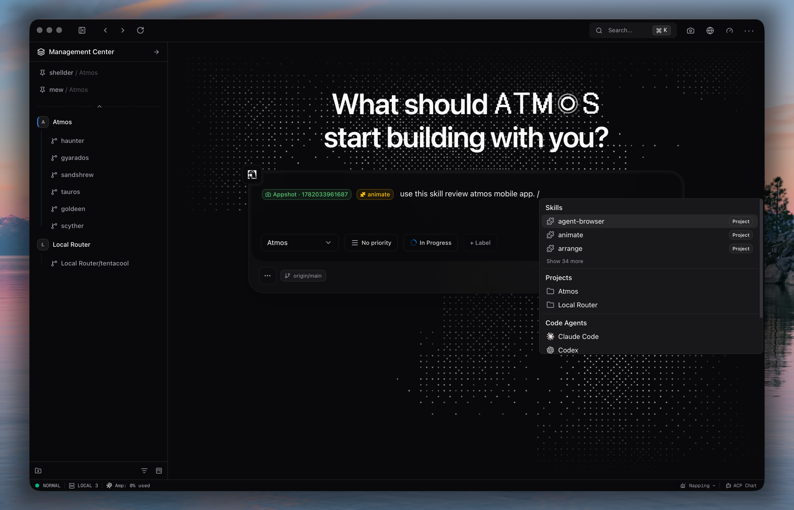

<div align="center">

# ATMOS

Atmosphere for Agentic Builders

[简体中文](./README.zh-CN.md) | English

</div>

<p align="center">
  
</p>


## Features

- **15+ Built-in Terminal Agents** — Launch and manage Claude Code, Codex, Gemini, Cursor, Devin, Antigravity, and more from one unified terminal interface.
- **Multi-Workspace Development** — Git worktree isolation for parallel agent execution across multiple environments.
- **Persistent Tmux Sessions** — Fault-tolerant terminal management with tmux; sessions survive interruptions and restarts.
- **Built-in Lightweight Editor** — File preview, inline editing, and switch back to manual coding mode anytime.
- **Integrated Git Workflow** — Diff view, commit assistance, code review, and GitHub PR management in one place.
- **Review Workflow** — Review changes in Atmos's built-in diff UI, leave inline comments on specific lines, then hand off to your Code Agent to apply fixes.
- **Global Agent Chat Panel** — Start non-terminal conversations from anywhere via ACP, reusing your Code Agent CLI.
- **Terminal Side Chat** — Quick `/side` conversations from the terminal AI input without leaving your terminal workflow.
- **Skill Management System** — Discover, enable/disable, and delete agent skills with one-click control.
- **Global Search & Command Palette** — Keyboard-driven workflow for searching and executing Atmos features.
- **Agent Status & Notifications** — Real-time agent lifecycle tracking via hooks (running, idle, waiting for permission, done) across the UI, with native notifications and self-hosted push server support (ntfy, Gotify, or a custom webhook).
- **Usage Analytics Dashboard** — Track AI coding subscription quotas, agent token consumption, and cost estimation.
- **Kanban View** — Quickly manage Workspace status, priority, labels and other information in Kanban view.
- **Canvas** — A cross-project infinite canvas: pin terminal cards from any workspace or project onto one persistent board, and let Code Agents drive the canvas diagrams, notes, and layout without leaving your agent workflow.
- **Atmos Computer** — Register your VPS or any machine to the Atmos Register Center, then connect from Desktop, Web, and run terminals, workspaces, and Canvas on that computer—your Atmos environment, wherever the machine lives.
- **Browser Element Inspector** — Hover and click to select elements in live browser preview, locating source code in React, Vue, Angular, and Svelte projects.
- **Cross-Platform & Tunnel Connector** — Web, desktop, and mobile apps, integrated tunneling (Ngrok/Tailscale/Cloudflare Tunnel).
- **Automations & GitHub Triggers** — Scheduled local automation runs powered by Atmos terminal agents, with optional GitHub App webhook triggers.
- **Appshots** — Cross-app desktop snapshots as lightweight clipboard references for quick capture during development.

## Get Started

### Download

Latest desktop release: [View the latest release](https://github.com/AruNi-01/atmos/releases/latest).

### Homebrew (Desktop App)

```bash
brew install --cask AruNi-01/tap/atmos
```

### Desktop App (macOS Install Script)

```bash
curl -fsSL https://install.atmos.land/install-desktop.sh | bash
```

This installer is for **macOS only** (Intel & Apple Silicon). It downloads and extracts the app to `/Applications`.

For **Linux/Windows**, download the installer directly from GitHub Releases:
[https://github.com/AruNi-01/atmos/releases](https://github.com/AruNi-01/atmos/releases)

### Local Web Runtime

```bash
curl -fsSL https://install.atmos.land/install-local-web-runtime.sh | bash
```

### Quick Use

#### Desktop App

1. Install Atmos via Homebrew or install script.
2. Launch the desktop app and create or open a workspace.
3. Connect your project, open a terminal, and work with agents in the same place.

#### Local Web Runtime

1. Install via the install script.
2. The runtime will start automatically (or run `~/.atmos/bin/atmos runtime ensure`).
3. Open your browser to the displayed URL (default: `http://127.0.0.1:30303`).
4. Create a workspace and start working with agents.

### Run From Source

> **Prerequisite**: [just](https://github.com/casey/just) — `brew install just` (macOS) / `cargo install just`

```bash
## Install
bun install
cargo fetch

## Run in web
just dev-api
just dev-web

# Run in desktop
just dev-web
just dev-desktop
```

**Or without `just`:**

```bash
# API
cargo run --bin api -- --cleanup-stale-clients true

# Web
cd apps/web && bun x next dev --turbopack --port 3030

# Desktop
bash ./scripts/desktop/prepare-sidecar.sh && cd apps/desktop && bun run tauri dev --no-watch --no-dev-server-wait --config src-tauri/tauri.debug.conf.json
```

## License

See [LICENSE](./LICENSE).
