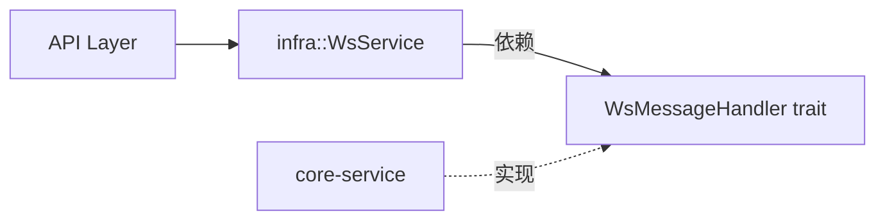

# WebSocket 依赖反转优化总结

## ✅ 优化完成

已成功实现 WebSocket 的依赖反转架构，确保各层职责清晰。

## 🔄 主要改动

### 1. **infra 层 - WsService** (`crates/infra/src/websocket/service.rs`)

**新增功能**：
- ✅ 支持注入 `WsMessageHandler` 业务处理器
- ✅ 新增 `with_message_handler()` 方法用于依赖注入
- ✅ 新增 `handle_message()` 统一消息处理入口
- ✅ 在 `register()` 和 `unregister()` 中调用处理器的生命周期钩子

**核心代码**：
```rust
pub struct WsService {
    manager: Arc<WsManager>,
    message_handler: Option<Arc<dyn WsMessageHandler>>,  // 注入的业务处理器
    config: WsServiceConfig,
}

impl WsService {
    pub fn with_message_handler(mut self, handler: Arc<dyn WsMessageHandler>) -> Self {
        self.message_handler = Some(handler);
        self
    }
    
    pub async fn handle_message(&self, conn_id: &str, text: &str) -> Option<String> {
        // 1. 更新活跃时间
        self.manager.touch_connection(conn_id).await;
        
        // 2. 处理控制消息 (ping/pong)
        match process_text_message(text, conn_id) {
            HandleResult::Reply(response) => Some(response),
            HandleResult::None => {
                // 3. 委托给业务处理器
                if let Some(handler) = &self.message_handler {
                    handler.handle_message(conn_id, text).await
                } else {
                    warn!("No message handler configured");
                    None
                }
            }
            HandleResult::Close => None,
        }
    }
}
```

### 2. **core-service 层 - WsMessageService** (`crates/core-service/src/ws_message_service.rs`)

**新增功能**：
- ✅ 实现 `WsMessageHandler` trait
- ✅ 实现 `handle_message()` 业务逻辑
- ✅ 实现 `on_connect()` 和 `on_disconnect()` 生命周期钩子

**核心代码**：
```rust
use async_trait::async_trait;
use infra::WsMessageHandler;

#[async_trait]
impl WsMessageHandler for WsMessageService {
    async fn handle_message(&self, conn_id: &str, message: &str) -> Option<String> {
        match self.process_ws_message(message).await {
            Ok(result) => Some(result),
            Err(e) => {
                tracing::error!("Failed to process message: {}", e);
                None
            }
        }
    }
    
    async fn on_connect(&self, conn_id: &str) {
        tracing::info!("WebSocket client connected: {}", conn_id);
    }
    
    async fn on_disconnect(&self, conn_id: &str) {
        tracing::info!("WebSocket client disconnected: {}", conn_id);
    }
}
```

### 3. **API 层 - 消息处理** (`apps/api/src/api/ws/handlers.rs`)

**简化前**（60行）：
```rust
async fn handle_incoming_message(...) -> bool {
    // 1. 判断是否控制消息
    if let Some(response) = state.ws_service.handle_control_message(...).await {
        let _ = tx.send(response).await;
        return true;
    }
    
    // 2. 判断是否业务消息
    if !state.ws_service.is_control_message(text_str) {
        // 3. 调用 core-service
        if let Ok(result) = state.ws_message_service.process_ws_message(text_str).await {
            // 4. 更新推送服务
            state.message_push_service.update_latest_message(&result).await;
            
            // 5. 构造响应
            let response = WsMessage::message(conn_id, result);
            if let Ok(json) = response.to_json() {
                let _ = tx.send(json).await;
            }
        }
    }
    true
}
```

**简化后**（16行）：
```rust
async fn handle_incoming_message(...) -> bool {
    match msg {
        Message::Text(text) => {
            // 统一消息处理 - infra 层处理所有消息
            if let Some(response) = state.ws_service.handle_message(conn_id, text).await {
                if let Err(e) = tx.send(response).await {
                    tracing::warn!("Failed to send response: {}", e);
                    return false;
                }
            }
            true
        }
        Message::Close(_) => false,
        _ => true,
    }
}
```

### 4. **AppState 依赖注入** (`apps/api/src/app_state.rs`)

**优化前**：
```rust
pub struct AppState {
    pub ws_message_service: Arc<WsMessageService>,  // 直接暴露
    pub ws_service: Arc<WsService>,                  // 未注入处理器
}
```

**优化后**：
```rust
pub struct AppState {
    pub message_push_service: Arc<MessagePushService>,  // 仅用于周期推送
    pub ws_service: Arc<WsService>,                      // 包含注入的处理器
}

impl AppState {
    pub fn new(
        test_service: Arc<TestService>,
        ws_message_service: Arc<WsMessageService>,
        message_push_service: Arc<MessagePushService>,
        ws_service_config: WsServiceConfig,
    ) -> Self {
        // 依赖注入：将业务处理器注入到 WsService
        let ws_service = WsService::with_config(ws_service_config)
            .with_message_handler(ws_message_service);
        
        Self {
            test_service,
            message_push_service,
            ws_service: Arc::new(ws_service),
        }
    }
}
```

### 5. **main.rs 初始化** (`apps/api/src/main.rs`)

**优化后**：
```rust
// 创建服务
let ws_message_service = Arc::new(WsMessageService::new(...));

// 配置 WebSocket 服务
let ws_config = WsServiceConfig {
    heartbeat_interval_secs: 10,
    connection_timeout_secs: 30,
};

// 依赖注入
let app_state = AppState::new(
    test_service,
    ws_message_service,  // 注入到 WsService
    message_push_service,
    ws_config,
);
```

## 📊 优化效果对比

| 方面 | 优化前 | 优化后 |
|------|--------|--------|
| **消息处理逻辑** | 分散在 API 层（60行） | 统一在 infra 层（16行） |
| **职责分离** | API 层需判断消息类型 | API 层只负责转发 |
| **依赖方向** | API → core-service（直接） | infra → interface ← core-service |
| **代码复杂度** | 高（多层if判断） | 低（单一入口） |
| **可测试性** | 难（需真实依赖） | 易（可mock处理器） |
| **扩展性** | 差（修改需改多处） | 好（只需实现trait） |

## 🎯 架构优势

### 1. **职责清晰**
```
infra 层：WebSocket 基础设施 + 消息分发中枢
API 层：HTTP 升级 + 连接生命周期管理
core-service 层：纯业务逻辑实现
```

### 2. **依赖反转实现**


### 3. **消息处理流程统一**
```
Client → API → WsService.handle_message()
                 ├─ ping/pong (infra 处理)
                 └─ business (委托给 WsMessageHandler)
```

## 🔧 依赖变更

**新增依赖**：
- `crates/core-service/Cargo.toml`: `async-trait = "0.1"`

## ✅ 测试结果

```bash
$ cargo check --package api
   Finished `dev` profile [unoptimized + debuginfo] target(s) in 1.03s

$ cargo build --package api
   Finished `dev` profile [unoptimized + debuginfo] target(s) in 5.25s
```

所有编译通过，无错误！

## 🚀 后续可扩展场景

### 1. **多租户支持**
```rust
struct TenantWsHandler {
    tenant_id: String,
    business_logic: TenantService,
}

impl WsMessageHandler for TenantWsHandler {
    async fn handle_message(&self, conn_id: &str, message: &str) -> Option<String> {
        self.business_logic.handle_tenant_message(&self.tenant_id, message).await
    }
}
```

### 2. **A/B 测试**
```rust
struct ABTestHandler {
    handler_a: Arc<dyn WsMessageHandler>,
    handler_b: Arc<dyn WsMessageHandler>,
}

impl WsMessageHandler for ABTestHandler {
    async fn handle_message(&self, conn_id: &str, message: &str) -> Option<String> {
        if should_use_version_b(conn_id) {
            self.handler_b.handle_message(conn_id, message).await
        } else {
            self.handler_a.handle_message(conn_id, message).await
        }
    }
}
```

### 3. **消息过滤器链**
```rust
struct FilterChainHandler {
    filters: Vec<Box<dyn MessageFilter>>,
    inner: Arc<dyn WsMessageHandler>,
}
```

## 📝 关键要点

1. ✅ **infra 层现在可以统一处理所有 WebSocket 消息**
2. ✅ **API 层职责简化为连接管理和消息转发**
3. ✅ **core-service 层通过 trait 实现业务逻辑，无需 infra 直接依赖**
4. ✅ **依赖注入在应用初始化时完成**
5. ✅ **代码更简洁、可测试、可扩展**

---

**优化完成时间**: 2026-01-18  
**影响范围**: infra、core-service、api  
**破坏性变更**: 无（保留了 `handle_control_message` 的向后兼容）