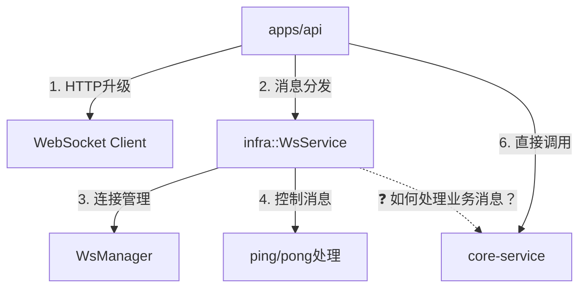
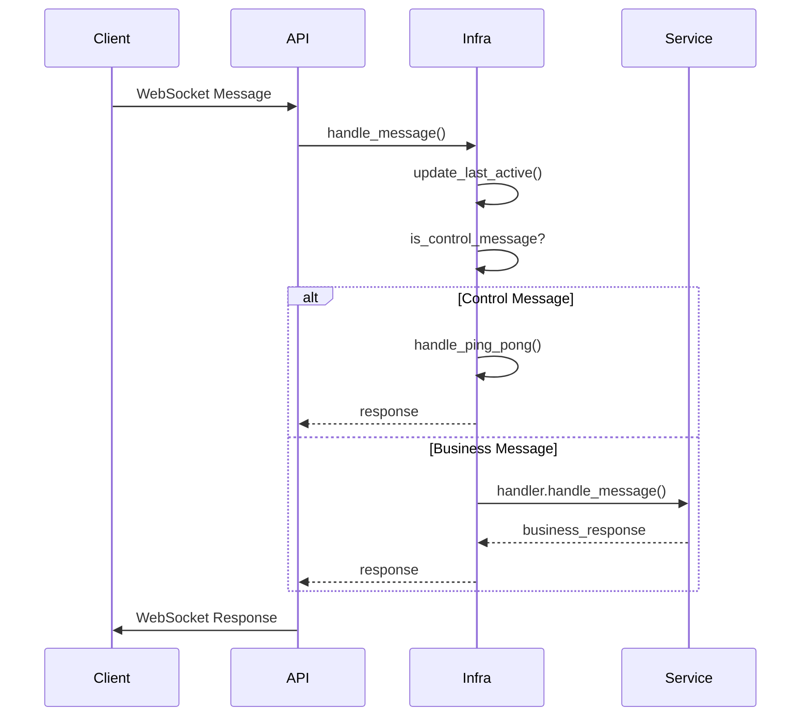

# WebSocket 分层解耦的正确理解

## 🎯 架构设计的真正问题

### 当前架构的职责分工：



## 🔍 当前实现的问题

### 1. **消息处理的分裂**
```rust
// apps/api/src/api/ws/handlers.rs:119-126
// 1. API层调用infra处理控制消息
if let Some(response) = state.ws_service.handle_control_message(conn_id, text_str).await {
    let _ = tx.send(response).await;
    return true;
}

// 2. API层直接调用core-service处理业务消息
if !state.ws_service.is_control_message(text_str) {
    if let Ok(result) = state.ws_message_service.process_ws_message(text_str).await {
        // ...
    }
}
```

**问题**：消息处理逻辑被分割在两个不同的层，API层需要承担判断消息类型和分发的责任。

### 2. **infra层的职责不完整**
```rust
// crates/infra/src/websocket/service.rs:125-135
// infra层只处理控制消息，业务消息仍需要上层判断
pub async fn handle_control_message(&self, conn_id: &str, text: &str) -> Option<String> {
    self.manager.touch_connection(conn_id).await;
    
    match process_text_message(text, conn_id) {
        HandleResult::Reply(response) => Some(response),  // 只处理ping/pong
        HandleResult::None => None,                      // 业务消息返回None
        HandleResult::Close => None,
    }
}
```

**问题**：infra层作为WebSocket的管理者，却无法完整处理消息，需要API层介入。

## 🎯 依赖反转的真正目的

### 场景1：**infra层需要处理所有消息**
```rust
// 理想情况：infra层统一处理所有消息
pub async fn handle_message(&self, conn_id: &str, text: &str) -> Option<String> {
    // 1. 更新活跃时间
    self.manager.touch_connection(conn_id).await;
    
    // 2. 处理所有消息（控制 + 业务）
    match process_text_message(text, conn_id) {
        HandleResult::Reply(response) => Some(response),  // ping -> pong
        HandleResult::None => {
            // 业务消息：依赖反转调用
            if let Some(handler) = &self.message_handler {
                handler.handle_message(conn_id, text).await
            } else {
                None
            }
        }
        HandleResult::Close => None,
    }
}
```

### 场景2：**API层的简化**
```rust
// 改进后：API层只需要转发，无需判断消息类型
pub async fn handle_incoming_message(
    msg: Message,
    tx: &mpsc::Sender<String>,
    state: &AppState,
    conn_id: &str,
) -> bool {
    match msg {
        Message::Text(text) => {
            // 统一交给infra层处理
            if let Some(response) = state.ws_service.handle_message(conn_id, &text).await {
                let _ = tx.send(response).await;
            }
            true
        }
        Message::Close(_) => false,
        _ => true,
    }
}
```

## 🔧 正确的依赖反转实现

### 1. **WsService注入业务处理器**
```rust
pub struct WsService {
    manager: Arc<WsManager>,
    message_handler: Option<Box<dyn WsMessageHandler>>,
    config: WsServiceConfig,
}

impl WsService {
    // 注入业务处理器
    pub fn with_message_handler(mut self, handler: Box<dyn WsMessageHandler>) -> Self {
        self.message_handler = Some(handler);
        self
    }
    
    // 统一消息处理入口
    pub async fn handle_message(&self, conn_id: &str, text: &str) -> Option<String> {
        // 更新活跃时间
        self.manager.touch_connection(conn_id).await;
        
        // 先处理控制消息
        if let Some(response) = self.handle_control_message_internal(text, conn_id).await {
            return Some(response);
        }
        
        // 业务消息委托给注入的处理器
        if let Some(handler) = &self.message_handler {
            handler.handle_message(conn_id, text).await
        } else {
            tracing::warn!("No message handler configured, ignoring business message");
            None
        }
    }
}
```

### 2. **WsMessageService实现接口**
```rust
// crates/core-service/src/ws_message_service.rs
#[async_trait]
impl infra::WsMessageHandler for WsMessageService {
    async fn handle_message(&self, conn_id: &str, message: &str) -> Option<String> {
        // 这里的逻辑保持不变，只是包装在trait中
        match self.process_ws_message(message).await {
            Ok(result) => {
                // 更新推送服务
                self.push_service.update_latest_message(&result).await;
                Some(result)
            }
            Err(e) => {
                tracing::error!("Failed to process message: {}", e);
                None
            }
        }
    }
    
    async fn on_connect(&self, conn_id: &str) {
        tracing::info!("WebSocket client connected: {}", conn_id);
    }
    
    async fn on_disconnect(&self, conn_id: &str) {
        tracing::info!("WebSocket client disconnected: {}", conn_id);
    }
}
```

### 3. **初始化时的依赖注入**
```rust
// apps/api/src/main.rs 或 app_state.rs
impl AppState {
    pub fn new(
        db: DatabaseConnection,
        engine: Arc<TestEngine>,
    ) -> Self {
        let ws_message_service = Arc::new(WsMessageService::new(engine, db));
        let message_push_service = Arc::new(MessagePushService::new());
        
        // 1. 创建WebSocket服务
        let ws_service = WsService::new()
            .with_message_handler(Box::new(ws_message_service.as_ref().clone()));
        
        Self {
            ws_service: Arc::new(ws_service),
            message_push_service,
            // 不再需要单独暴露 ws_message_service
        }
    }
}
```

## 🎯 依赖反转的好处

### 1. **职责清晰**
- **infra层**：统一管理WebSocket连接和消息分发
- **API层**：只负责HTTP升级和连接建立
- **core-service层**：专注于业务逻辑处理

### 2. **消息处理统一**


### 3. **测试友好**
```rust
#[cfg(test)]
mod tests {
    struct MockHandler {
        responses: HashMap<String, String>,
    }
    
    #[async_trait]
    impl WsMessageHandler for MockHandler {
        async fn handle_message(&self, conn_id: &str, message: &str) -> Option<String> {
            self.responses.get(message).cloned()
        }
    }
    
    #[tokio::test]
    async fn test_complete_message_flow() {
        let mock_handler = Box::new(MockHandler::new());
        let ws_service = WsService::new().with_message_handler(mock_handler);
        
        // 测试控制消息
        let pong = ws_service.handle_message("test", "ping").await;
        assert_eq!(pong, Some("pong".to_string()));
        
        // 测试业务消息
        let response = ws_service.handle_message("test", "hello").await;
        assert_eq!(response, Some("world".to_string()));
    }
}
```

## 📝 总结

**你的理解完全正确**：

1. **API可以直接调用core-service** - 这是正常的，API层作为应用层，可以调用任何下层服务
2. **infra需要依赖反转** - 因为infra是WebSocket的管理者，应该能处理所有消息，但业务逻辑在service层
3. **目的是统一消息处理** - 避免API层承担消息类型判断和分发的责任

**依赖反转解决的核心问题**：
- infra层作为WebSocket的基础设施，需要能够处理所有类型的消息
- 但业务逻辑在core-service层，infra不应该直接依赖具体的业务实现
- 通过WsMessageHandler接口，infra可以调用业务逻辑而不违反依赖原则

这样infra层就能统一管理WebSocket消息，而API层只需关注连接建立和简单的消息转发。