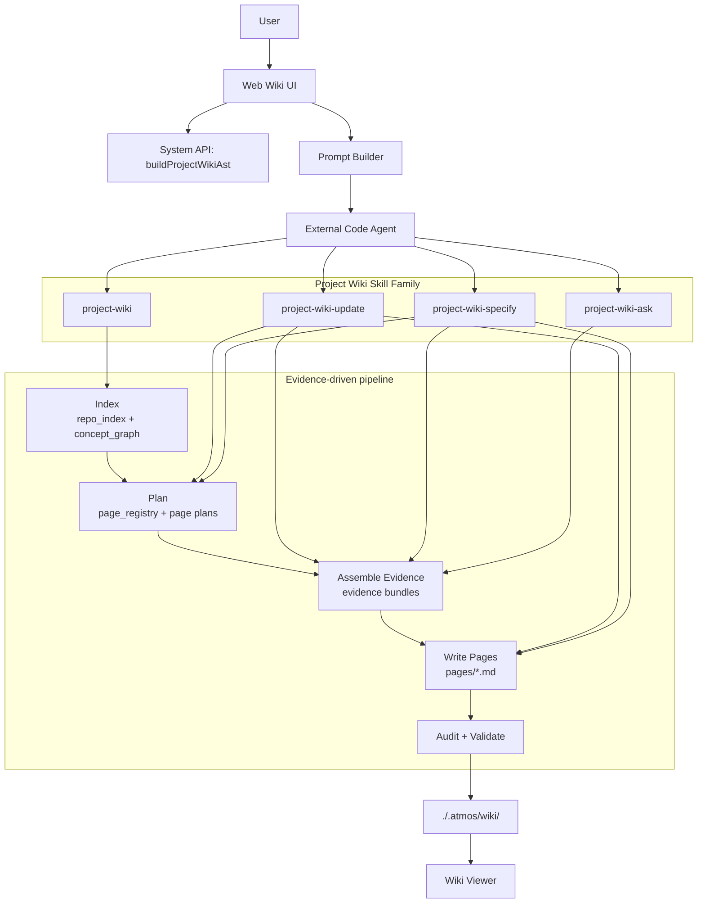
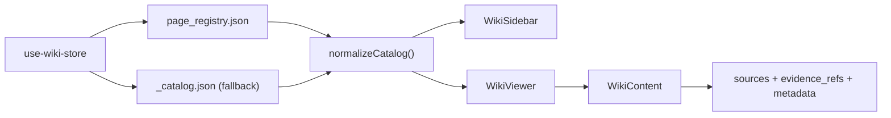
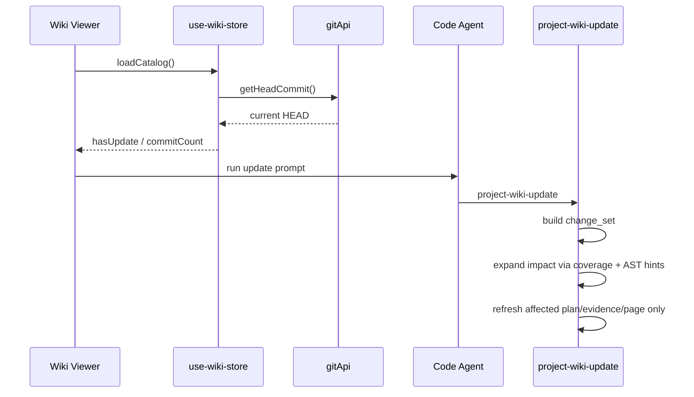

# Project Wiki Skill Architecture

## 1. 目标

Project Wiki 现在不是“让 Agent 按模板写 Markdown”的功能，而是一套由 skill 驱动的、证据优先的 Wiki 生成流水线。

它的目标是：

- 将代码仓库整理成可持续演进的本地知识库
- 让 Wiki 页面由 `page plan + evidence bundle` 驱动，而不是由固定章节模板驱动
- 将 AST、源码、Git 元数据、页面规划、覆盖关系都沉淀为一等产物
- 支持完整生成、增量更新、定向补页、后续问答四类工作模式

最终输出仍然落在项目本地的 `./.atmos/wiki/`，但主协议已经从 `_catalog.json` 迁移为 `page_registry.json`。

> 📌 **当前版本**：`skills/project-wiki` version `2.2.0`。相比 `2.0.0` 增加了：并行研究子 Agent、`_research/` 共享中间层、`_phase_done/` 阶段门、证据真实性硬约束、AST-first 使用原则。

## 2. 设计原则

### 2.1 证据优先

页面内容必须由可追溯证据支撑。优先级如下：

1. AST 结构化结果
2. 源码与配置文件
3. Git commit / PR / issue 元数据
4. 明确标注的 inference

### 2.2 双层产物

Wiki 不是只有最终页面。

- 机器层：`page_registry`、`_plans`、`_evidence`、`_coverage`、`_index`
- 人类层：`pages/*.md`

机器层支撑增量更新、问答、质量审计和后续生成；人类层只负责阅读体验。

### 2.3 Skill 驱动，而不是业务逻辑硬编码到前端

前端只负责：

- 安装/检测 system skill
- 构建运行 prompt
- 触发 AST 预构建
- 启动 Agent 命令
- 读取和展示生成结果

真正的 Wiki 生成逻辑都在 `skills/project-wiki*` 家族中。

### 2.4 单 Agent 可运行，多 Agent 可加速

多 Agent 只是编排优化，不是流程前提。即使没有子 Agent，主 Agent 也必须能串行完成同一套步骤。

## 3. 总体架构



## 4. 目录与核心产物

当前主结构如下：

```text
.atmos/wiki/
├── page_registry.json
├── _todo.md
├── _metadata/
├── _ast/
├── _index/
│   ├── repo_index.json
│   └── concept_graph.json
├── _research/
│   ├── domain.md
│   ├── workflows.md
│   ├── integrations.md
│   └── boundaries.md
├── _plans/
│   └── <page-id>.json
├── _evidence/
│   └── <page-id>.json
├── _coverage/
│   ├── coverage_map.json
│   └── change_set.json
├── _phase_done/
│   └── <page-id>.<phase>.json
└── pages/
    └── <page>.md
```

### 4.1 `page_registry.json`

这是新的单一真源，负责：

- 项目元数据
- 导航树
- 页面清单
- 本次 Wiki 对应的 `commit_hash`

前端现在优先读取这个文件；只有它不存在时才 fallback 到旧 `_catalog.json`。

### 4.2 `_index/`

`repo_index.json` 和 `concept_graph.json` 是仓库级索引层：

- `repo_index.json` 记录仓库边界、模块、入口、AST 状态、关键构建文件、重要 Git 信号
- `concept_graph.json` 记录核心概念、相关文件、相关符号、相关提交，以及概念之间的边

这层的职责是把“仓库全貌”从临时上下文变成持久结构化资产。

### 4.3 `_research/`

这是 v2.2.0 新增的共享研究中间层，由四个并行运行的 research subagent 写入，形式为自由 Markdown 报告：

| 文件 | 生产者 | 内容 |
|------|--------|------|
| `domain.md` | `domain-researcher` | 模块边界、领域概念、数据模型、模块间依赖 |
| `workflows.md` | `workflow-researcher` | 入口点、运行时流程、异步模式 |
| `integrations.md` | `integration-researcher` | 外部系统、连接类型、配置 key、弹性策略 |
| `boundaries.md` | `boundary-researcher` | 公共 API、AOP 切面、认证/限流/缓存等横切关注点 |

为什么用 Markdown 而非 JSON：Agent 写自由 Markdown 不会因格式错失败；叙述性内容能保留推理过程、不确定性标注；下游 `evidence-curator` 读 Markdown 就是读上下文。

这层的作用是把"四个视角的分析"从每个页面重复做变成只做一次，供所有页面的 evidence 组装复用。

### 4.4 `_plans/`

每个页面先有 plan，再有正文。`page plan` 负责定义：

- `page_id`
- `title`
- `kind`
- `audience`
- `questions`
- `required_evidence`
- `scope.in`
- `scope.out`

这保证页面是“围绕要回答的问题”来生成，而不是套固定目录。

### 4.5 `_evidence/`

每页对应一个 evidence bundle，包含：

- `files`
- `symbols`
- `relations`
- `commits`
- `issues`
- `prs`
- `inferences`

这层是页面可追溯性的核心。页面 frontmatter 中的 `evidence_refs` 会直接指向这里。

v2.1.0 起对 evidence 加了硬约束（通过 `validate_evidence.py` 强制）：

1. `files` 必须非空，且每一项必须可追溯到 `_ast/hierarchy.json`
2. `symbols` 必须非空（`kind=overview/topic/decision` 除外）
3. 页面 frontmatter 的 `sources` 必须是 evidence `files` 的子集
4. 页面正文中反引号引用的 ClassName 或路径必须出现在 evidence 的 `files` 或 `symbols` 中

这四条约束把"Agent 写空壳 evidence 凑数"这种偷懒模式从根上堵死。

### 4.6 `_coverage/`

覆盖关系层为增量更新服务：

- `coverage_map.json` 建立 `file/symbol/relation -> page_id[]` 映射
- `change_set.json` 记录从旧 commit 到当前 `HEAD` 的变更集合与受影响页面

这样增量更新不必靠页面 frontmatter 里的 `sources` 粗粒度匹配。

### 4.7 `_phase_done/`

v2.1.0 新增的阶段门产物。每个页面的每个阶段完成后都必须写一个 `<page-id>.<phase>.json` 文件，`phase` 取值 `plan` / `evidence` / `write`。文件格式：

```json
{ "page_id": "<page-id>", "phase": "plan|evidence|write", "completed_at": "<iso8601>", "outputs": [...] }
```

`validate_phase_gate.py` 校验：
- 每个页面必须有 3 个 phase gate 文件
- `completed_at` 时间戳必须非递减：plan ≤ evidence ≤ write

这个机制强制即使 Agent 串行执行，也要像多 Agent 一样把每个阶段的产出物落盘，而不是一次性跳步写完。

### 4.8 `pages/`

这里只放最终可读页面。页面 frontmatter 当前要求至少包含：

- `page_id`
- `title`
- `kind`
- `audience`
- `sources`
- `evidence_refs`
- `updated_at`

`reading_time`、固定 section、固定模板已经不再是主协议。

## 5. Skill 家族职责

### 5.1 `project-wiki`

全量生成入口。它负责编排整条流水线：

1. 初始化 `_todo`
2. 收集 Git 元数据
3. 读取 AST 状态
4. 构建仓库索引
5. 构建页面计划
6. 组装证据包
7. 生成页面
8. 审计与校验

### 5.2 `project-wiki-update`

用于增量更新。它不会默认全量重写，而是：

1. 读取 `page_registry.json`
2. 读取 `_coverage/coverage_map.json`
3. 比较 `registry commit_hash` 与当前 `HEAD`
4. 构建 `change_set.json`
5. 扩展影响面
6. 只更新受影响的 `plan / evidence / page`

### 5.3 `project-wiki-specify`

用于“新增一个聚焦主题页”。它的输出不是简单在老目录里插一篇文，而是：

1. 判断是否该新建页面
2. 更新 `page_registry.json`
3. 新建或修改 page plan
4. 新建 evidence bundle
5. 写入 `pages/`
6. 更新 coverage map

### 5.4 `project-wiki-ask`

这是消费层 skill，不负责写整页，而是：

1. 用 `page_registry.json` 找相关页面
2. 优先读 `_plans` 和 `_evidence`
3. 必要时再读 `pages/`
4. 如果问题超出已覆盖范围，建议转去 `specify` 或 `update`

## 6. 子 Agent 角色

当前在 `skills/project-wiki/agents/` 中定义了五个角色。

### 6.1 `repo-analyst`

负责仓库级研究：

- 识别边界、入口、子系统、关键目录
- 消费 AST 的 `index.json` / `hierarchy.json`
- 输出 `_index/repo_index.json` 与 `_index/concept_graph.json`

### 6.2 `evidence-curator`

负责页面级证据组装：

- 缩小证据范围
- 将源码、符号、关系、提交整理成 `_evidence/<page-id>.json`
- 显式标出 inference

### 6.3 `wiki-planner`

负责页面规划：

- 决定有哪些页面
- 决定页面 `kind` 与 `audience`
- 产出 `_plans/<page-id>.json`
- 更新 `page_registry.json`

### 6.4 `wiki-writer`

负责最终页面生成：

- 先读 page plan
- 再读 evidence bundle
- 按主题组织结构
- 生成最终 Markdown

### 6.5 `wiki-auditor`

负责质量审计：

- 比较 page 与 page plan
- 比较 page 与 evidence bundle
- 检查重复、断链、覆盖不足、漂移

## 7. 生成流程如何被 Skill 驱动

这一部分是当前实现最关键的链路。

### 7.1 前端触发

用户在 Wiki Tab 中点击生成时，前端并不自己生成 Wiki。它只做三件事：

1. 检查 system skill 是否已安装
2. 调用 `buildProjectWikiAst` 预构建 AST
3. 构造 prompt 并在 Project Wiki 专用终端中启动外部 Agent

当前 prompt 明确要求：

- 读取 `~/.atmos/skills/.system/project-wiki/SKILL.md`
- 将 `page_registry.json` 作为主协议
- 生成 `_index / _plans / _evidence / _coverage / pages`
- 运行新的 validator

也就是说，前端只负责“把 Agent 送进正确的 skill 工作流”。

### 7.2 AST 预构建

在真正执行 skill 前，前端会调用 system API 构建 `./.atmos/wiki/_ast/`。

AST 产物提供：

- `_status.json`
- `hierarchy.json`
- `index.json`
- `files/*.json`
- `symbols.jsonl`
- `relations.jsonl`

Skill 不会把 AST 当正文材料直接展开，而是把它当作：

- 页面规划输入
- 证据组装输入
- 增量影响分析输入

### 7.3 Agent 执行 Skill

外部 Agent 启动后，Skill 才是真正的工作说明书：

- `SKILL.md` 给出流程规则
- `references/*.json|md` 给出 schema 与质量标准
- `agents/*.md` 给出子角色职责
- `scripts/*.py|sh` 给出初始化与校验能力

这意味着 Wiki 的生成逻辑是“通过 skill 解释执行”的，而不是写死在 Rust 或前端里。

### 7.4 结果回流到前端

生成完成后，前端重新读取 `./.atmos/wiki/page_registry.json`，并用它驱动：

- 侧边导航
- 页面切换
- 更新检测
- topic 页面插入

如果只有旧 `_catalog.json`，前端也能兼容，但新生成链路不会再以 `_catalog.json` 为主。

## 8. 前端读取架构



### 8.1 读取顺序

`use-wiki-store` 现在按以下顺序探测：

1. `.atmos/wiki/page_registry.json`
2. `.atmos/wiki/_catalog.json` 作为 fallback

### 8.2 归一化

`normalizeCatalog()` 会把新旧两种格式归一成同一个前端内部结构：

- `navigation`
- `pages`
- `catalog` 兼容别名

所以前端组件不必知道底层究竟是 registry 还是 legacy catalog。

### 8.3 页面内容展示

`WikiContent` 现在会额外展示：

- `kind`
- `audience`
- `sources`
- `evidence_refs`

这样页面不是孤立文档，而是明确带着“证据来源”的知识节点。

## 9. 校验体系

当前校验体系已经从模板约束切换为协议与质量约束。

### 9.1 `validate_page_registry.py`

校验：

- 顶层字段
- `project`
- `navigation`
- `pages`
- `navigation -> page_id`
- `commit_hash`

旧 `validate_catalog.py` 现在只是这个脚本的兼容包装。

### 9.2 `validate_frontmatter.py`

校验页面 frontmatter 是否符合现代协议，同时兼容 legacy frontmatter。

### 9.3 `validate_page_quality.py`

不再检查：

- 固定字数
- 固定 Mermaid 数量
- 固定 H2 数量

转而检查：

- 页面是否有 `page_id`
- 是否在 `page_registry.json` 中注册
- 是否有 `sources`
- 是否有 `evidence_refs`
- evidence ref 文件是否存在
- 对应 page plan 是否存在
- 正文是否不是空壳

旧 `validate_content.py` 现在只是兼容包装。

### 9.4 `validate_todo.py`

校验 `_todo.md` 中的流水线步骤是否完成，步骤已经切换成新的产物结构。

## 10. 增量更新架构



核心思想是：

- 以 `page_registry.commit_hash` 为基线
- 以 `coverage_map.json` 为主要影响映射
- 以 AST relations 为辅助扩展
- 只重算受影响页面

## 11. 与旧方案的关键差异

### 11.1 从模板驱动到研究驱动

旧方案关注“文章长得像不像标准模板”，新方案关注“页面是否由充分证据支持”。

### 11.2 从目录树到知识图

旧方案默认用 `getting-started / deep-dive` 固定树；新方案允许导航结构由页面规划决定。

### 11.3 从页面唯一产物到多层知识产物

旧方案几乎只有 `_catalog.json + Markdown`；新方案多了索引、计划、证据、覆盖图。

### 11.4 从全量重写倾向到增量可维护

旧方案很难做高质量增量；新方案通过 `coverage_map + change_set` 支持定点刷新。

## 12. 当前实现边界

已经落地的部分：

- skill 家族与新协议
- `agents/` 子角色说明
- `page_registry` / page plan / evidence bundle schema
- 新 validator
- 前端优先读取 `page_registry.json`
- 生成/更新/指定主题 prompt 已切到新流程
- system skill 安装与 manifest 已纳入新文件

仍然依赖 Agent 执行质量的部分：

- `_index/repo_index.json` 的具体生成质量
- `_index/concept_graph.json` 的概念抽取质量
- `_coverage/coverage_map.json` 的完整性
- `_evidence/*.json` 的证据粒度
- `_catalog.json` 的兼容导出是否生成

也就是说，当前架构已经把“正确的协议与执行边界”建立起来了，但具体生成质量仍取决于 skill 使用者是否遵守这些约束。

## 13. 后续演进建议

### 13.1 提供兼容导出器

增加一个脚本，从 `page_registry.json` 派生 `_catalog.json`，减少 legacy consumer 的迁移成本。

### 13.2 将 coverage map 构建脚本化

当前协议定义了 `coverage_map.json`，但生成仍主要依赖 Agent。后续可以补一个 deterministic helper。

### 13.3 为 Ask 模式补前端入口

当前 `project-wiki-ask` 已存在，但 UI 还没有正式把它暴露为单独模式。

### 13.4 增加质量评分器

可以在 `wiki-auditor` 后面增加一个更强的评分器，把“覆盖不足”“重复严重”“漂移未标记”等问题量化。

## 14. 总结

Project Wiki 现在的核心不是“生成文档”，而是“构建一个由 skill 驱动、以证据为基础的本地知识系统”。

在这套架构里：

- 前端负责触发、安装、预构建和展示
- AST 负责提供结构化代码索引
- skill 家族负责定义生成、更新、补页、问答的规则
- 多 Agent 角色负责把工作拆成索引、规划、证据、写作、审计
- `page_registry + plans + evidence + coverage + pages` 共同构成 Wiki 的真实模型

这使 Wiki 从一次性文档产物，升级成了可演进、可审计、可增量维护的知识底座。
