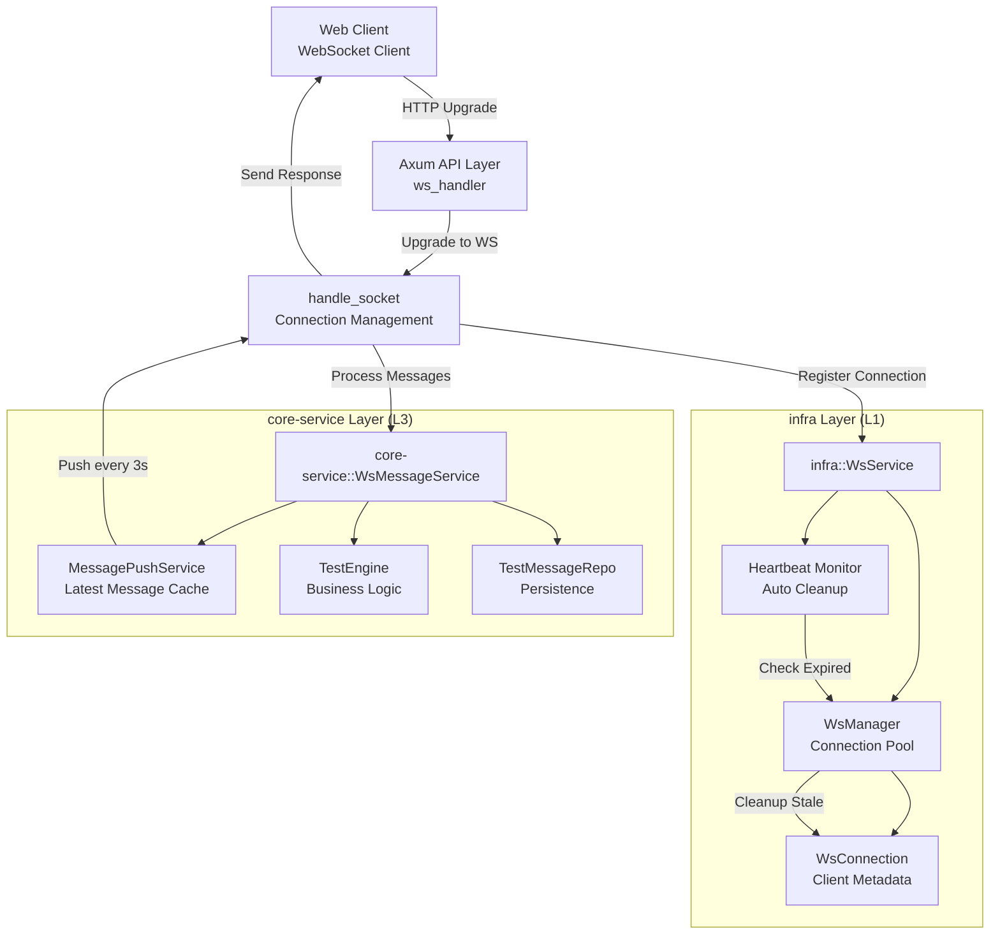
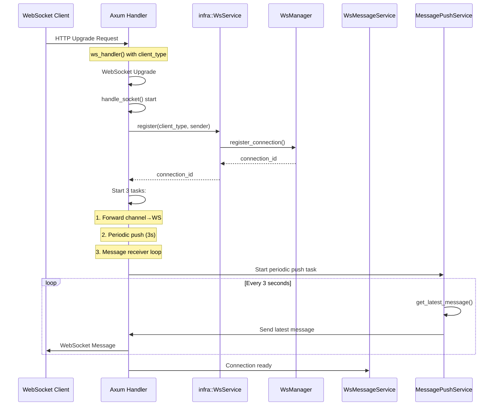
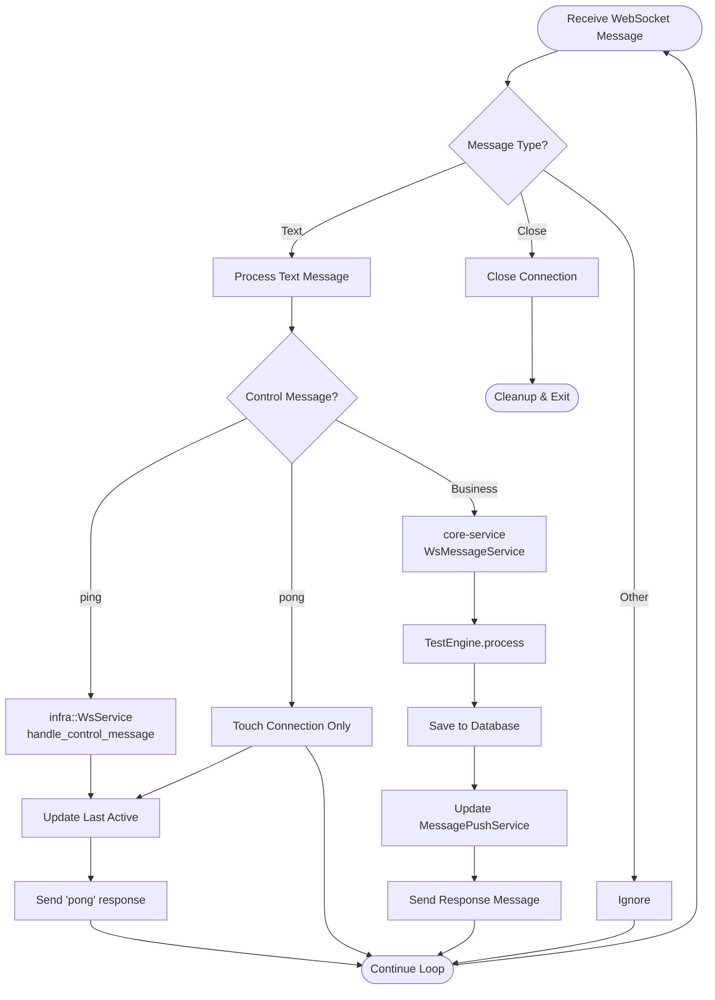
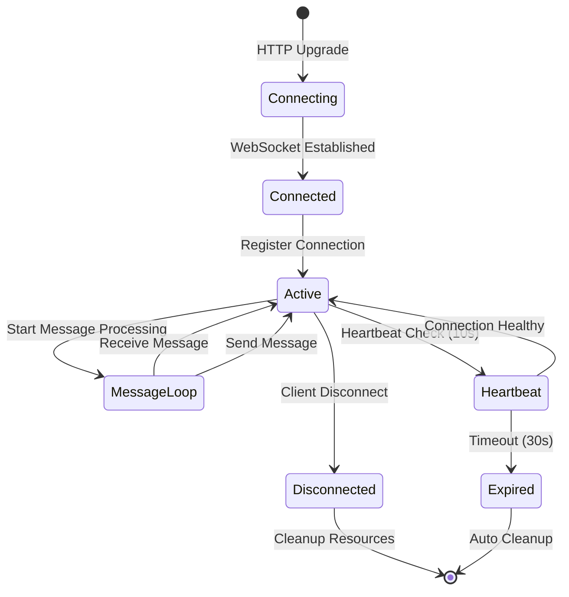

# WebSocket 架构图



## 架构分层说明

### 1. **客户端层** 
- 支持多种客户端类型：Web、Desktop、CLI、Mobile
- 发起HTTP升级请求建立WebSocket连接

### 2. **API应用层** (`apps/api`)
- **ws_handler**: 处理HTTP → WebSocket升级
- **handle_socket**: 连接建立后的生命周期管理
- 负责消息分发和响应推送

### 3. **基础设施层** (`crates/infra`)
- **WsService**: WebSocket服务的统一入口点
- **WsManager**: 连接池管理，支持注册/注销/广播
- **HeartbeatMonitor**: 心跳检测，自动清理过期连接
- **WsConnection**: 连接对象，包含元数据和最后活跃时间

### 4. **核心服务层** (`crates/core-service`)
- **WsMessageService**: 业务消息处理逻辑
- **MessagePushService**: 消息推送缓存（3秒定期推送）
- **TestEngine**: 业务逻辑引擎
- **TestMessageRepo**: 数据持久化

### 关键设计原则
- **分层解耦**: infra层不处理业务逻辑，core-service层实现WsMessageHandler接口
- **依赖注入**: 上层服务注入到API层的AppState中
- **自动清理**: 心跳监控确保连接健康
- **消息分离**: 控制消息（ping/pong）在infra层处理，业务消息在core-service层处理


# WebSocket 消息处理流程图

## 连接建立流程



## 消息处理流程



## 连接生命周期



## 关键处理逻辑

### 1. 控制消息处理 (infra层)
```rust
// crates/infra/src/websocket/handler.rs:50
if text_lower == "ping" {
    return HandleResult::Reply("pong".to_string());
}
```

### 2. 业务消息处理 (core-service层)
```rust
// apps/api/src/api/ws/handlers.rs:126
state.ws_message_service.process_ws_message(text_str).await
```

### 3. 定期推送机制
```rust
// apps/api/src/api/ws/handlers.rs:69
let mut interval = tokio::time::interval(tokio::time::Duration::from_secs(3));
```

### 4. 心跳监控
```rust
// crates/infra/src/websocket/service.rs:89
let expired = service.manager.get_expired_connections(timeout).await;
```

## 消息类型定义

```rust
// crates/infra/src/websocket/message.rs
#[serde(tag = "type", content = "payload")]
pub enum WsMessage {
    Ping,
    Pong,
    Message(MessagePayload),
}
```

## 连接管理特性

1. **连接ID生成**: `{client_type}-{uuid}`
2. **活跃时间追踪**: 每次 ping/pong 或业务消息都会更新
3. **自动清理**: 30秒无活跃自动断开
4. **类型支持**: Web/Desktop/CLI/Mobile
5. **元数据支持**: 可扩展的连接元数据存储
