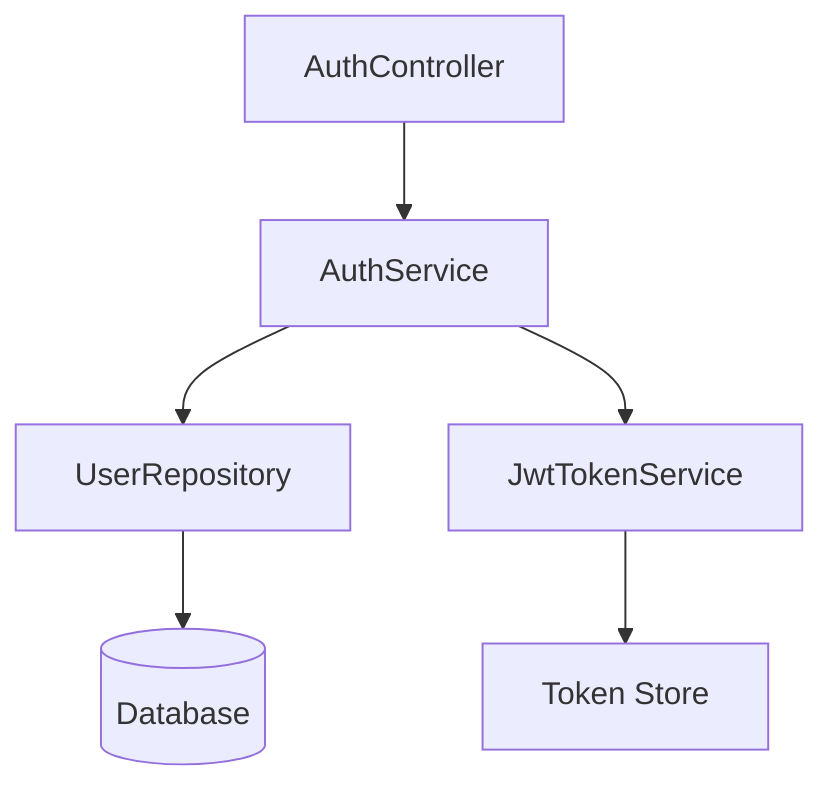

# User Authentication

## Overview

The authentication module is responsible for verifying user identity through JWT-based tokens. It handles login, token generation, token validation, and session management. The module integrates with the `UserRepository` for credential lookup and the `JwtTokenService` for cryptographic operations.

## Architecture



## Core Components

### AuthService

The central service that orchestrates authentication logic. Accepts login credentials, validates them against stored user data, and issues JWT tokens on success.

```rust
pub struct AuthService {
    user_repo: Arc<UserRepository>,
    jwt_service: Arc<JwtTokenService>,
}

impl AuthService {
    pub async fn login(&self, credentials: LoginRequest) -> Result<AuthToken, AuthError> {
        let user = self.user_repo.find_by_email(&credentials.email).await?;
        user.verify_password(&credentials.password)?;
        self.jwt_service.generate_token(&user)
    }
}
```

> **Source**: [src/auth/service.rs](../../../src/auth/service.rs#L15-L28)

### AuthMiddleware

Axum middleware that extracts and validates the JWT token from the `Authorization` header on every protected request.

```rust
pub async fn auth_middleware(
    State(state): State<AppState>,
    mut req: Request,
    next: Next,
) -> Result<Response, AuthError> {
    let token = extract_bearer_token(&req)?;
    let claims = state.jwt_service.validate_token(&token)?;
    req.extensions_mut().insert(claims);
    Ok(next.run(req).await)
}
```

> **Source**: [src/auth/middleware.rs](../../../src/auth/middleware.rs#L10-L22)

## API Reference

### POST /api/auth/login

Authenticate a user and return a JWT token.

**Request Body**:
```json
{
  "email": "user@example.com",
  "password": "secure-password"
}
```

**Response (200 OK)**:
```json
{
  "token": "eyJhbGciOiJIUzI1NiIs...",
  "expires_at": "2026-02-11T12:00:00Z"
}
```

## Configuration

| Variable | Default | Description |
|----------|---------|-------------|
| `JWT_SECRET` | (required) | Secret key for signing JWT tokens |
| `JWT_EXPIRY_HOURS` | `24` | Token expiration time in hours |
| `BCRYPT_COST` | `12` | Bcrypt hashing cost factor |

## Related Links

- [Authorization & Permissions](../core/authorization.md)
- [REST Endpoints](../api/endpoints.md)
- [Project Overview](../overview/index.md)
