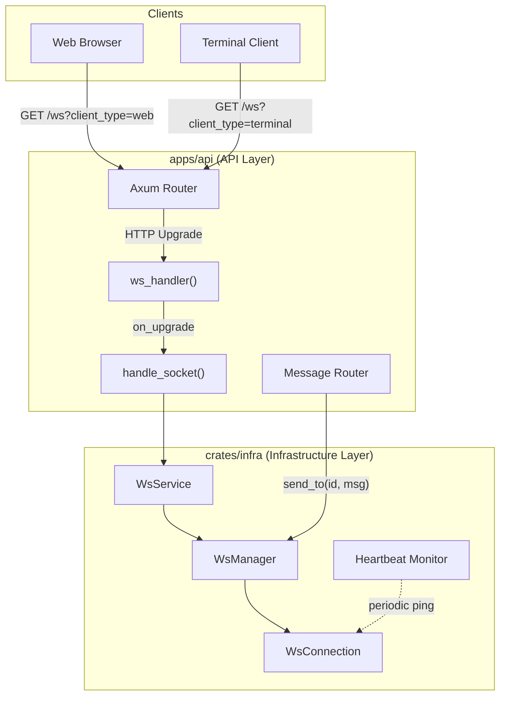
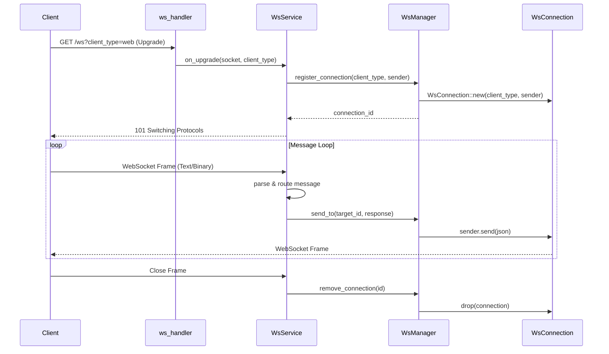
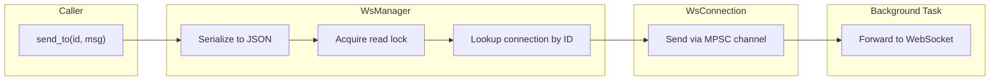

# WebSocket Service Architecture

The WebSocket service is the real-time communication backbone of ATMOS, enabling bidirectional messaging between the web frontend and the Rust backend. This article explains the design, data flow, and lifecycle of WebSocket connections — from the initial HTTP upgrade handshake through message routing to graceful disconnection. Understanding this service is essential for anyone working on real-time features like terminal sessions, file system events, or collaborative editing.

## Overview

The WebSocket infrastructure in ATMOS is split across two layers: the **infrastructure layer** (`crates/infra/src/websocket/`) provides connection management primitives, while the **API layer** (`apps/api/src/api/ws/`) handles HTTP upgrade logic and application-level message routing.

At the core is **WsManager**, a thread-safe connection registry. Each connection is represented by a **WsConnection** that holds the sender half of an MPSC channel — allowing any part of the application to push messages to specific clients. The manager supports two connection types (`WebClient` and `TerminalClient`) and provides both targeted and broadcast messaging.

This design was chosen over actor-based systems or pub/sub brokers for simplicity and debuggability. With typically fewer than 100 concurrent connections per ATMOS instance, a shared registry with read-write locking provides excellent performance without the complexity of more sophisticated architectures.

## Architecture

### System-Level View

### Connection Lifecycle (Sequence Diagram)

### Data Flow: Message Delivery

## Connection Management

### The WsManager Registry

WsManager maintains a thread-safe hash map of all active connections, keyed by a UUID. The implementation uses a read-write lock so that **sends** (which only read the map) can proceed concurrently, while **registration** and **removal** (which modify the map) serialize. This is intentional: in typical usage, sends vastly outnumber registration/removal, making a read-write lock more efficient than a mutex.

When a connection registers, WsManager generates a UUID, stores the connection, and returns the ID to the caller. Removal is idempotent — if the connection is already gone, the operation silently succeeds. This supports graceful cleanup when the client disconnects without sending a proper close frame.

### Targeted vs Broadcast Delivery

**Targeted delivery** (`send_to`) sends a message to a specific connection by ID. The method acquires only a read lock, so multiple sends to different connections can run in parallel. Serialization happens before the lock is acquired to minimize the critical section.

**Broadcast** sends the same message to all connections of a given type (e.g., all web clients). Errors on individual connections are logged but do not stop the broadcast — some clients may be disconnecting while the broadcast runs.

### The WsConnection Model

Each connection encapsulates: a UUID, client type classification, the MPSC sender channel, and timing metadata. The `last_heartbeat` field is updated on every pong frame; the heartbeat monitor uses it to detect stale connections. When a client sends a close frame or the heartbeat times out, the connection is removed from the registry and its channel is dropped, which causes the outbound forwarder task to exit and the WebSocket to close.

## HTTP Upgrade Flow

The upgrade from HTTP to WebSocket is handled by Axum's `WebSocketUpgrade` extractor. The handler reads `client_type` from query parameters (e.g., `?client_type=web`) and delegates to `handle_socket` once the protocol switch completes.

Inside `handle_socket`, the WebSocket is split into sender and receiver. A new MPSC channel is created; the sender half is passed to WsManager for registration. Two background tasks are spawned: one forwards outbound messages from the MPSC channel to the WebSocket, and one processes inbound messages from the client. When either task completes (e.g., client disconnect or channel closure), the other is aborted and the connection is removed from the registry.

## Message Protocol

All WebSocket messages use a JSON envelope with a `type` field for routing and an optional `payload` field. The `WsMessage` struct mirrors this — callers construct messages with a type string and optional payload, which is serialized to JSON before sending.

Error handling is explicit: `WsError` covers `ConnectionNotFound`, `SendFailed`, `Serialization`, and generic `WebSocket` errors. Callers can match on these to implement retries or user feedback.

## Heartbeat & Connection Health

The heartbeat system prevents zombie connections. A background task runs periodically (default: every 10 seconds), sending ping frames and checking `last_heartbeat`. Connections that haven't responded within the timeout (default: 30 seconds) are removed.

The cleanup is cascading: when a connection is removed, its MPSC sender is dropped. That causes the outbound forwarder task to exit (it receives an error on send), which in turn causes the WebSocket to close. No resources are leaked even when clients disconnect abruptly (browser tab crash, network failure).

### Configuration

| Variable | Default | Description |
|----------|---------|-------------|
| `heartbeat_interval_secs` | `10` | How often ping frames are sent |
| `connection_timeout_secs` | `30` | Max time to wait for pong before disconnecting |

## Key Source Files

| File | Purpose |
|------|---------|
| `crates/infra/src/websocket/manager.rs` | WsManager — Connection registry with concurrent read/write access |
| `crates/infra/src/websocket/connection.rs` | WsConnection — Individual connection state, identity, and send channel |
| `crates/infra/src/websocket/types.rs` | WsMessage, ClientType — Message envelope and client classification |
| `crates/infra/src/websocket/error.rs` | WsError, WsResult — Error types for all failure modes |
| `apps/api/src/api/ws/handlers.rs` | HTTP upgrade handler, socket splitting, message routing |
| `apps/api/src/api/ws/mod.rs` | WebSocket route registration in the Axum router |
| `apps/api/src/main.rs` | Heartbeat configuration and WsManager initialization |

## Next Steps

- **[Database & ORM](../infra/database.md)** — Learn how persistent state (sessions, workspace metadata) is stored and queried using SeaORM
- **[Terminal Service](../../deep-dive/core-service/terminal.md)** — Understand how terminal sessions use WebSocket for real-time PTY output streaming
- **[HTTP Routes & Handlers](../api/routes.md)** — See how WebSocket endpoints are registered alongside REST routes in the Axum router
- **[Architecture Overview](../../getting-started/architecture.md)** — Return to the high-level architecture to see where WebSocket fits in the full system
