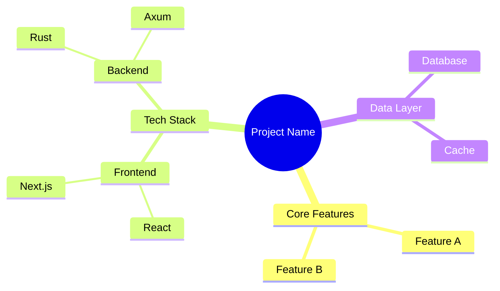

# Project Wiki Output Structure Specification

This is the authoritative specification for the output structure of a Project Wiki generated by the `project-wiki` skill. All generated content MUST conform to this specification.

## Directory Layout

```
.atmos/wiki/
├── _catalog.json          # Catalog metadata (required)
├── _mindmap.md            # Project mindmap (optional)
├── overview/              # Project overview
│   ├── index.md
│   ├── quick-start.md
│   └── tech-stack.md
├── core/                  # Core modules
│   ├── index.md
│   ├── authentication.md
│   └── authorization.md
└── api/                   # API reference
    ├── index.md
    └── endpoints.md
```

---

## 1. `_catalog.json` Specification (Required)

The catalog metadata file defines the hierarchical structure and navigation of the Wiki.

### Top-Level Fields

| Field | Type | Required | Description |
|-------|------|----------|-------------|
| `version` | string | Yes | Catalog format version (e.g., `"1.0"`) |
| `generated_at` | string | Yes | ISO 8601 timestamp (e.g., `"2026-02-10T12:00:00Z"`) |
| `project` | object | Yes | Project metadata |
| `catalog` | array | Yes | Hierarchical catalog tree (min 1 item) |

### `project` Fields

| Field | Type | Required | Description |
|-------|------|----------|-------------|
| `name` | string | Yes | Project name |
| `description` | string | Yes | Brief project description |
| `repository` | string | No | Repository URL (URI format) |

### Catalog Item Fields

| Field | Type | Required | Description |
|-------|------|----------|-------------|
| `id` | string | Yes | Unique identifier, dot-separated hierarchy (e.g., `core.authentication`) |
| `title` | string | Yes | Display title |
| `path` | string | Yes | File path relative to `.atmos/wiki/` |
| `order` | integer | Yes | Sort order among siblings (0-based) |
| `file` | string | Yes | Path to Markdown file relative to `.atmos/wiki/` |
| `children` | array | Yes | Child catalog items (empty array if leaf node) |

### Naming Conventions

- `id`: lowercase, hyphen-separated words, dot-notation for hierarchy. Pattern: `^[a-z0-9]+(-[a-z0-9]+)*(\.[a-z0-9]+(-[a-z0-9]+)*)*$`
- `path`: lowercase, hyphen-separated, slash-separated. Pattern: `^[a-z0-9]+(-[a-z0-9]+)*(/[a-z0-9]+(-[a-z0-9]+)*)*$`
- `file`: same as path but ending in `.md` or `.markdown`.

### JSON Schema Validation

The `_catalog.json` file MUST validate against the JSON Schema defined in `catalog.schema.json` (in this same directory). The schema enforces required fields, type constraints, ID/path patterns, ISO 8601 timestamps, and URI formats.

---

## 2. Markdown Document Specification

Each Markdown document in the Wiki MUST follow this structure.

### Frontmatter (Recommended)

```yaml
---
title: User Authentication
path: core/authentication
sources:
  - src/auth/service.rs
  - src/auth/middleware.rs
updated_at: 2026-02-10T12:00:00Z
---
```

| Field | Type | Description |
|-------|------|-------------|
| `title` | string | Document title |
| `path` | string | Path relative to `.atmos/wiki/` |
| `sources` | array | Source files this document covers |
| `updated_at` | string | ISO 8601 last-updated timestamp |

### Document Body Structure

Every document MUST include at minimum:

1. **`# Title`** - H1 heading matching the catalog `title`
2. **`## Overview`** - Brief description of the module's responsibilities and core functionality
3. **`## Architecture`** - Mermaid diagram illustrating the component's relationships

Recommended additional sections:

4. `## Core Components` - Detailed description of key classes/structs/functions
5. `## API Reference` - Endpoint documentation (if applicable)
6. `## Configuration` - Configuration details (if applicable)
7. `## Related Links` - Cross-references to other Wiki documents

### Mandatory Content Rules

| Rule | Description |
|------|-------------|
| **Real code only** | All code blocks MUST come from actual source files. Never invent code. |
| **Source file links** | Every code block MUST include a source file path using a relative link from the project root. Format: `> **Source**: [src/auth/service.rs](../../../src/auth/service.rs#L10-L20)` |
| **Mermaid accuracy** | Mermaid diagrams MUST reflect actual code architecture, not aspirational designs. |
| **Relative links** | Use relative paths for all cross-document references (e.g., `[Authorization](../core/authorization.md)`). |

---

## 3. `_mindmap.md` Specification (Optional)

A project architecture mindmap using Mermaid mindmap syntax. Provides a high-level visual overview of the entire project.

### Format

```markdown
# Project Architecture Mindmap


```

### Guidelines

- Root node should be the project name
- Top-level branches should represent major project dimensions (Features, Tech Stack, Data Layer, etc.)
- Keep depth to 3-4 levels for readability
- Include all major technologies and frameworks
