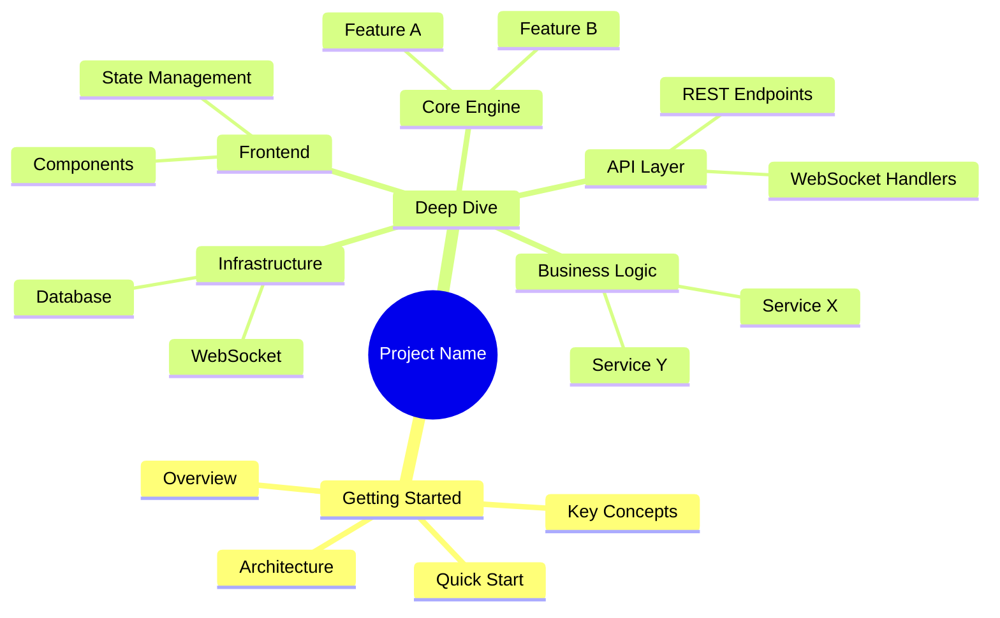

# Project Wiki Output Structure Specification

This is the authoritative specification for the output structure of a Project Wiki generated by the `project-wiki` skill. All generated content MUST conform to this specification.

## Directory Layout

The Wiki follows a **two-part structure**: Getting Started (for newcomers) and Deep Dive (for contributors/maintainers).

```
.atmos/wiki/
├── _catalog.json                    # Catalog metadata (required)
├── _mindmap.md                      # Project architecture mindmap (optional)
├── getting-started/                 # Part 1: Getting Started
│   ├── index.md                     # Overview & welcome
│   ├── quick-start.md               # Install & run in 5 minutes
│   ├── installation.md              # Detailed setup guide
│   ├── architecture.md              # High-level architecture
│   ├── key-concepts.md              # Core terminology & patterns
│   └── configuration.md             # All config options
└── deep-dive/                       # Part 2: Deep Dive
    ├── index.md                     # Deep dive overview
    ├── infra/                       # Infrastructure layer
    │   ├── index.md
    │   ├── database.md
    │   └── websocket.md
    ├── core/                        # Core modules
    │   ├── index.md
    │   ├── authentication.md
    │   └── authorization.md
    ├── api/                         # API layer
    │   ├── index.md
    │   └── endpoints.md
    ├── frontend/                    # Frontend
    │   ├── index.md
    │   └── components.md
    ├── build-system/                # Build & tooling
    │   └── index.md
    └── design-decisions/            # Architecture decisions
        └── index.md
```

---

## 1. `_catalog.json` Specification (Required)

The catalog metadata file defines the hierarchical structure and navigation of the Wiki.

### Top-Level Fields

| Field | Type | Required | Description |
|-------|------|----------|-------------|
| `version` | string | Yes | Catalog format version (e.g., `"2.0"`) |
| `generated_at` | string | Yes | ISO 8601 timestamp |
| `project` | object | Yes | Project metadata |
| `catalog` | array | Yes | Hierarchical catalog tree (min 1 item) |

### `project` Fields

| Field | Type | Required | Description |
|-------|------|----------|-------------|
| `name` | string | Yes | Project name |
| `description` | string | Yes | Brief project description |
| `repository` | string | No | Repository URL (URI format) |

### Catalog Item Fields

| Field | Type | Required | Description |
|-------|------|----------|-------------|
| `id` | string | Yes | Unique identifier, dot-separated hierarchy |
| `title` | string | Yes | Display title |
| `path` | string | Yes | File path relative to `.atmos/wiki/` |
| `order` | integer | Yes | Sort order among siblings (0-based) |
| `file` | string | Yes | Path to Markdown file relative to `.atmos/wiki/` |
| `section` | string | No | `getting-started` or `deep-dive` |
| `level` | string | No | `beginner`, `intermediate`, or `advanced` |
| `reading_time` | integer | No | Estimated reading time in minutes |
| `children` | array | Yes | Child catalog items (empty array if leaf) |

### Naming Conventions

- `id`: lowercase, hyphen-separated words, dot-notation for hierarchy. Pattern: `^[a-z0-9]+(-[a-z0-9]+)*(\.[a-z0-9]+(-[a-z0-9]+)*)*$`
- `path`: lowercase, hyphen-separated, slash-separated. Pattern: `^[a-z0-9]+(-[a-z0-9]+)*(/[a-z0-9]+(-[a-z0-9]+)*)*$`
- `file`: same as path but ending in `.md` or `.markdown`.

### Two-Part Structure

The top-level catalog MUST contain exactly two major sections:

1. **`getting-started`** -- Articles for newcomers (beginner to intermediate level)
2. **`deep-dive`** -- Articles for contributors/maintainers (intermediate to advanced level)

```json
{
  "catalog": [
    {
      "id": "getting-started",
      "title": "Getting Started",
      "section": "getting-started",
      "level": "beginner",
      ...
      "children": [...]
    },
    {
      "id": "deep-dive",
      "title": "Deep Dive",
      "section": "deep-dive",
      "level": "intermediate",
      ...
      "children": [...]
    }
  ]
}
```

### JSON Schema Validation

The `_catalog.json` file MUST validate against the JSON Schema defined in `catalog.schema.json`.

---

## 2. Markdown Document Specification

Each Markdown document in the Wiki MUST follow this structure to ensure depth and consistency.

### Frontmatter (Required) — YAML Only

Metadata MUST be in YAML frontmatter format. The frontend parser expects this exact structure. Any other format causes rendering failure.

**Structure:** The file MUST begin with `---` on line 1, followed by valid YAML, followed by `---` on its own line, then a blank line, then the H1 heading and body.

```yaml
---
title: WebSocket Service Architecture
section: deep-dive
level: advanced
reading_time: 13
path: deep-dive/infra/websocket
sources:
  - crates/infra/src/websocket/manager.rs
  - crates/infra/src/websocket/connection.rs
  - crates/infra/src/websocket/types.rs
  - apps/api/src/api/ws/handlers.rs
  - apps/api/src/api/ws/mod.rs
updated_at: 2026-02-10T12:00:00Z
---

# WebSocket Service Architecture

First paragraph...
```

**FORBIDDEN (causes rendering failure):**

```markdown
# Workspace Service

> **Reading Time:** 13 minutes
>
> **Source Files:** 8+ referenced

---
```

```markdown
# Title

Reading Time: 13 minutes | Level: Advanced
```

- Do NOT use markdown blockquotes (`>`) for metadata.
- Do NOT put metadata in the document body.
- Do NOT use inline text like "Reading Time: X minutes".
- `sources` MUST be a YAML array (hyphen-prefixed list), not a string or inline text.

| Field | Type | Required | Description |
|-------|------|----------|-------------|
| `title` | string | Yes | Document title |
| `section` | string | Yes | `getting-started` or `deep-dive` |
| `level` | string | Yes | `beginner`, `intermediate`, or `advanced` |
| `reading_time` | integer | Yes | Estimated reading time in minutes |
| `path` | string | Yes | Path relative to `.atmos/wiki/` |
| `sources` | array | Yes | Source files this document covers (min 3 for getting-started, min 5 for deep-dive) |
| `updated_at` | string | Yes | ISO 8601 last-updated timestamp |

### Document Body Structure

#### Required Sections (Every Article)

1. **`# Title`** -- H1 heading matching the catalog `title`

2. **Introduction Paragraph** (no heading) -- 2-4 sentences immediately after the title that tell the reader:
   - What this article covers
   - Why it matters
   - What they'll be able to do after reading it

3. **`## Overview`** -- Detailed description of the module/topic:
   - For **Getting Started**: Focus on "what" and "why". Use plain language. Explain the purpose and value proposition.
   - For **Deep Dive**: Include technical details about "how". Reference specific types, functions, and design patterns from the code.

4. **`## Architecture`** -- One or more Mermaid diagrams:
   - Show internal component relationships
   - Show dependencies on other modules
   - Show data flow direction
   - Label connections with method names or message types where appropriate

5. **Content Sections** (H2/H3 headings, varies by article) -- The core content. Rules:
   - **Translate code logic into natural language** — describe what the code does and why in prose
   - **Use Mermaid diagrams** (architecture, flowchart, sequence) to illustrate structure and flow
   - Keep code snippets **minimal** (0–2 per article); only when a brief example is genuinely clearer than prose
   - Deep Dive articles MUST trace request/operation flow — use sequence diagrams and numbered steps
   - Cover error handling and edge cases in prose
   - Explain design decisions and trade-offs

6. **`## Key Source Files`** -- Table of source files referenced:

   ```markdown
   | File | Purpose |
   |------|---------|
   | `crates/infra/src/websocket/manager.rs` | Connection lifecycle management |
   | `crates/infra/src/websocket/connection.rs` | Individual connection state and I/O |
   | `apps/api/src/api/ws/handlers.rs` | HTTP upgrade and message routing |
   ```

7. **`## Next Steps`** -- 2-4 bullet points linking to related articles:

   ```markdown
   - **[Database & ORM](../infra/database.md)** -- Learn how persistent data is stored and queried
   - **[API Routes](../api/endpoints.md)** -- See how WebSocket endpoints are exposed alongside HTTP routes
   - **[Terminal Service](../core/terminal.md)** -- Understand how terminal sessions use WebSocket for real-time I/O
   ```

#### Additional Recommended Sections

- `## Core Components` -- Detailed description of key types/structs/classes
- `## API Reference` -- Endpoint documentation with request/response examples
- `## Configuration` -- Configuration options table
- `## Error Handling` -- Error types, failure modes, recovery strategies
- `## Data Flow` -- Step-by-step trace of how data moves through the module
- `## Testing` -- How to test this module, key test cases
- `## Performance Considerations` -- Caching, pooling, optimization strategies

### Content Depth Standards

| Metric | Getting Started | Deep Dive |
|--------|----------------|-----------|
| **Word Count** | 800+ words | 1500+ words |
| **Source Files** | 3+ referenced | 5+ referenced |
| **Code Snippets** | 0–1 (only when essential) | 0–2 (only when essential) |
| **Mermaid Diagrams** | 2+ | 3+ |
| **Reading Time** | 5-8 minutes | 8-15 minutes |
| **H2 Sections** | 4+ | 6+ |
| **Cross-references** | 2+ links to other articles | 4+ links to other articles |

**Readers come for business logic, implementation reasoning, and technical architecture — not to read code.** Translate code logic into natural language. Use diagrams liberally. Prefer prose and Mermaid over code blocks.

### Mandatory Content Rules

| Rule | Description |
|------|-------------|
| **Prose over code** | Translate implementation logic into natural language. Use Mermaid diagrams (architecture, flowchart, sequence) to illustrate structure and flow. |
| **Diagram-heavy** | At least 2–3 Mermaid diagrams per article. Architecture, flow, and sequence diagrams communicate faster than code. |
| **Minimal code** | Code snippets only when a short 2–3 line example is genuinely clearer than prose. Avoid long code blocks. |
| **Source file links** | If you include a code snippet, it MUST have a source file path. Prefer citing source files in the Key Source Files table. |
| **Mermaid accuracy** | Mermaid diagrams MUST reflect actual code architecture. |
| **Relative links** | Use relative paths for all cross-document references. |
| **Trace the flow** | Use sequence diagrams and numbered prose steps, not code. |
| **Cover error cases** | Explain failure modes in prose, not just the happy path. |

### Writing Quality Guidelines

1. **Translate, don't quote**: Describe what the code does in prose. "The connection manager maintains a thread-safe registry of active connections, keyed by client ID" — not a 20-line code block.

2. **Be specific**: "The `WsManager` holds an `Arc<RwLock<HashMap>>` to allow concurrent reads while serializing writes" is better than "The manager stores connections" — but say it in prose, don't paste the struct definition.

3. **Diagram first**: Use Mermaid for architecture, flow, and sequences. Diagrams communicate structure faster than code.

4. **Explain the "why"**: Explain design decisions in prose. "Worktrees allow multiple workspaces to be active simultaneously without branch conflicts" — not code.

5. **Connect modules**: Explain how each module relates to others. Use flowcharts and links, not code dumps.

---

## 3. `_mindmap.md` Specification (Optional)

A project architecture mindmap using Mermaid mindmap syntax that shows both Getting Started and Deep Dive topics.

### Format

```markdown
# Project Architecture Mindmap


```

### Guidelines

- Root node should be the project name
- First level should show the two-part structure (Getting Started + Deep Dive)
- Keep depth to 3-4 levels for readability
- Include all major modules and technologies
