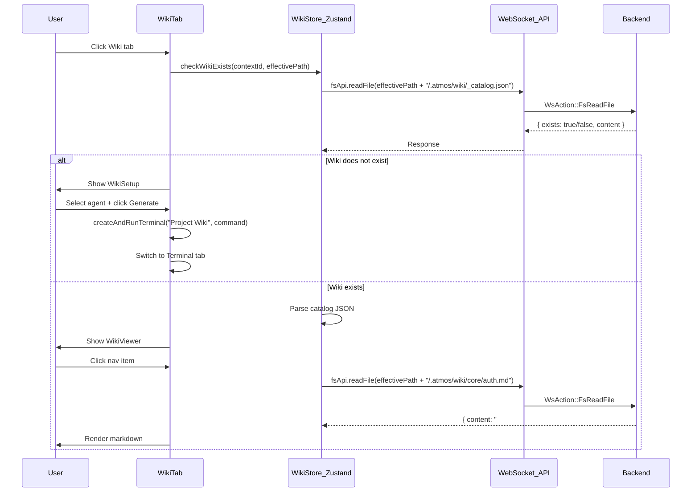

# Wiki Tab Integration Plan

## Architecture Overview

```mermaid
flowchart TB
    subgraph CenterStage["CenterStage.tsx"]
        OverviewTab["OverviewTab (icon)"]
        WikiTab["WikiTab (icon) -- NEW"]
        TerminalTab["Terminal"]
        FileTabs["File Tabs..."]
    end

    WikiTab --> CheckExist{"`.atmos/wiki/` exists?"}
    CheckExist -->|No| WikiSetup["WikiSetup Component"]
    CheckExist -->|Yes| WikiViewer["WikiViewer Component"]

    WikiSetup --> SelectAgent["Select Code Agent"]
    SelectAgent --> OpenTerminal["Open Terminal + Run Command"]

    subgraph WikiViewerLayout["WikiViewer 3-Column Layout"]
        NavTree["Left: Catalog Nav Tree"]
        Content["Center: Markdown Content"]
        TOC["Right: Heading TOC"]
    end
    WikiViewer --> WikiViewerLayout
```


## Files to Create

```
apps/web/src/components/wiki/
├── WikiTab.tsx            # Entry: detect wiki, route to Setup or Viewer
├── WikiSetup.tsx          # Setup flow: select agent, generate
├── WikiViewer.tsx         # 3-column layout container
├── WikiSidebar.tsx        # Left panel: catalog tree navigation
├── WikiContent.tsx        # Center panel: markdown rendering
├── WikiToc.tsx            # Right panel: heading-based TOC
└── wiki-utils.ts          # Parse catalog, extract headings, build tree
```

```
apps/web/src/hooks/
└── use-wiki-store.ts      # Zustand store for wiki state
```

## Files to Modify

- [apps/web/src/components/layout/CenterStage.tsx](apps/web/src/components/layout/CenterStage.tsx) -- Add Wiki tab + content panel
- [apps/web/src/components/markdown/MarkdownRenderer.tsx](apps/web/src/components/markdown/MarkdownRenderer.tsx) -- Add Mermaid diagram rendering support

---

## Step 1: Wiki Zustand Store (`use-wiki-store.ts`)

State to manage:

```typescript
interface WikiContextState {
  // Catalog
  catalog: CatalogData | null;
  catalogLoading: boolean;
  // Active page
  activePage: string | null;
  activeContent: string | null;
  contentLoading: boolean;
  // Wiki existence
  wikiExists: boolean | null;
}

interface WikiStore {
  // Keyed by contextId (workspaceId or projectId)
  contextStates: Record<string, WikiContextState>;
  // Actions
  checkWikiExists: (contextId: string, effectivePath: string) => Promise<boolean>;
  loadCatalog: (contextId: string, effectivePath: string) => Promise<void>;
  loadPage: (contextId: string, effectivePath: string, filePath: string) => Promise<void>;
  setActivePage: (contextId: string, pageId: string) => void;
  resetContext: (contextId: string) => void;
}
```

Data loading uses existing WebSocket API:

- `fsApi.readFile(effectivePath + '/.atmos/wiki/_catalog.json')` -- check existence + load catalog
- `fsApi.readFile(effectivePath + '/.atmos/wiki/' + page.file)` -- load page content

Implementation notes:
- Use request token/sequence per `contextId` to prevent stale async responses from overwriting current context state.
- `effectivePath` must be derived as `workspacePath || projectPath` in `CenterStage`.

## Step 2: Register Wiki Tab in CenterStage

Modify [CenterStage.tsx](apps/web/src/components/layout/CenterStage.tsx):

1. Expand `fixedTab` union type: `"overview" | "terminal" | "wiki"`
2. Add icon-only `TabsTab` after OverviewTab (use `BookOpen` icon from lucide-react)
3. Add CSS-visibility-controlled content div (same pattern as OverviewTab -- always mounted, hidden via CSS)
4. Update `onValueChange` to include `"wiki"` in the fixed-tab check

Position in tab bar: `[Overview icon] [Wiki icon] [Terminal] [File tabs...]`

## Step 3: WikiTab Entry Component

Logic:

1. On mount (or when tab becomes active), call `checkWikiExists(contextId, effectivePath)`
2. If `wikiExists === null` -- show skeleton loading
3. If `wikiExists === false` -- render `<WikiSetup />`
4. If `wikiExists === true` -- call `loadCatalog(contextId, effectivePath)`, render `<WikiViewer />`

Path source must follow existing workspace behavior:
- `effectivePath = currentWorkspace?.localPath || currentProject?.mainFilePath`
- `contextId = effectiveContextId` (workspaceId preferred, fallback projectId)

## Step 4: WikiSetup Component

UI layout (centered card, similar to empty states in OverviewTab):

- Icon + title: "Generate Project Wiki"
- Description text explaining what will be generated
- **Agent selector**: Dropdown with options:
  - Claude Code (`claude`)
  - Codex CLI (`codex`)
  - Aider (`aider`)
- **Generate button**
- On click:
  1. Build command using a controlled preset map (Phase 1 has no custom free-text command):
    ```ts
    const AGENT_COMMANDS = {
      claude: (prompt: string) => `claude ${shellQuote(prompt)}`,
      codex: (prompt: string) => `codex ${shellQuote(prompt)}`,
      aider: (prompt: string) => `aider --message ${shellQuote(prompt)}`,
    } as const;
    ```
  2. Create a **new terminal tab** named `Project Wiki`
  3. Send command to that new tab after session is ready
  4. Switch `fixedTab` to `"terminal"` to show execution
  5. After command completes, user switches back to Wiki tab, which re-checks and loads

### Terminal orchestration contract (required)

`TerminalGridHandle` must support opening a new terminal and executing command programmatically:

```ts
export interface TerminalGridHandle {
  addTerminal: (title?: string) => string | void;
  sendToTerminal: (paneId: string, input: string) => void;
  createAndRunTerminal: (options: { title: string; command: string }) => Promise<void>;
}
```

Expected behavior:
- `createAndRunTerminal({ title: "Project Wiki", command })` always creates a fresh tab.
- Wait for terminal ready event, then send `command + "\\r"`.
- If terminal creation/sending fails, show toast and keep WikiSetup actionable for retry.

Command safety rules:
- Prompt is generated from static template + normalized `effectivePath`.
- All interpolated values are escaped via shared utility (`shellQuote`) for current shell.
- Reuse existing skills metadata API for skill location/config; avoid frontend path env coupling.

## Step 5: WikiViewer 3-Column Layout

Uses `react-resizable-panels` (already a dependency) for the internal 3-column layout:

```
+------------------+----------------------------+----------------+
| WikiSidebar      | WikiContent                | WikiToc        |
| (catalog tree)   | (markdown body)            | (heading nav)  |
| 20% collapsible  | flex-1                     | 18% collapsible|
+------------------+----------------------------+----------------+
```

```tsx
<PanelGroup direction="horizontal">
  <Panel defaultSize={20} minSize={15} maxSize={30} collapsible>
    <WikiSidebar />
  </Panel>
  <PanelResizeHandle />
  <Panel defaultSize={62} minSize={40}>
    <WikiContent />
  </Panel>
  <PanelResizeHandle />
  <Panel defaultSize={18} minSize={12} maxSize={25} collapsible>
    <WikiToc />
  </Panel>
</PanelGroup>
```

## Step 6: WikiSidebar (Left Panel)

- Parse `_catalog.json` into a tree structure
- Render as a recursive tree with collapsible categories (reuse `Collapsible` from `@workspace/ui`)
- Each leaf node is clickable, triggers `loadPage()` from wiki store
- Active page highlighted with `bg-accent` style
- Sort items by `order` field
- Show project name + description at top

Tree item rendering pattern (similar to FileTree but simpler):

```
v Project Overview          <- collapsible parent
    Quick Start             <- leaf, clickable
    Tech Stack              <- leaf, clickable
v Core Modules
    User Authentication     <- active (highlighted)
    Authorization
```

## Step 7: WikiContent (Center Panel)

- Read `activeContent` from wiki store
- Parse frontmatter (title, sources) for header display
- Render markdown body using existing `MarkdownRenderer`
- Add a thin header bar showing: page title + source file badges (from frontmatter `sources` array)
- Scroll to top on page change

## Step 8: WikiToc (Right Panel)

- Parse `activeContent` markdown to extract headings (`##` , `###` , `####` )
- Build a flat list with indentation levels
- Render as clickable anchor links
- Highlight current section on scroll (Intersection Observer)
- Title: "On this page" (matching DeepWiki style)

Anchor consistency (required):
- TOC id must exactly match rendered heading id in Markdown DOM.
- Prefer adding `rehype-slug` in `MarkdownRenderer` and generating TOC ids with the same slug strategy.
- If not using `rehype-slug`, inject `id` in custom `h2/h3/h4` renderers and reuse shared `slugifyHeading()` from `wiki-utils.ts`.

Heading extraction utility in `wiki-utils.ts` (for TOC model only):

```typescript
function extractHeadings(markdown: string): Heading[] {
  // Regex: /^(#{2,4})\s+(.+)$/gm
  // Returns: { level: 2|3|4, text: string, id: string (slugified) }
}
```

## Step 9: Mermaid Support in MarkdownRenderer

Modify [MarkdownRenderer.tsx](apps/web/src/components/markdown/MarkdownRenderer.tsx):

- Install `mermaid` package (`bun add mermaid`)
- Add a `MermaidBlock` component that:
  1. Detects code blocks with `language-mermaid`
  2. Lazy-loads `mermaid` library via `dynamic import()`
  3. Renders SVG into a container div
  4. Supports dark mode (initialize mermaid with theme based on `next-themes`)
  5. Handles render failure with fallback message and safe defaults (`securityLevel`)
- Register in the existing `components` override for `code` blocks

This enhancement benefits the entire app (OverviewTab, file previews, etc.), not just Wiki.

---

## Security and Rollout Notes

- Phase 1 only supports controlled agent presets (`claude`, `codex`, `aider`).
- No raw user-defined shell command execution in wiki generation flow.
- Escape all command interpolation and avoid exposing sensitive absolute paths in UI toasts/logs.
- Optional Phase 2 can add custom command mode behind explicit "unsafe" confirmation.

---

## Data Flow Summary




## Dependency Changes

- `bun add mermaid` in `apps/web/` -- for Mermaid diagram rendering (lazy-loaded, ~200KB gzipped but only loaded when a mermaid block is encountered)
- `bun add rehype-slug github-slugger` in `apps/web/` -- for stable heading ids and TOC anchor consistency

